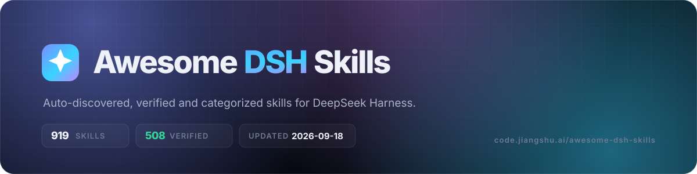

<div align="center">

<a href="https://code.jiangshu.ai/awesome-dsh-skills"></a>

<br>

[](https://awesome.re)
[](https://code.jiangshu.ai/awesome-dsh-skills)
[](https://github.com/yzfly/awesome-dsh-skills/actions)
[](LICENSE)

**English** · [中文](README.zh.md)

</div>

> Auto-discovered & verified skills for [DeepSeek Harness (dsh)](https://github.com/deepseek-ai/deepseek-harness).

**731** skill repos tracked · **390** passed SKILL.md validation · updated daily (last: 2026-08-25)

🔎 **Searchable site: https://code.jiangshu.ai/awesome-dsh-skills** — filter by category, stars, and verification status.

✦ **[2026 Q3 Edition](editions/2026-q3.md)** — 28 skills read and reviewed one by one, with verdicts. Picks are marked ✦ below.

## How entries get here

- Candidates are crawled daily from GitHub topics (`dsh-skill`, …) and full-text search; PRs welcome ([CONTRIBUTING](CONTRIBUTING.md)).
- Descriptions come from each repo's own GitHub description — never copied from other lists.
- ✅ = a SKILL.md with valid frontmatter (name/description) was found, so dsh can load it; ☑️ = SKILL.md found but frontmatter incomplete; no mark = no SKILL.md found in common layouts (may be a custom layout — PRs welcome).
- Want a stronger signal? Check your skill against the [DSH Skill Specification](SPEC.md) with [`dsh-skill-lint`](LINT.md) — it catches missing trigger clauses, broken references, leaked secrets and unsafe shell patterns.
- A listing is not a security endorsement: skills drive an agent that acts on your machine. Review the source before installing.

## Contents

- [📦 Skill Packs & Curations](#-skill-packs--curations) (148)
- [📝 Docs, Writing & Office](#-docs-writing--office) (62)
- [📊 Data & Visualization](#-data--visualization) (28)
- [💻 Coding, Review & Architecture](#-coding-review--architecture) (87)
- [🔍 Research & Knowledge](#-research--knowledge) (30)
- [🎨 Design & Media](#-design--media) (41)
- [🌐 Web & Automation](#-web--automation) (43)
- [🤖 Agents & Orchestration](#-agents--orchestration) (164)
- [🎓 Education & Competitions](#-education--competitions) (1)
- [🎮 Fun & Lifestyle](#-fun--lifestyle) (3)
- [🧰 Other Skills](#-other-skills) (124)

### 📦 Skill Packs & Curations

| Repo | ⭐ | ✓ | Description |
|:--|--:|:-:|:--|
| ✦ [alaliqing/claude-paper](https://github.com/alaliqing/claude-paper) | 327 | ✅ | 📖 Cross-agent research paper toolkit for Claude Code, Codex, OpenCode, and DeepSeek Harness—quick summaries, deep study materials, code demos, and a local web viewer. |
| [Unclecheng-li/DeepSec](https://github.com/Unclecheng-li/DeepSec) | 324 |  | DeepSec — AI Security Offense & Defense Platform. Shield audits AI-generated code for hallucinated packages, missing safeguards & AI pattern errors in real time. Spear automates authorized penetration testing with 40+ skill packs, from recon to PoC. |
| [Dominic789654/awesome-deepseek-harness](https://github.com/Dominic789654/awesome-deepseek-harness) | 191 |  | A curated list of plugins, skills, MCP servers, patch/profile layers, orchestrators & UIs for DeepSeek Harness (DSH). Visualization · PPT · Coding · Agents · Loops (auto-research) and more. #dsh |
| [imsai-sh/awesome-deepseek-harness-plugins](https://github.com/imsai-sh/awesome-deepseek-harness-plugins) | 182 | ✅ | DeepSeek Harness plugin store, marketplace and hub — 3,100+ dsh plugins with search, rankings, install commands and a free public API. DeepSeek Harness 插件市场 / 插件商店：自动收集与格式校验，免费搜索 API。deepseek1024.com |
| [EverMind-AI/SkillCorpus](https://github.com/EverMind-AI/SkillCorpus) | 159 |  | Open-source infrastructure that turns scattered SKILL.md files into curated, retrieval-ready agent-skill corpora—with retrieval and evaluation tooling included. |
| [Fishquito7/dsh-skill-mcp-panel](https://github.com/Fishquito7/dsh-skill-mcp-panel) | 101 |  | DSH Web UI plugin: skill and MCP management（Web界面的skill/MCP管理工具） |
| [dhicoc/dsh-reverse-skill](https://github.com/dhicoc/dsh-reverse-skill) | 75 | ✅ | Complete reverse-skill (85 SKILL.md) as a DeepSeek Harness (dsh) Cordis plugin — reverse engineering, authorized pentesting and security research skill pack. |
| [vlln/plugin-registry](https://github.com/vlln/plugin-registry) | 57 | ✅ | DSH 插件生态基建：薄控制台（浏览器面板管理官方 repository 插件，0 patch）+ make-dsh-plugin skill 官方插件开发引导 |
| [FlashingChen/dsh-desktop-hub](https://github.com/FlashingChen/dsh-desktop-hub) | 51 |  | DSH Desktop Hub — DeepSeek Harness 桌面管理控制台（Electron + TypeScript）。多 Tab 管理 Harness / Plugin / MCP / Skills，双击即用。 |
| ✦ [zimodzh/dsh-plugin-dev-skills](https://github.com/zimodzh/dsh-plugin-dev-skills) | 39 | ✅ | An Agent Skills skill for developing DeepSeek Harness (DSH) plugins（开发 DSH 插件的 Agent Skill）——插件/服务/事件/工具/LLM 适配器/打包安装的标准。Works with Claude Code, Codex, DSH, VS Code Copilot & any compatible agent. |
| [kejixiaoliang/awesome-dsh-plugins](https://github.com/kejixiaoliang/awesome-dsh-plugins) | 27 |  | DeepSeek Harness (DSH) 插件精选目录 — 14 类 280+ 个社区插件，覆盖 MCP / Skill / TUI / 多 Agent / 上下文记忆 / UI 皮肤，点链接直达仓库。Curated directory of dsh plugins for DeepSeek Harness. |
| [xiajiajun516/dsh-config-manager](https://github.com/xiajiajun516/dsh-config-manager) | 21 |  | DeepSeek Harness (DSH) backup & restore plugin — export, import, migrate and sync your complete DSH configuration, plugins, MCP servers, skills and workspace. One-click migration to another machine. |
| [MichengAI/dsh-skills-manager](https://github.com/MichengAI/dsh-skills-manager) | 19 |  | DSH Skills Manager 基于 DeepSeek Harness 的Skills管理插件 |
| ✦ [zhaiyateng/dsh-design-skills](https://github.com/zhaiyateng/dsh-design-skills) | 18 | ✅ | Design aesthetics skill pack for DeepSeek Harness (DSH) - keeps vibe-coded websites away from the AI look. 6 styles: dark-saas, apple-minimal, neo-neumorphism, brutalism, glassmorphism, japanese-minimal. |
| [zebbkira/dsh-skills-mcp-manager](https://github.com/zebbkira/dsh-skills-mcp-manager) | 16 |  | 面向 DeepSeek Harness Web GUI 的正式插件包：在设置页的「Web UI 插件」分组中新增一张「技能与 MCP」卡片，用于在浏览器里管理技能（skills）与 MCP 服务器。 |
| ✦ [seed-forge/harness-ai-kit](https://github.com/seed-forge/harness-ai-kit) | 16 | ✅ | Package manager for AI agent assets — 42 skills, 5 CLIs, 1 plugin. Skills for AI/LLM agent engineering, eval-driven dev, spec-driven dev, database (MySQL/PG/Redis/Kafka/Mongo/Oracle/NL2SQL), K8s/Docker diagnostics, infra ops (Dify/Nexus/Harbor/SonarQube) & docs/patent. Runtimes: Codex, Claude Code, Cursor, Kiro, DSH. |
| [FeatherHunter/dsh-opencode-palette](https://github.com/FeatherHunter/dsh-opencode-palette) | 14 |  | 🎨 看腻了 DSH 默认皮肤？34 款 opencode 经典配色一键换上——tokyonight、dracula、gruvbox、matrix、rose-pine……即点即换，重启不丢。34 opencode themes for DeepSeek Harness, one click, persisted. More by @FeatherHunter: ⚡ dsh-prompt · 🧠 dsh-mattpocock-skills-deck |
| [FeatherHunter/dsh-mattpocock-skills-deck](https://github.com/FeatherHunter/dsh-mattpocock-skills-deck) | 13 |  | 拨开迷雾看见终点，剩下的交给任务栏。Part the fog, see the end — the task bar handles the rest. 🎮 mattpocock/skills 的 DSH 游戏任务系统：map 拨迷雾，任务栏推进一步。A game-like mission system for Matt Pocock skills in DeepSeek Harness. More by @FeatherHunter: 🎨 dsh-opencode-palette · ⚡ dsh-prompt |
| [omdsh-dev/dsh-plugin-skills](https://github.com/omdsh-dev/dsh-plugin-skills) | 12 | ✅ | Agent skills for building and testing DeepSeek Harness plugins — from scaffolding a new plugin package to choosing the right test tiers, entirely inside an agent session. |
| [Thanksgiver233/dsh-mobile](https://github.com/Thanksgiver233/dsh-mobile) | 11 |  | DeepSeek Harness Mobile 是 DeepSeek Harness 的 Android 原生应用，将原本仅支持 PC 浏览器的 AI Agent 框架完整迁移至移动端。采用 Kotlin + Jetpack Compose 开发，内置 Node.js ARM64 二进制和 dsh CLI，实现零依赖安装——下载 APK 即可运行，无需 Root、Termux 或额外环境配置。应用覆盖网页端全部核心功能：多会话管理、流式对话、插件市场、模型设置等，并针对竖屏触控体验深度优化。技术上采用 MVVM 架构、Dagger Hilt 依赖注入、Room 本地数据库，后台 Foreground Service 确保引擎持续运行，支持离线场景和弱网环境自动重连。 |
| [YTxue/dsh-skill-manager-ytxue](https://github.com/YTxue/dsh-skill-manager-ytxue) | 11 |  | DSH web plugin: skill manager in the Settings sidebar - list/enable/disable, folder batch import with conflict prompts, state-driven one-click DSH-spec check & auto-fix, system/project scope labels. |
| [liqichen/dsh-plugin-manager](https://github.com/liqichen/dsh-plugin-manager) | 11 |  | DSH 插件管理器:在 DeepSeek Harness 设置面板内嵌 GUI,管理 MCP 服务 / Skills / 内置插件包,改动热生效无需重启 |
| [sulfide2085/dsh-skill-manager](https://github.com/sulfide2085/dsh-skill-manager) | 9 |  | 在 DeepSeek Harness 设置页统一管理 DSH / Codex / Claude 的 AI 技能：热开关启停、GitHub 技能市场一键发现安装、本地 ZIP 导入（dsh-plugin skill hub） |
| [peiqi10086/dsh-skills-market](https://github.com/peiqi10086/dsh-skills-market) | 9 |  | DSH（DeepSeek Harness）Skills 管理 + SkillHub 商城插件：侧边栏面板管理本地 skills（用户级/工作区项目级/内置只读），搜索并一键安装 SkillHub 公开技能，附模型工具 dsh_skillhub_search。 |
| [leechen298/Code2Skill](https://github.com/leechen298/Code2Skill) | 8 | ✅ | Generate Function, MCP, Agent Skill, and offline test packages from existing code; installable as a DeepSeek Harness bundle. |
| [lhmd/dsh-director-toolkit](https://github.com/lhmd/dsh-director-toolkit) | 7 |  | DSH Director Toolkit is a DeepSeek Harness plugin for 3D artists, technical designers, and creative coders. Paste a half-formed idea, a reference note, or a portfolio caption and get a compact direction pack for Blender, Three.js, Houdini, or C4D. |
| [Retr0-rgb-lab/Openwisdom](https://github.com/Retr0-rgb-lab/Openwisdom) | 6 |  | (no description) |
| [cccakeee/awesome-dsh-plugins](https://github.com/cccakeee/awesome-dsh-plugins) | 6 |  | A curated, evidence-led directory of DeepSeek Harness (DSH) plugins: verified loadable extensions, skills, and permission-aware installation guidance. |
| [gyg9006/DSH-Desktop](https://github.com/gyg9006/DSH-Desktop) | 6 |  | 把 DeepSeek Harness（DSH 完整服务）装进一个桌面窗口 —— Windows 便携客户端，内嵌 DSH Web 完整服务（模型/会话/API Key 原生管理）。内置便携 Node/Git/pnpm/dsh 环境开箱即用（dsh 依赖随包预装，解压免联网安装），含环境检测与一键安装、服务启停与端口管理、两步引导、非阻断更新（版本号自动同步、无更新误报）、Skill 安装热加载即用、智能同步与个性化配置快照保护。 |
| [cyanseek/dsh-native-playbook](https://github.com/cyanseek/dsh-native-playbook) | 5 | ✅ | Task-aware native capability manager for DeepSeek Harness — use, prepare, and verify built-in DSH tools before adding another plugin. |
| [dshworks/awesome-dsh-plugins](https://github.com/dshworks/awesome-dsh-plugins) | 5 |  | Spam-filtered, open-data registry of DeepSeek Harness (dsh) plugins, bundles, and skills. |
| [why913/dshx](https://github.com/why913/dshx) | 5 | ✅ | DeepSeek Harness（dsh）的 MCP / Skill / 记忆管理工具：写入前先连接自检，连不上不写；从 Claude Code / Codex 一键迁移；可装成 dsh 插件，在 Web 里用 /mcp 命令和卡片操作。 |
| [statem-li/Kr-DSH](https://github.com/statem-li/Kr-DSH) | 5 |  | DeepSeek Harness (DSH) 外部插件集合：dsh-usage-skill（用量统计+技能管理面板）、dsh-browser（AI 浏览器）、dsh-vision-helper（辅助视觉）、dsh-session-message-nav（消息导航）、dsh-zh-thinking（中文思考）、dsh-better-markdown（流式渲染）、dsh-image-gallery（生图画廊）、dsh-tool-summary（工具调用聚合）、dsh-router-standard（推理模式路由）、dsh-reasoning-effort（推理强度滑块，模型与强度独立入口，支持手动档位） |
| [songoao25/dsh-virtual-product-team](https://github.com/songoao25/dsh-virtual-product-team) | 5 |  | Product Team Mode - a DeepSeek Harness agent preset: user-led conversation with a virtual product team (PM to Engineer to QA to Release) walking you from idea to shipped product |
| [hackerFish/awesome-dsh-skills](https://github.com/hackerFish/awesome-dsh-skills) | – | ✅ | 实测可用的 DeepSeek Harness 技能库：每个 SKILL.md 都通过格式校验与加载冒烟，复制即用（中文优先） |
| [gongyijie85/mattpocock-skills-dsh](https://github.com/gongyijie85/mattpocock-skills-dsh) | – | ✅ | Matt Pocock's skills for DeepSeek Harness (DSH): grilling, writing-for-agents, wait-what, TDD and more — 25 skills adapted from mattpocock/skills (MIT) |
| [lilyblessing/dsh-mcp-skill-panel](https://github.com/lilyblessing/dsh-mcp-skill-panel) | – |  | MCP 与技能管理面板：设置页展示 MCP 服务器与 Skill 目录，随时启停释放上下文占用。 |
| [tuogusa/dsh-skill-manager](https://github.com/tuogusa/dsh-skill-manager) | – |  | DeepSeek Harness 技能管理器：扫描/删除/撤回/检查更新技能，支持 GitHub/Gitee Release（host + client 一体包） |
| [xiaoxianyu-office/dsh-skills-manager](https://github.com/xiaoxianyu-office/dsh-skills-manager) | – |  | DSH Skills 管理器：设置页系统/用户技能分类，用户技能开关/编辑/删除/新建。Skills manager for DeepSeek Harness: system/user skill management (toggle/edit/delete/create) in Settings. |
| [ZBCs-StudioCr-CN/dsh-skill-manager](https://github.com/ZBCs-StudioCr-CN/dsh-skill-manager) | – |  | DeepSeek Harness 可视化侧边栏 Skill 管理器：启用/禁用、默认加载、分类管理、智能归类、SKILL.md 可视化编辑——无需手动操作文件 |
| [redfox-data/redfox-community-dsh](https://github.com/redfox-data/redfox-community-dsh) | – | ✅ | The official bundle plugin package of DSH (DeepSeek Harness) from RedFoxHub（红狐数据）: Over 100 social media data skills (Douyin / Xiaohongshu / Kuaishou / Bilibili / Official Accounts / Video Accounts / Weibo / YouTube / TikTok, etc.), installed in the native DSH skill format with just one click. |
| [green-dalii/dsh-plugin-dev-skill](https://github.com/green-dalii/dsh-plugin-dev-skill) | – | ✅ | A skill pack that enables any agent to develop DeepSeek Harness (DSH) plugins correctly, efficiently, and in accordance with the official conventions. |
| [zp-home/dsh-weixin-clawbot](https://github.com/zp-home/dsh-weixin-clawbot) | – | ✅ | Phone-to-DSH control through Tencent's official Weixin ClawBot/iLink channel \| 基于腾讯官方微信 ClawBot/iLink 的 DSH 手机远程控制插件 |
| [OrinVoss/dsh-math-team](https://github.com/OrinVoss/dsh-math-team) | – | ✅ | DSH Math Modeling Team Plugin Pack: 2 role agent presets (modeling-coding / paper) for DeepSeek Harness, multi-folder Git collaboration + vision sub-agent; includes a full run on 2023 CUMCM-C. ｜ DeepSeek Harness 数学建模团队插件包：2 套岗位Agent预设(建模编程+论文)、多文件夹协同+识图子代理，含2023国赛C题全流程跑通示例。 |
| [gongyijie85/dsh-ecc](https://github.com/gongyijie85/dsh-ecc) | – | ✅ | ECC (227k-star operator system) skills for DeepSeek Harness — progressive port, v0.1.0 ships 20 curated skills; adapted from affaan-m/ECC (MIT) |
| [Piccolo123/url-manager](https://github.com/Piccolo123/url-manager) | – | ✅ | AI 足迹 — 跨平台智能收藏管理工具。AI自动分类整理、共享协作、Agent API接入。支持PC/手机H5/浏览器扩展。 |
| [z-col/dsh-SkillsManagePlugins](https://github.com/z-col/dsh-SkillsManagePlugins) | – |  | DSH Skills 可视化管理器：在 DSH Web 界面可视化查看、编辑、创建、删除 Skills（用户级 ~/.dsh/skills 与项目级 .dsh/skills） |
| [Lanxing6480/dsh-skill-manager](https://github.com/Lanxing6480/dsh-skill-manager) | – |  | Deepseek Harness 的Skill管理插件 |
| [jeremy9682/dsh-skill-pack](https://github.com/jeremy9682/dsh-skill-pack) | – | ✅ | 11 shareable workflow skills for DeepSeek Harness: handoffs, triage, specs, tickets, wayfinding, teaching, mode routing, overnight runs |
| [winterhuan/dsh-skills-viewer](https://github.com/winterhuan/dsh-skills-viewer) | – |  | Read-only Skills settings page plugin for DeepSeek Harness Web |
| [PerryLink/dsh-skill-pack-security](https://github.com/PerryLink/dsh-skill-pack-security) | – | ✅ | Security-audit skill pack + plugin_vet supply-chain gate for DeepSeek Harness (dsh): 8 bilingual agent skills (secret scan, dependency audit, supply-chain review, prompt-injection review, audit orchestration, threat modeling, vuln intel, incident response) plus the plugin_vet automated pre-install scanner. Apache-2.0. |
| [open-dshai/dsh-employee-marketplace](https://github.com/open-dshai/dsh-employee-marketplace) | – |  | A marketplace panel plugin for DeepSeek Harness digital employees. It integrates Experts, Skills and Connectors, supporting browsing, collection, invocation and release of digital employee capabilities in the dialogue interface. |
| [SunQingyuan0/Kabutack](https://github.com/SunQingyuan0/Kabutack) | – |  | Kabutack 是一个面向 DSH 的插件，用于在一个界面里统一管理插件、Skill 和 MCP，并支持按“角色”一键动态装载、切换与恢复能力组合。 |
| [BAIKAI23333/dsh-skills-manager](https://github.com/BAIKAI23333/dsh-skills-manager) | – |  | 一个方便管理skills的deepseekharness插件 |
| [LiuJunheng/DeepSeekHarnessGreen](https://github.com/LiuJunheng/DeepSeekHarnessGreen) | – | ✅ | DeepSeek Harness绿色整合版，一键启动，不污染C盘，一个文件夹里管理。DeepSeek Harness Green All-in-One Launcher - double-click to run, all-localized |
| [hexbee/dsh-skill-panel](https://github.com/hexbee/dsh-skill-panel) | – |  | DSH plugin: manage agent skills in settings \| DSH 插件：设置页技能管理面板 |
| [JingHao-Leon/dsh-alpha-desk](https://github.com/JingHao-Leon/dsh-alpha-desk) | – | ✅ | Alpha Desk — a deepseek-harness (dsh) skill pack that turns an agent session into a compliance-first AI investment desk: multi-strategy fund backtesting via ai-hedge-fund, a tools/pre-execute risk gate, cron monitoring and thesis memory. 把 dsh 会话变成合规、可复现、可追责的 AI 投研工作台。 |
| [gongyijie85/mattpocock-skills-dsh-zh](https://github.com/gongyijie85/mattpocock-skills-dsh-zh) | – | ✅ | Matt Pocock 技能中文版 for DeepSeek Harness: 25 个技能正文全译中文 (Chinese translation of mattpocock/skills, MIT) |
| [saitamahang/dsh-skill-importer](https://github.com/saitamahang/dsh-skill-importer) | – |  | Import, validate, manage, and migrate Agent Skills for DeepSeek Harness (DSH), Claude Code, Codex, and other AI coding agents. |
| [AKS1st/dsh-skill-manager](https://github.com/AKS1st/dsh-skill-manager) | – |  | DSH web plugin: a Skill Manager page in the settings panel browsing system / user / workspace / preset skills, with file-tree editing, zip import/export, and delete (system skills read-only). |
| [Mvyvn/dsh-skill-manager](https://github.com/Mvyvn/dsh-skill-manager) | – | ✅ | 为 DSH 打造的技能管理器插件：扫描/一键导入技能、分组启停、默认组与全部禁用、会话级选择器、全中文 UI，AI 可经 skillmg_* 工具自主管理。A DSH skill-manager plugin: scan & one-click import skills, group enable/disable via atomic SKILL.md rename, default group & all-off mode, per-session picker, all-Chinese UI, and AI self-service via skillmg_* tools. |
| [YTyangtao666/dsh-skills-bridge](https://github.com/YTyangtao666/dsh-skills-bridge) | – |  | Bring your Claude Code skills into DeepSeek Harness — zero migration, one plugin. 一个插件把 Claude Code 技能桥接进 DeepSeek Harness |
| [cxdyun/dsh-skills-marketplace](https://github.com/cxdyun/dsh-skills-marketplace) | – |  | DeepSeek Harness 版本的类 CodeX 插件市场 |
| [luoying2334/dsh-plugin-skill-manager-gui](https://github.com/luoying2334/dsh-plugin-skill-manager-gui) | – |  | DeepSeek Harness (DSH) 图形化技能管理器——可通过 Web 设置界面创建、编辑、导入（ZIP 压缩包）和删除 SKILL.md 技能。支持全局安装及按工作区安装。 |
| [MoYuSOwO/dsh-provision](https://github.com/MoYuSOwO/dsh-provision) | – | ✅ | Manifest-driven multi-source asset manager for DeepSeek Harness profiles (npm/github/release/skill/preset/local) — sync, plan, conflict detection, transactional rollback. |
| [omdsh-dev/dsh-kb-sieve](https://github.com/omdsh-dev/dsh-kb-sieve) | – |  | DSH knowledge-base plugin: build audit-able KB packs (references + SQLite FTS5) from md/txt/docx/pdf, deterministic retrieval (kb_query) and original-text reading (kb_read), zero-script generated skills. Apache-2.0. |
| [kingselyjoe/awesome-legal-dsh](https://github.com/kingselyjoe/awesome-legal-dsh) | – |  | ⚖️ 法律版 DeepSeek Harness 工具集合——DSH 原生法律项目/Skill/广义法律 AI 全景清单，按 star 排列。Awesome list for legal x DeepSeek Harness. |
| [dsh-tui-ecosystem/plugin-template](https://github.com/dsh-tui-ecosystem/plugin-template) | – | ✅ | Starting scaffold for dsh-TUI ecosystem plugins: full Cordis contract, log-only session events with type registration, optional TUI prompt slot, packaged skill, theme asset. |
| [ZihaoVistonWang/Stata-AI-Skill](https://github.com/ZihaoVistonWang/Stata-AI-Skill) | – | ✅ | Stata AI Skill Native Service: Native localhost HTTP service that lets AI agents run Stata without VS Code, Node.js, or Python on the user side. |
| [GHJIVHIDD/dsh-plugin-repoflow](https://github.com/GHJIVHIDD/dsh-plugin-repoflow) | – |  | RepoFlow — DeepSeek Harness (DSH) 的 Git 可视化与 GitHub 部署插件。提供设置页、全局 GitHub 账号配置、仓库管理、分支图，以及供智能体使用的 git_* 系列工具。原生UI界面 |
| [shynloc/acks-dsh-plugins](https://github.com/shynloc/acks-dsh-plugins) | – |  | ACKS DeepSeek Harness 插件库 — AI Agent / Creative / Knowledge / Service 四类插件合集 |
| [Klukai-416-Clukay/dsh-skill-curator](https://github.com/Klukai-416-Clukay/dsh-skill-curator) | – | ✅ | Meta-skill for DeepSeek Harness: install, create, localize (Codex→DSH), iterate, and feed fixes back into skills. Includes a curated knowledge base with keyword + local bge-small-zh semantic retrieval, a 7-point write-back checklist, anti-bloat archiving, an optional agent hook plugin, and self-validation tools. |
| [Thanksgiver233/deepseek-harness-win-desktop](https://github.com/Thanksgiver233/deepseek-harness-win-desktop) | – |  | `@deepseek-ai/dsh-win-desktop` 是 DeepSeek Harness（DSH）的 Windows 桌面插件，通过本地 HTTP 服务桥接 Windows 桌面会话。它在 8765 端口（可配置）运行一个轻量 HTTP 服务器，提供完整的会话管理 REST API（`GET /health`、`GET /sessions`、`POST /sessions`、`DELETE /sessions/:id`），并以 React 组件形式注入 DSH Web UI 的 Slot 系统，支持 3 秒轮询刷新和实时状态指示。该插件严格遵循 DSH 官方插件架构：Host 端基于 Cordis `Service` 类实现，使用 `schemastery` 做配置校验。 |
| [weshopai/weshop-skill-pakage](https://github.com/weshopai/weshop-skill-pakage) | – | ✅ | Creative AI Skills for Codex, Claude Code, Cursor, Deepseek harness and any Agent Skills-compatible runtime. |
| [stakeswky/awesome-dsh](https://github.com/stakeswky/awesome-dsh) | – | ✅ | DSH 插件生态导航：GitHub topic dsh-plugin 全量目录，自动抓取 + Workers AI 中文翻译 + 按需检索 skill｜Auto-updating catalog of 2600+ DeepSeek Harness plugins |
| [ShanHaiFish/Shimmering-dsh-skills](https://github.com/ShanHaiFish/Shimmering-dsh-skills) | – | ✅ | DeepSeek Harness (dsh) agent skills collection — plugin install, Cordis plugin dev, and /init AGENTS.md generator, each individually installable. dsh 的 agent skill 合集：插件安装、Cordis 插件开发、/init 一键生成 AGENTS.md，每个可单独安装。 |
| [MoonCoder-HAPPY/SpecWorkflow](https://github.com/MoonCoder-HAPPY/SpecWorkflow) | – | ✅ | Workflow skill pack for DSH: requirements, specs, implementation, review, repair, bugs, and research |
| [kingselyjoe/xiaohongshu-skills-dsh](https://github.com/kingselyjoe/xiaohongshu-skills-dsh) | – | ✅ | 面向 DeepSeek Harness 的小红书自动化 Agent Skill，支持登录检查、内容检索、图文与视频发布、评论互动和数据抓取。 |
| [yehuioc/dsh-memory-pack](https://github.com/yehuioc/dsh-memory-pack) | – | ✅ | File-based layered memory skill pack for DeepSeek Harness and skill-driven agent runtimes: 11-layer directory model, Maps-first navigation, producer/review metadata contract, contamination guard, zero-dep scaffold/audit scripts. |
| [kiligzzz/dsh-capability-manager](https://github.com/kiligzzz/dsh-capability-manager) | – |  | Capability Manager for DeepSeek Harness: manage MCP servers and Skills from a Settings-page UI (dual-face dsh plugin) |
| [Max-Null/dsh-skill-mcp-center](https://github.com/Max-Null/dsh-skill-mcp-center) | – |  | Skill & MCP center for DeepSeek Harness: manage skills and MCP servers in Settings, live MCP status in the sidebar · Skill 与 MCP 管理中心：设置里管理技能与 MCP 服务器，侧边栏实时状态 |
| [Saded-bot/dsh-skill-manager](https://github.com/Saded-bot/dsh-skill-manager) | – |  | DSH ??????????????? |
| [ylwl1997/dshbase-skills](https://github.com/ylwl1997/dshbase-skills) | – | ✅ | DeepSeek Harness (DSH) skills pack — 8 tested skills |
| [Suida/dsh-skills](https://github.com/Suida/dsh-skills) | – | ✅ | DSH (DeepSeek Harness) agent skills collection |
| [lovstudio/dsh-plugin-publisher-skill](https://github.com/lovstudio/dsh-plugin-publisher-skill) | – | ✅ | Publish a validated DSH plugin package (@deepseek-ai/dsh-* or @lovstudio/dsh-*) to npm, git, or tarball channels and verify it loads in the DeepSeek Harness. |
| [LongSir0419/dsh-skill-manager](https://github.com/LongSir0419/dsh-skill-manager) | – |  | DeepSeek Harness (DSH) 的 Skill 管理插件——在 Web 设置里管理所有用户级 Skill：查看、启用/停用、编辑、新增、删除、改名。停用的 Skill 会从模型目录中排除（不再加载）。 |
| [LIU20030725/dsh-skill-manager](https://github.com/LIU20030725/dsh-skill-manager) | – |  | DSH (DeepSeek Harness) skill manager: categorize/tag/organize agent skills into collections, with a settings panel. 技能分类管理器 |
| [CH3SH-LC/dsh-skill-packdge](https://github.com/CH3SH-LC/dsh-skill-packdge) | – |  | Packdge skill provider plugin for DeepSeek Harness: workflow bundles of skills + hooks + tools + data, registered as {packdge}-{skill}. |
| [CLAPEILL/dsh-skill-manager](https://github.com/CLAPEILL/dsh-skill-manager) | – |  | DeepSeek Harness 插件：Skill 管理——全局启用/禁用 skill、按工作区设置新对话默认加载的 skill、对话中随时调整当前会话的 skill 集合并可删除用户 skill，每个 skill 自带中文简介与详细介绍。 |
| [midokarin/dsh-skill-catalog](https://github.com/midokarin/dsh-skill-catalog) | – |  | 开发一个符合 DSH 插件规范的技能管理插件。插件安装后，用户可以在 DSH WebUI 设置界面浏览和安装 https://www.skills.sh/ 中的技能，并管理本机已经安装的技能。 |
| [Jiangdl0220/dsh-skills-manager](https://github.com/Jiangdl0220/dsh-skills-manager) | – |  | Manage installed DeepSeek Harness skills from Settings: disable/enable without uninstalling, restorable trash. Desktop + web. (dsh-plugin) |
| [zhouran-hhh/dsh-skills-manage](https://github.com/zhouran-hhh/dsh-skills-manage) | – |  | (no description) |
| [lcthe/dsh-skills-hub](https://github.com/lcthe/dsh-skills-hub) | – |  | DSH plugin: centralized skill manager — browse, enable/disable, import from Codex/ZCode, auto-discover skills |
| [hollis-openlab/dsh-matt-skills-flow](https://github.com/hollis-openlab/dsh-matt-skills-flow) | – |  | Matt Skills engineering workflow plugin for DeepSeek Harness |
| [dhicoc/skills-to-dsh-plugin](https://github.com/dhicoc/skills-to-dsh-plugin) | – |  | Zero-dependency converter: package a SKILL.md skill repo into an installable DeepSeek Harness (dsh) Cordis plugin. |
| [lovstudio/dsh-plugin-creator-skill](https://github.com/lovstudio/dsh-plugin-creator-skill) | – | ✅ | Create a @deepseek-ai/dsh-* plugin package end-to-end — choose the extension point or capability seam, scaffold the package, implement the tool/hook/service, and run the repo gates. |
| [darker2016/WorkbuddySkillGroups4DSH](https://github.com/darker2016/WorkbuddySkillGroups4DSH) | – | ✅ | WorkBuddy 专家团 Skill 开源包 → DeepSeek Harness (dsh) 插件式 skillgroups 包：44 个多角色专家团队 SKILL.md bundle，支持 ~/.dsh/skills 安装与 Cordis 插件注册。WorkBuddy expert-team skill groups repackaged as a DeepSeek Harness plugin skillgroups pack (44 SKILL.md bundles). |
| [Whning0513/awesome-deepseek-skills](https://github.com/Whning0513/awesome-deepseek-skills) | – |  | Pinned and statically verified Agent Skills for DeepSeek and DSH |
| [stvlynn/dsh.fish](https://github.com/stvlynn/dsh.fish) | – |  | Discover and install DeepSeek Harness plugins, skills, MCP servers, agent presets, bundles, and profiles. |
| [CHF-hub99/dsh-plugin-manager](https://github.com/CHF-hub99/dsh-plugin-manager) | – |  | DeepSeek Harness plugin: plugin/MCP/skill management with Web GUI and agent tools |
| [yyyy231209/awesome-deepseek-harness](https://github.com/yyyy231209/awesome-deepseek-harness) | – |  | A curated list of DeepSeek Harness Skills, plugins, samples, and starter kits. |
| [HeyCar-art/DeepSeek-Harness-practical-skills](https://github.com/HeyCar-art/DeepSeek-Harness-practical-skills) | – | ✅ | deepseek harness 基础技能包（DeepSeek Harness Basic Skills Pack）：桌面背景 / 语音回复 / 控制微信 |
| [Jaywang1013/Awesome-Himice-SOP-skill](https://github.com/Jaywang1013/Awesome-Himice-SOP-skill) | – |  | Local-first event operations SOP skills for Codex, DeepSeek Harness, and Claude Code. |
| [fuzhengwei/xfg-skills-dsp-plugin-template](https://github.com/fuzhengwei/xfg-skills-dsp-plugin-template) | – | ✅ | dsh plugin skills，用于开发 Deepseek Harness 插件的技能。 |
| [WODE25500/dsh-niche-industries](https://github.com/WODE25500/dsh-niche-industries) | – | ✅ | Cold-industry domain pack for DeepSeek Harness: agent presets + skills for tea tasting (GB/T 23776), classical text collation, and beekeeping. |
| [KLRSL/dsh-packer](https://github.com/KLRSL/dsh-packer) | – |  | 配置打包器 for DeepSeek Harness: pack your agent config (skills/sessions/profiles/settings/memory) into zip for migration or sharing, with privacy scanning, diff restore, pack management |
| [MartyYao/deepseek-harness-plugin-hub](https://github.com/MartyYao/deepseek-harness-plugin-hub) | – |  | DeepSeek Harness plugin: sidebar footer hub for self-built plugin settings, skill catalog, and MCP server management (侧边栏插件设置/技能/MCP 管理面板) |
| [PerryLink/dsh-industry-research](https://github.com/PerryLink/dsh-industry-research) | – | ✅ | Industry and company research domain pack for DeepSeek Harness: methodology skills, industry chain mapping, public-source policy/news tracking, company research cards, and auditable research reports. Research only - not investment advice. |
| [xuewenyuan6/dsh-local-sync](https://github.com/xuewenyuan6/dsh-local-sync) | – |  | DSH (DeepSeek Harness) 本地资源同步与管理插件：管理 MCP 服务器（多来源发现/同步/连接检测）与 Skills |
| [Amnesia-accompany/deepseek-harness-client](https://github.com/Amnesia-accompany/deepseek-harness-client) | – |  | 蓝色大肥鱼 DeepSeek Harness 懒人客户端：一键安装启动，内置桌面大肥鱼桌宠、玻璃拟态界面、MCP/Skills 管理、插件市场 |
| [kingselyjoe/longjin-skills](https://github.com/kingselyjoe/longjin-skills) | – | ✅ | 面向 DeepSeek Harness 的自媒体与内容生产 Skills 合集，覆盖图文创作、社媒发布、内容提取、格式转换和多模型图像生成。 |
| [songoao25/dsh-contract-drafting-agent](https://github.com/songoao25/dsh-contract-drafting-agent) | – |  | Professional contract-drafting agent mode for DeepSeek Harness: 11-stage lawyer workflow with 5-way parallel AI review, decision gate, and domain packs (general contract / employment / equity investment) |
| [wmengxiang/dsh-any-skills](https://github.com/wmengxiang/dsh-any-skills) | – |  | skills 管理插件 |
| [wwumit/skills-tools](https://github.com/wwumit/skills-tools) | – | ✅ | 通用工具技能（Excel/CSV/PPT/健身等） |
| [Fectivnfy112357/dsh-dual-plugin-guide](https://github.com/Fectivnfy112357/dsh-dual-plugin-guide) | – | ✅ | Dual-format plugin development guide: DSH static plugin package (dsh plugin --profile add) + Agent Plugins 1.0 (plugin.json + skills/). Not DSH-only — installs through both formats. |
| [Jensen-Yao/agents-skills](https://github.com/Jensen-Yao/agents-skills) | – | ✅ | 个人 Agent 技能库（SKILL.md）：140+ 技能，供 DeepSeek Harness / Claude Code 等 agent 使用 |
| [simune/dsh-desktop](https://github.com/simune/dsh-desktop) | – |  | DeepSeek Harness 的插件管理工作区与一个基于 Tauri 的桌面客户端（dsh-desktop），把 dsh Web 服务捆绑并以原生窗口呈现，简化桌面端部署与使用体验。 |
| [wwumit/skills-compliance-intl](https://github.com/wwumit/skills-compliance-intl) | – | ✅ | CCPA/GDPR/COPPA/HIPAA 国际隐私合规技能，纯本地运行 |
| [my-dsh-plugin/dsh-skill-manager](https://github.com/my-dsh-plugin/dsh-skill-manager) | – |  | DeepSeek Harness 技能安装管理器:从 GitHub 安装/更新/卸载 Skills,分组展示已加载技能,可选兼容 Claude Code .claude/skills。Install/update/uninstall DSH skills from GitHub with loaded-skills overview & .claude/skills compat. |
| [temidayoxyz/deep-design](https://github.com/temidayoxyz/deep-design) | – | ✅ | Design mode for DeepSeek Harness: the design-loop agent preset plus design-principles and design-qa skill packs |
| [kongyecn-wq/dsh-okx-skill-hub](https://github.com/kongyecn-wq/dsh-okx-skill-hub) | – | ✅ | 📊OKX 官方行情技能库 for DeepSeek Harness (DSH)：将 OKX 官方 okx-cex-market 技能（价格/K线/资金费率/70+ 技术指标）零改动适配进 DSH 生态，支持纯技能目录与 dsh-plugin 插件双通道一键安装。 |
| [DecresLuna/DSH-Service](https://github.com/DecresLuna/DSH-Service) | – |  | DSH Service - DeepSeek Harness Mac 菜单栏服务管理器 |
| [wwumit/skills-stock](https://github.com/wwumit/skills-stock) | – | ✅ | A 股市场分析技能（情绪/选股/回测/资金流） |
| [frederico-kluser/dsh-plugin-dev-agent-skill](https://github.com/frederico-kluser/dsh-plugin-dev-agent-skill) | – | ✅ | Global agent skill: create, extend, secure, test and publish Cordis plugins for the DeepSeek Harness (DSH). Verified-by-measurement API surface (ctx.webServer, spawn(spec)), frontend levers, IPC, security, testing, packaging & publishing. |
| [w2112515/dsh-marketplace-publish](https://github.com/w2112515/dsh-marketplace-publish) | – | ✅ | Portable Agent Skill for DSH Plugin Marketplace listings and solution packs. |
| [muyangplus/dsh-oi-workbench](https://github.com/muyangplus/dsh-oi-workbench) | – | ✅ | OI 出题工作台：知识点锁定、数据构造、本地评测，打包 Hydro/HOJ 原生题目包，发布/管理 Hydro 与 HOJ OJ。Opt-in skill-first plugin for DeepSeek Harness. |
| [hskelp9527-pixel/dsh-skill-hub](https://github.com/hskelp9527-pixel/dsh-skill-hub) | – |  | Cross-agent skill hub for DeepSeek Harness (DSH) Web: scans every local coding agent's skills (Claude Code, Codex, OpenCode, Qwen, iFlow, Trae...), merges multi-agent duplicates into one card, filters by agent, loads into the global DSH library. |
| [striveh/dsh-plugin-development](https://github.com/striveh/dsh-plugin-development) | – | ✅ | Unofficial thin, source-driven Agent Skill for DeepSeek Harness plugin development |
| [JasperGuWP/dsh-plugin-market](https://github.com/JasperGuWP/dsh-plugin-market) | – |  | DeepSeek Harness 插件技能库：浏览/预检/一键安装/更新/卸载 dsh 插件与 Skill 技能包，设置页一键重启与 harness 本体自更新。Plugin & skill marketplace for deepseek-harness. |
| [SLin-code/dsh-skill-manager](https://github.com/SLin-code/dsh-skill-manager) | – |  | Minimal, security-focused local Skill Manager for DeepSeek Harness Web. |
| [welay21312312321/dsh-design-feishu-docs](https://github.com/welay21312312321/dsh-design-feishu-docs) | – | ✅ | Feishu/Lark document design & layout skill for DeepSeek Harness (dsh) — management-readable, brand-consistent, evidence-traceable formatting for long-form docs. 飞书文档设计排版技能（DeepSeek Harness 技能插件）：管理层可扫描、品牌一致、证据可追溯的长文排版。 |
| [YUCONG-28/dsh-skills-plugins](https://github.com/YUCONG-28/dsh-skills-plugins) | – | ✅ | (no description) |
| [oukeming64-tech/codex-skills](https://github.com/oukeming64-tech/codex-skills) | – | ✅ | Evidence-first agent skills for handoff auditing and documentation sync, packaged for Codex and DeepSeek Harness. |
| [HOWILLMAKEIT/skills](https://github.com/HOWILLMAKEIT/skills) | – | ✅ | howill 个人维护的 Agent Skills 合集 |
| [OpenCnid/deepseek-dovetail](https://github.com/OpenCnid/deepseek-dovetail) | – |  | Eight OpenCnid Dovetail agent skills for DeepSeek Harness—packaged as a hardened, reproducible Cordis plugin with evaluation evidence. |
| [YiyuZh/dsh-skillflux](https://github.com/YiyuZh/dsh-skillflux) | – |  | DeepSeek Harness 动态 Skill 运行时管理器，自动发现、路由、挂载和卸载 Agent Skills |
| [Randy0609/randy-agent-skills](https://github.com/Randy0609/randy-agent-skills) | – |  | Curated catalog of Randy's public Agent Skills and canonical sources. |
| [AndersOnLin4/andersonlin4-skills](https://github.com/AndersOnLin4/andersonlin4-skills) | – |  | 🧩 Andersonlin4 的 AI Agent 技能库：12 个 skill 分 4 类——多 AI 协作委派（豆包/DeepSeek 通道 + 委派中枢）、发布通知（GitHub 推送/企微推送）、系统文件管理（网盘/会话清理）、专业领域应用（视觉 AI 部署/代理建模/安卓应用维护）。统一整理自 dsh-skills / doubao-v2 / dsh-skill-test。A curated collection of 12 AI-agent skills in 4 categories. |
| [TheEarlyWinter/dsh-skill-manager](https://github.com/TheEarlyWinter/dsh-skill-manager) | – |  | 🎛️ Pure Skill & Bundle Manager for DeepSeek Harness (dsh) Web GUI. |
| [988hj7tczd-oss/dsh-skill-creator](https://github.com/988hj7tczd-oss/dsh-skill-creator) | – |  | One-shot DSH skill (SKILL.md) generator: capture intent, draft, validate, package and distribute skills from inside a DeepSeek Harness session |
| [Itailang2333/workspace-batch-manager](https://github.com/Itailang2333/workspace-batch-manager) | – |  | (no description) |
| [alone-tree/dsh-skill-mcp-manager](https://github.com/alone-tree/dsh-skill-mcp-manager) | – |  | 能力库 (Capability) — one-stop visual management of DSH Skills & MCP: on-demand MCP loading, in-session hot reload, and SKILL/MCP descriptions viewable in the plugin. |
| [988hj7tczd-oss/dsh-modernize-code](https://github.com/988hj7tczd-oss/dsh-modernize-code) | – | ✅ | DSH skill pack: legacy code modernization workflow (preflight -> assess -> map -> transform) with Cordis mount plugin, offline Python scripts and smoke tests |
| [863683348/dsh-starter-zh](https://github.com/863683348/dsh-starter-zh) | – |  | DSH 新手入门包：安装即得欢迎语、从 0 到 1 学习路径、按场景推荐插件、新手自查清单，并与 dsh-handbook-zh 中文教程联动。Starter pack for DeepSeek Harness beginners (Chinese). |
| [Crayonnan/dsh-math-modeling-skills-Gatecraft-](https://github.com/Crayonnan/dsh-math-modeling-skills-Gatecraft-) | – | ✅ | (no description) |
| [JUNQINGV587/mattpocock-skills-dsh](https://github.com/JUNQINGV587/mattpocock-skills-dsh) | – | ✅ | (no description) |
| [WilShi/dsh-skill-station](https://github.com/WilShi/dsh-skill-station) | – |  | Skill station for DeepSeek Harness: scan Claude/Codex/Cursor/Gemini skill libraries, one-click import, global/project skill management, drag-and-drop install — all from a sidebar panel. |
| [kouyichi/dsh-plugins](https://github.com/kouyichi/dsh-plugins) | – |  | dsh (DeepSeek Harness) plugin family: 31 plugins / 80+ tools — learn/profile/dream/tower/kanban + scaffold/guard/xray/cron/bench/pack/a2a/meter + 18 TUI bricks |

### 📝 Docs, Writing & Office

| Repo | ⭐ | ✓ | Description |
|:--|--:|:-:|:--|
| [nexu-io/open-design](https://github.com/nexu-io/open-design) | 91111 | ✅ | 🎨 Best DeepSeek Harness Design Plugin. The open-source Claude Design alternative. 🖥️ Local-first desktop app. 🖼️ Your coding agent becomes the design engine: prototypes, landing pages, dashboards, slides, images & video — real files, HTML/PDF/PPTX/MP4 export. 🤖 Claude Code / Codex / Cursor / DeepSeek Harness / OpenCode & 20+ CLIs via BYOK. |
| [wxkingstar/SpecFusion](https://github.com/wxkingstar/SpecFusion) | 55 |  | 在 DeepSeek Harness / Claude Code / Cursor / Codex / Gemini CLI 里直接搜索 20 个中国开放平台的 65,600+ 篇 API 文档；零配置，支持 Skill 与 DSH 原生插件。 |
| ✦ [Viy1204/recruiting-copilot](https://github.com/Viy1204/recruiting-copilot) | 42 | ✅ | 给 HR / 猎头的 AI 招聘工作流：岗位标准梳理、Boss直聘 + 猎聘双通道寻源初筛、市场人才盘点、简历评估、约面试、候选人台账与日报。可装成 Claude Code 插件或 DeepSeek Harness (dsh) 插件——后者自带可直接上手操作的「招聘浏览器」面板；也能配合任意读 AGENTS.md 的 AI 编程助手使用。 |
| ✦ [xiehuan123/dsh-deepread](https://github.com/xiehuan123/dsh-deepread) | 39 | ✅ | Evidence-first deep reading for AI agents — trace claims, evidence, confidence and knowledge maps across articles, books and PDFs. |
| [PerryLink/dsh-plugin-guide](https://github.com/PerryLink/dsh-plugin-guide) | 30 | ✅ | Installable DSH bundle: the dsh-plugin-guide plugin-development knowledge base as an on-demand agent skill. Official docs archive (EN/ZH), Cordis primer, 114-repo community archive, 1654 archived Discussions, 20+ battle-tested pitfalls. |
| [Zhenyu98/dsh-context-doctor](https://github.com/Zhenyu98/dsh-context-doctor) | 20 |  | DSH 上下文注入审计插件：统计 AGENTS.md 指令链/技能目录/工具 schema 的 token 成本，检测重复与冲突；Web UI 圆环面板 + context_audit 工具。Context Doctor for DeepSeek Harness: audit instruction-chain / skill catalog / tool schemas token cost. |
| [Thanksgiver233/comm-protocol-hub](https://github.com/Thanksgiver233/comm-protocol-hub) | 14 |  | 将分散在 3GPP Release 15~18 的 70+ 条通信协议规范，按 TN/NTN/全息/近远场/混合/安全等 8 个维度结构化整理，为通信工程师和 AI 助手提供一键式协议查询能力。通过三个 DSH 工具（关键词搜索、分类浏览、单条详情），取代人工翻阅数百页 PDF 的繁琐过程，让大模型在通信领域回答更准确、有据可查。本项目填补了通信工程专业知识在 AI 助手中的空白，是首个面向通信领域的 DSH 协议知识库插件。 |
| ✦ [linhut/gongwen-skill](https://github.com/linhut/gongwen-skill) | 14 | ✅ | 中文公文全流程处理工具——基于 GB/T 9704《党政机关公文格式》 国家标准，面向公文写作、企事业单位材料编制场景，支持 格式检查与修复、内容优化（Word 原生修订+批注/差异对比版）、模板生成、Markdown 转公文、版头版记页码注入、事实核验、风格增强 等完整能力。原生支持 DeepSeek Harness (DSH) 技能系统，打包为可被 AI Agent 直接调用的 Skill，完全自包含，克隆即用。 |
| [shuguang1994/project-blueprint](https://github.com/shuguang1994/project-blueprint) | 13 | ✅ | Make any project AI-agent-ready in one command. Adaptive tech stack detection (7 languages × 14 frameworks × 61 components), auto-generates AGENTS.md, docs skeleton, CI/CD, and testing infrastructure. 一句话让任何项目具备 AI 开发能力。 |
| [omdsh-dev/dsh-plugin-dev](https://github.com/omdsh-dev/dsh-plugin-dev) | 13 | ✅ | DSH 插件开发踩坑与做法档案（skill + 文档）：cordis 双副本、tsconfig 三件套、Windows junction、多帧 zstd 等实测记录 |
| [mudden2380078550-creator/write-chinese-long-screenplay](https://github.com/mudden2380078550-creator/write-chinese-long-screenplay) | 11 | ✅ | 中文电影与剧集长剧本写作 skill |
| [PerryLink/dsh-claude-move](https://github.com/PerryLink/dsh-claude-move) | 9 |  | Four-source migration wizard for DeepSeek Harness: move Claude Code, Codex, OpenCode and Hermes sessions, memories, skills, instructions and slash commands into DSH (/move wizard + resumable sessions, approval-gated, idempotent). |
| [7dgroup-ai/dsh-skill-7d-code-reviewer](https://github.com/7dgroup-ai/dsh-skill-7d-code-reviewer) | 7 | ☑️ | 这是一个专业级的 DSH（DeepSeek Harness）代码审查技能插件，由 7DGroup 团队开发，专为 AI 辅助代码审查场景设计。基于 TypeScript + Cordis 开发，以组合包（bundle）形式安装，通过 ctx.skills 注册 7d-code-reviewer 技能：五步审查流程、严重/中等/轻微三级问题分级、四维度评分标准，文本摘要与 HTML 报告双输出。零核心改动——安装即启用，移除 bundle 行即卸载。 |
| [liustack/pptwise](https://github.com/liustack/pptwise) | 7 | ✅ | A real PowerPoint file. Not a picture of one. Tell your AI what to cover and pptwise builds an editable deck on your own machine. Agent skill + DSH plugin, no account and no API key to render. \| 真正的 PPT，不是一张图。跟 AI 说要讲什么，pptwise 在你自己电脑上做出一份能改的 PPT。Agent skill + DSH 插件，不用注册，渲染不用 API key。 |
| [Andiii208/dsh-ultramath](https://github.com/Andiii208/dsh-ultramath) | 5 | ✅ | UltraMath 数学建模竞赛多 Agent 求解 DSH 插件: 5 角色预设 + 33 篇模型库 + 论文模板/审稿脚本随包 + 进度可视化 |
| [tjxj/dsh-wanghong-handwritten-ppt](https://github.com/tjxj/dsh-wanghong-handwritten-ppt) | – | ✅ | 王虹学术手写风 PPT Skill for DeepSeek Harness · Notability-style HTML slides and PNG export |
| [Jesse-njx/dsh-skillport](https://github.com/Jesse-njx/dsh-skillport) | – |  | Every skill you already have — Claude Code, Codex, Cursor, Gemini CLI — works in DSH: Agent Skills SKILL.md discovery, Tier-2 conversions, find_skill search, and a skills doctor |
| [soyoungzsy/soya-workflows](https://github.com/soyoungzsy/soya-workflows) | – | ☑️ | 🏭 SOYA Workflows — enterprise workflow skills for DeepSeek Harness: notify (webhook), docs (Yuque API), intel (RSS), report (daily/weekly/monthly). 企业工作流四件套 AI 技能。 |
| [GHJIVHIDD/dsh-plugin-container](https://github.com/GHJIVHIDD/dsh-plugin-container) | – |  | Docker 容器沙箱部署级插件(与 dsh-plugin-vm-sandbox 全能力对齐,无需 OrbStack):39 个 docker_* 模型工具、快照/回滚、文件传输、端口转发、后台任务、审计、共享/配额/回收、网络策略与华丽原生 UI。 |
| [tanleikingsley913/dsh-management-suite](https://github.com/tanleikingsley913/dsh-management-suite) | – |  | Five open-source management plugins for DeepSeek Harness: MCP, Skills, project docs, rules and memory, and SSH. |
| [tree201/dsh-capability-inspector](https://github.com/tree201/dsh-capability-inspector) | – |  | DeepSeek Harness Doctor and DSH runtime diagnostics for tools, models, skills, workspaces, sessions, plugins, and MCP troubleshooting |
| [kingselyjoe/dsh-legal-ip](https://github.com/kingselyjoe/dsh-legal-ip) | – |  | dsh-legal-ip：基于 DeepSeek Harness 的律师自媒体（Legal IP）套件——法律内容生产流水线：热点监测→选题→法律研究→写作→核验→合规→多平台发布。11 skills + preset，MIT 开源。 |
| [Motuo24/dsh-thinking-slider](https://github.com/Motuo24/dsh-thinking-slider) | – |  | 让 DSH 的思考强度调节像音量一样顺滑——把模型推理等级按钮列表换成带档位吸附的滑条。 |
| [addxing/function-testing](https://github.com/addxing/function-testing) | – | ✅ | 面向各类 AI 编程代理的功能测试用例生成 Skill。它可以根据 PRD、Git 提交记录或用户故事生成功能测试用例，并输出 Excel 风格测试报告 A skill for generating functional test cases from PRDs, Git commits, or user stories, and exporting an Excel-style test report. Works with any AI coding agent |
| [v587d/dsh-multimodal-skill](https://github.com/v587d/dsh-multimodal-skill) | – | ✅ | 给纯文本 LLM 一双慧眼。 一个 DeepSeek Harness（DSH）原生 skill + 零依赖 Python CLI， 为 DeepSeek 等纯文本模型补上图像理解与文档解析（OCR、表格、公式、PDF → Markdown）， 使用免费额度优先的三方多模态 API，国内网络直连、无需代理。 |
| [jonnycafong/office-farmer-emoji](https://github.com/jonnycafong/office-farmer-emoji) | – | ✅ | 🧑‍🌾 agent 通用 skill / npm 包：把中国农村传统农具画成「搪瓷缸怀旧质感 + 打工人梗」的微信表情包（CLI / 编程 API / DSH 插件三种接入） |
| [zjsthmjialin/inspiration-deck-workshop](https://github.com/zjsthmjialin/inspiration-deck-workshop) | – | ✅ | Inspiration Deck Workshop: local HTML presentation skill and template toolkit |
| [Yts1919/research-assistant](https://github.com/Yts1919/research-assistant) | – | ✅ | 做一个合格的科研助手！ |
| [casperkwok/dsh-skill-docx](https://github.com/casperkwok/dsh-skill-docx) | – | ✅ | docx-builder: a Word/.docx authoring skill that runs unchanged in both Claude Code and DeepSeek Harness |
| [kingselyjoe/legal-research-dsh](https://github.com/kingselyjoe/legal-research-dsh) | – | ✅ | 面向 DeepSeek Harness 的可复核法律研究与法学论文工作流。 |
| [KairosSignal/driftlock-agent-docs](https://github.com/KairosSignal/driftlock-agent-docs) | – | ✅ | Detect stale project docs and keep AI coding agents on current context. Agent skill + dependency-free Python CLI. |
| [kingselyjoe/wewrite-dsh](https://github.com/kingselyjoe/wewrite-dsh) | – | ✅ | 面向 DeepSeek Harness 的微信公众号内容全流程 Agent Skills，覆盖选题、写作、审稿、配图、排版、发布和复盘。 |
| [AmethystLuna/logicprobe](https://github.com/AmethystLuna/logicprobe) | – | ✅ | Claim verification for AI coding agents — 7 structural + 7 adversarial logic-primitive probes against design docs & refactoring plans \| AI 编程助手声明核查插件:对设计文档与重构计划做逻辑原语验证(7 结构 + 7 对抗探针) for Claude Code, Codex, Cursor, Kimi, OpenCode, ZCode and DeepSeek Harness (dsh) |
| [openHacking/pptkit-presentation](https://github.com/openHacking/pptkit-presentation) | – | ✅ | End-user presentation workflows, preview application, and Agent Skill powered by PPTKit. |
| [TheChengXi/intent-flow](https://github.com/TheChengXi/intent-flow) | – |  | IntentFlow — Comment-Driven Development Framework 注释驱动开发框架：以 @intent 注释为契约的 AI 辅助开发工作流（需求/设计/执行/报告四阶段 + 状态机自动流转），提供 pi 扩展、MCP Server、CLI 三种形态 |
| [maike-china/rejection-check](https://github.com/maike-china/rejection-check) | – | ✅ | 标书废标项检查工具（DeepSeek Harness 插件）｜Tender/bid rejection-check skill plugin for DSH：解析招标/投标文件，提取无效投标与废标项，三轮风险检查 + 错别字/逻辑谬误检查，生成 PDF 报告。无需 API Key。dsh plugin add 即可安装。 |
| [Equinox7379/dsh-skill-search](https://github.com/Equinox7379/dsh-skill-search) | – |  | On-demand skill search for DSH: zero preloading, keyword-search a shared skill library |
| [satan9394/dsh-doc-compiled-skills](https://github.com/satan9394/dsh-doc-compiled-skills) | – | ✅ | DSH skill: 文档预编译成可执行技能（提取→分类→按需揭示、预编译 vs RAG、动作/选择/护栏结构化）（受 MicrosoftDocs/Agent-Skills 启发） |
| [Aidenwu0209/dsh-Unlimited-OCR-Skill](https://github.com/Aidenwu0209/dsh-Unlimited-OCR-Skill) | – | ✅ | Unlimited-OCR for DeepSeek Harness with a native tool and GUI configuration |
| [YYTbit/dsh-plugin-auto-docs](https://github.com/YYTbit/dsh-plugin-auto-docs) | – |  | Auto documentation generation skill for DeepSeek Harness |
| [STARKTANG108/deepseek-doctor](https://github.com/STARKTANG108/deepseek-doctor) | – | ✅ | DeepSeek Doctor: safe, read-only codebase health check for DeepSeek Harness agents (deepseek_doctor tool) and SKILL.md-aware agents. MIT. |
| [dshworks/howto-dsh](https://github.com/dshworks/howto-dsh) | – |  | Verified field notes for DeepSeek Harness (dsh): traps, skills, hooks, profiles. Every claim dated against a dsh version, with source paths to re-verify. Not affiliated with DeepSeek. |
| [AATINF/pdf-extractor-dsh-plugin](https://github.com/AATINF/pdf-extractor-dsh-plugin) | – | ☑️ | 让 AI Agent 直接处理 PDF：提取/拆分/合并/旋转，100% 纯本地执行。DeepSeek Harness 插件，三种接入方式：DSH Skill / MCP Server / 原生 Cordis 插件。\| PDF tools for AI agents - extract, split, merge, rotate, fully local. 3 integration paths for DeepSeek Harness: Skill, MCP Server, native Cordis plugin. |
| [Mikuzjc/dsh-office-for-mso](https://github.com/Mikuzjc/dsh-office-for-mso) | – | ✅ | DeepSeek Harness (DSH) plugin/skill: control open Word/Excel/PowerPoint via Office add-in (33 actions, AI-orchestrated, near-Copilot workflows) \| DSH 的 Office 技能：操控打开的 Word/Excel/PPT |
| [FuncWei/dsh-wechat-mp-studio](https://github.com/FuncWei/dsh-wechat-mp-studio) | – | ✅ | 微信公众号内容生产工作台：防低创作度结构轮换写作法 + 视觉基线 + gpt-image 配图管线 + OCR 验收 + 小绿书草稿接口实测 (DeepSeek Harness plugin) |
| [HiccupGeng/dsh-doc-skill](https://github.com/HiccupGeng/dsh-doc-skill) | – |  | DSH 规范文档生成技能（源自 Claude Code /doc）\| Standardized doc generation skill for DeepSeek Harness: docs/yyyy_MM_dd_HH_<name>.md, type-aware checklists, pure Markdown, zero deps. |
| [Klukai-416-Clukay/dsh-skill-office-file-processing](https://github.com/Klukai-416-Clukay/dsh-skill-office-file-processing) | – | ✅ | Office 文件处理与省 Token 工作流。三大独特约定——Excel 全量经 SQLite 中转（导入→SQL 查询→导出报表）；Word 初稿走 Markdown→docx（pandoc）再精细排版；PPT 按用途自动选场景版式、生成前强制公文审查。默认交互式分组提问，确认清单后才执行。 |
| [addxing/function-extraction](https://github.com/addxing/function-extraction) | – | ✅ | 面向 AI 编程代理的功能链路提取 Skill。它可以从项目代码中提取某个具体功能的完整实现链路，并生成包含业务逻辑、数据流、异常处理、模块依赖和 Mermaid 图表的技术开发文档 A skill for extracting a complete feature implementation chain from a codebase and generating a technical development document with business logic, data flow, exception handling, and Mermaid diagrams. Works with any AI coding agent |
| [chengyuanjie455-cmd/writing-full-workflow](https://github.com/chengyuanjie455-cmd/writing-full-workflow) | – | ✅ | 可审阅、可回滚、可复用的中文写作全流程 Codex Skill，覆盖灵感、世界观、人物、大纲、故事线、语料、正文与门禁。 |
| [zzy2210/y1n-agent-flow](https://github.com/zzy2210/y1n-agent-flow) | – |  | y1n-flow · 多模型编排开发流 \| A multi-model orchestrated dev workflow for DeepSeek Harness:主代理编排、子代理执行,plan document 为唯一事实源,内置编码验证闭环 / lead agent orchestrates, sub-agents execute, one plan doc as source of truth, built-in review loop |
| [Nico0713520/dsh-doc-to-markdown](https://github.com/Nico0713520/dsh-doc-to-markdown) | – | ✅ | Convert PDF/DOCX to Markdown. Chinese-PDF optimized (NFKC), Windows-first. dsh / Claude Code / OpenClaw compatible SKILL.md skill. |
| [zslzxy/aitoubiaoling-bid-review](https://github.com/zslzxy/aitoubiaoling-bid-review) | – | ✅ | AI投标灵标书审核 Skill：稳定审核非扫描 PDF/DOCX 的商务标、技术标与通用文档风险 |
| [helloxkk/dsh-prompt-regression](https://github.com/helloxkk/dsh-prompt-regression) | – | ✅ | DeepSeek Harness plugin: wording is behavior — snapshot and gate your prompt surface. 把 prompt 措辞变成有测试保障的契约 |
| [welay21312312321/dsh-pitch-doc-generator](https://github.com/welay21312312321/dsh-pitch-doc-generator) | – | ✅ | Feishu/Lark bid-proposal document generator skill for DeepSeek Harness (dsh) — structured pitch docs with cover, background, solution, pricing, team & cases. 飞书讲标方案文档生成器（DeepSeek Harness 技能插件）：封面/背景/需求/方案/报价/团队/案例等章节。 |
| [welay21312312321/dsh-write-feishu-docs](https://github.com/welay21312312321/dsh-write-feishu-docs) | – | ✅ | Evidence-driven Feishu/Lark document writing skill for DeepSeek Harness (dsh) — turn business material into verified, structured docs with conclusions, evidence & actions. 飞书文档证据化编写技能（DeepSeek Harness 技能插件）：从业务资料到可验证飞书成稿。 |
| [Daive1119/local-ocr](https://github.com/Daive1119/local-ocr) | – | ✅ | Offline local OCR skill for DSH/agents - Windows native engine first, zero cloud cost |
| [GIStudio/ai-companion-reading](https://github.com/GIStudio/ai-companion-reading) | – | ✅ | AI 伴学模式 skill：逐段阅读 PDF/论文，苏格拉底追问 + teach-back + 间隔回顾，维护跨会话学习档案（DeepSeek Harness / DSH 插件） |
| [bocai-harry/dsh-executive-diligence](https://github.com/bocai-harry/dsh-executive-diligence) | – | ✅ | DeepSeek Harness（DSH）Skill：企业高管背调。公开信息检索、多平台扫码登录获取 Cookie（微博/小红书/抖音/知乎/微信）、公众号检索、负面台账 Excel。Apache-2.0 |
| [JohnXu22786/docgen](https://github.com/JohnXu22786/docgen) | – | ✅ | dsh 插件：文档工坊技能包。纯提示词（Agent Skills）的文档生成技能：README 生成、PR 描述、changelog 与代码审查；零第三方依赖。 |
| [YuanyuanMa03/cot-lint](https://github.com/YuanyuanMa03/cot-lint) | – | ✅ | Lint your repo for chain-of-thought leakage — the session-transcript residue AI assistants leave in docs and comments. |
| [dylanzhangzx/dknowc-dsh](https://github.com/dylanzhangzx/dknowc-dsh) | – | ✅ | 深知可信办公全家桶 dsh 插件包：深知可信咨询 / 深知可信搜索 / 深知公文写作（skill + MCP 转接） |
| [warm-flame-core/new-project-init](https://github.com/warm-flame-core/new-project-init) | – | ✅ | 以存量完善为核心的项目文档体系 skill：优化已有项目文档、固化 AI 分角色协作工作流；也支持中途加入补建体系与新项目初始化。提问驱动、26 模板、MIT 开源。 |

### 📊 Data & Visualization

| Repo | ⭐ | ✓ | Description |
|:--|--:|:-:|:--|
| ✦ [tt-a1i/archify](https://github.com/tt-a1i/archify) | 15394 | ✅ | Agent skill for beautiful, verifiable architecture, workflow, sequence, data-flow, and lifecycle diagrams—self-contained HTML with motion and crisp export. |
| ✦ [omdsh-dev/dsh-genui](https://github.com/omdsh-dev/dsh-genui) | 323 | ✅ | GenUI for DeepSeek Harness: interactive UI components rendered inline in assistant replies via the dsh-ui fence — layout, charts, plots, forms, quizzes, mermaid, 3D scenes, and an action event loop back to the model. Ships the fence-teaching host plugin, the browser renderer (client half), and the genui skill. |
| [MiaoQichuan/new-litigation-visualization](https://github.com/MiaoQichuan/new-litigation-visualization) | 40 |  | 把法律画出来 · Make the Law Visible —— 给法律人的诉讼可视化工具集：把凌乱的诉讼图重画成能进材料的图，或直接读案件材料画准一张时间轴。Claude Skill / DeepSeek Harness 通用。 |
| [dhicoc/dsh-chinese-traditional-wisdom-skill](https://github.com/dhicoc/dsh-chinese-traditional-wisdom-skill) | 23 | ✅ | 中华传统智慧（玄枢）AI Agent 技能包的 DeepSeek Harness（dsh）Cordis 插件：八字/紫微/六爻/梅花/奇门/风水/五运六气/体质全融合，本地确定性引擎 + 可视化 Dashboard，一行 dsh plugin add 安装。 |
| ✦ [YuLaiZ/interactive-code-map](https://github.com/YuLaiZ/interactive-code-map) | 7 | ✅ | Interactive evidence-backed HTML maps for AI agents — codebases and business processes — 面向 AI 代理的交互式证据图谱，支持代码库与业务流程 |
| [lxfu1/dsh-plugin-chart](https://github.com/lxfu1/dsh-plugin-chart) | – |  | DeepSeek Harness plugin that bundles the AntV chart visualization skill and a native chart-generation tool. |
| [lunw/shopline-ai-toolkit-dsh](https://github.com/lunw/shopline-ai-toolkit-dsh) | – | ✅ | SHOPLINE AI Toolkit for DeepSeek Harness (dsh-plugin): official SHOPLINE Developer MCP bridge + SHOPLINE agent skills, mirroring the Shopify AI Toolkit architecture. dsh-plugin |
| [wang-bool/visual-review](https://github.com/wang-bool/visual-review) | – |  | dsh 插件，可以支持图像上传，图像识别。将ds的使用体验变为多模态 |
| [123caiji/dsh-memory-toolkit](https://github.com/123caiji/dsh-memory-toolkit) | – |  | Memory and token-optimization plugin toolkit for DeepSeek Harness: cross-session knowledge graph memory + five-layer token-saving orchestration. |
| [xulelenlp/dsh-web-artifact-designer](https://github.com/xulelenlp/dsh-web-artifact-designer) | – | ✅ | dsh-web-artifact-designer 把「帮我做个海报 / 网页 / 信息图 / 图表」变成一份可直接双击打开、视觉上真正像样的自包含 HTML / SVG 设计稿。 A DeepSeek Harness (DSH) skill that turns visual/frontend design requests into polished, self-contained HTML/SVG artifacts — instead of generic AI-looking pages. |
| [cjz-wr/agent-engineering-workflow](https://github.com/cjz-wr/agent-engineering-workflow) | – | ✅ | 面向 AI Coding Agent 的工程化工作流 Skills：状态机、风险分级、Code Graph 影响分析与安全增量修改 |
| [Funnyvalentine00/deepseek-token-dashboard](https://github.com/Funnyvalentine00/deepseek-token-dashboard) | – |  | A simple token counter. |
| [SuperMate-Ai/SuperMate-Harness-System](https://github.com/SuperMate-Ai/SuperMate-Harness-System) | – | ✅ | Give DeepSeek Eyes · 给 DeepSeek 装眼睛 — a DeepSeek Harness (DSH) Skill: local vision models or vision APIs let DeepSeek read images and graphic files |
| [Kaalia0912/dsh-data-analysis-mode](https://github.com/Kaalia0912/dsh-data-analysis-mode) | – | ✅ | DeepSeek Harness「数据分析模式」：资深数据分析师 agent 预设 + 13 个开源技能（DuckDB 官方/OpenAI/deer-flow/自研）+ DuckDB MCP 服务器接入 |
| [nanjingya/agent-diagram](https://github.com/nanjingya/agent-diagram) | – | ✅ | Stop shipping Mermaid boxes. Agent skill for editorial HTML/SVG technical diagrams — DeepSeek Harness, Claude Code, Cursor. |
| [LEXXXXX666/dsh-lexgamefix-skill](https://github.com/LEXXXXX666/dsh-lexgamefix-skill) | – |  | 面向 Windows 游戏玩家的 DeepSeek Harness 可视化诊断、问题检索与一键修复插件。 |
| [YYTbit/dsh-plugin-agent-dashboard](https://github.com/YYTbit/dsh-plugin-agent-dashboard) | – |  | Multi-agent dashboard skill for DeepSeek Harness |
| [1797833970/dsh-data-analysis-plugin](https://github.com/1797833970/dsh-data-analysis-plugin) | – |  | DeepSeek Harness data-analysis agent plugin (Python code runtime + analysis tools + skill + bundle) |
| [kvuvuv/ecg-research-skill](https://github.com/kvuvuv/ecg-research-skill) | – | ✅ | A DeepSeek Harness research skill for ECG signal processing, experiment design, reproducibility, scientific visualization and paper writing. |
| [trrrrrryg/dsh-visual-skin](https://github.com/trrrrrryg/dsh-visual-skin) | – |  | DeepSeek Harness Skin Studio — 为 DeepSeek Harness (DSH) 打造的一键可视化换肤工具：Agent Skill + MCP Server + DSH 插件，图片即皮肤，隔离预览、人工确认后安全应用。A visual skin studio for DeepSeek Harness: design, preview and safely apply skins with one click. |
| [liustack/illoai](https://github.com/liustack/illoai) | – | ✅ | One story. One visual language. Every image in an article, deck, or campaign stays inside one coherent visual system. CLI + agent skill for Claude Code, Codex, Grok, and DeepSeek Harness. |
| [sa998aaron/deepseek-harness-matt-plugin](https://github.com/sa998aaron/deepseek-harness-matt-plugin) | – |  | DeepSeek Harness 插件：内置 Matt Pocock 技能集 + 侧边栏可视化流水线面板（Idea→Triage→Grill→Spec→Tickets→Implement→Review），一键把 /技能 发进会话。Bundled matt skills + visual pipeline sidebar for DSH. |
| [kobenfang/BigSeedSkill](https://github.com/kobenfang/BigSeedSkill) | – | ✅ | 🌱 BigSeed 闪念记录与人生拼图 - 捕捉生活点滴生成人生故事/自传 \| Life story, journal, biography, memory keeper |
| [Alice-P197/waterfall-plot](https://github.com/Alice-P197/waterfall-plot) | – | ✅ | Nature-style 3D filled spectrum waterfall plot — reusable template + DeepSeek Harness skill + sample spectra (400–700 nm) |
| [Tabbyaccessorial446/dsh-plugin-canvas](https://github.com/Tabbyaccessorial446/dsh-plugin-canvas) | – |  | Render HTML design prototypes directly in DeepSeek Harness with a canvas tab for visual review, annotation, and sandboxed previews. |
| [ck9847/deepseek-harness-ui-customizer-skill](https://github.com/ck9847/deepseek-harness-ui-customizer-skill) | – | ✅ | A DeepSeek Harness skill for safe themes, typography, animated backgrounds, movable UI, and guarded conversation controls. |
| [syncable-dev/dsh-plugin-memtrace](https://github.com/syncable-dev/dsh-plugin-memtrace) | – | ✅ | 🧠 Local-first code intelligence graph for DeepSeek Harness. Structural search, blast radius, temporal memory, and 27 agent skills. |
| [chunkithwang/craft-mermaid](https://github.com/chunkithwang/craft-mermaid) | – | ✅ | Portable Craft-style Mermaid generation, rendering, and visual review skill for AI coding agents |

### 💻 Coding, Review & Architecture

| Repo | ⭐ | ✓ | Description |
|:--|--:|:-:|:--|
| ✦ [hyhmrright/brooks-lint](https://github.com/hyhmrright/brooks-lint) | 1413 | ✅ | AI code reviews grounded in 12 classic engineering books — decay risk diagnostics with book citations, severity labels, and 6 analysis modes including full-sweep auto-fix |
| ✦ [GanyuanRan/Aegis](https://github.com/GanyuanRan/Aegis) | 1125 | ✅ | Make AI coding agents architecture-aware: baseline-first, evidence-verified, drift-checked, and safe across long tasks. |
| [Anionex/dsh-vision-toolkit](https://github.com/Anionex/dsh-vision-toolkit) | 821 | ☑️ | [dsh]为纯文本模型设计更强大的视觉工具箱：一行安装使用、粘贴图片直接识别、多张图片问答、截图到前端UI 还原等｜DeepSeek Harness-native integration for agent-vision-toolkit: image Q&A, long-screenshot OCR, UI restoration, grounding, pixel diff, Artifacts, and Web UI. |
| ✦ [linhay/harmony-next.skills](https://github.com/linhay/harmony-next.skills) | 337 | ✅ | 🚀 Expert guidance for HarmonyOS NEXT (API 12+) development. Covers IDE operations, performance tuning, architecture (HAP/HAR/HSP), and automation testing. |
| ✦ [liustack/modsearch](https://github.com/liustack/modsearch) | 253 | ✅ | 🥇 The strongest free web search plugin for DeepSeek Harness, and the search bridge for every model without native web access. Free, no signup, no API key. Ask the web or X, get structured JSON evidence. \| 🥇 全网最强的 DeepSeek Harness 免费联网搜索插件，免费免注册免 API key。为不能联网的模型补上搜索，问网页或 X，拿回结构化 JSON 证据（搜索、抓取、引用）。 |
| [LayneChai/superpowers-dsh](https://github.com/LayneChai/superpowers-dsh) | 89 | ✅ | Superpowers skills for DeepSeek Harness: TDD, debugging, planning, and collaboration skills adapted from obra/superpowers |
| [Vladimir-Human/ru-marketplace-mcp](https://github.com/Vladimir-Human/ru-marketplace-mcp) | 71 | ✅ | Одиннадцать маркетплейсов как MCP-серверы: Wildberries, Ozon, Яндекс Маркет, Детский мир, Авито, AliExpress, Taobao, Мегамаркет, Lamoda, DNS, Ситилинк. Плюс сравнение цен по всем сразу. Только чтение, ключи не нужны. |
| [lizhiyao/oh-my-knowledge](https://github.com/lizhiyao/oh-my-knowledge) | 17 |  | OMK — Evidence-backed evaluation and observability for prompts, RAG, skills, agents, and workflows. Native Codex, Claude Code, and DeepSeek Harness support. |
| [klarkxy/zhihu-search](https://github.com/klarkxy/zhihu-search) | 11 | ✅ | DeepSeek Harness plugin, Skill, CLI and MCP for Zhihu search, Zhida ask, and official open-platform APIs |
| [qkycir-123/dsh-run2skill](https://github.com/qkycir-123/dsh-run2skill) | 10 |  | Automatically turn successful DeepSeek Harness sessions into reusable, reviewable Agent Skills. |
| [Classicoke/cleverer-dsh](https://github.com/Classicoke/cleverer-dsh) | 10 |  | DSH execution-discipline plugin suite: 11 plugins + 6 skills, zero dependencies, 426 tests. 让 DeepSeek Harness 变聪明的插件套件。 |
| [Areium/dsh-fail-logger](https://github.com/Areium/dsh-fail-logger) | 9 |  | DeepSeek Harness（DSH）插件：自动记录所有执行模式（原生工具 / PTC run_code / 代码内嵌工具调用）的工具失败错因，去重、计数、确定性排序后沉淀进 skill 的机器维护实录区段——让 Agent 越用越少错。 |
| [fishzjp/qa-skills](https://github.com/fishzjp/qa-skills) | 8 | ✅ | 让 AI 像资深测试工程师一样工作：全生命周期 QA Agent Skills 框架——方法论 + 10 Skills + 可复现 Benchmark（Claude Code 等 Agent 可用） |
| [xegeng/dsh-pentest-skills](https://github.com/xegeng/dsh-pentest-skills) | 7 | ✅ | DSH 渗透测试 skills:信息收集+渗透测试工具链(国内场景适配) |
| [madage/dsh-self-improved](https://github.com/madage/dsh-self-improved) | 7 |  | DeepSeek Harness long-term memory & self-evolving plugin: L0 capture -> L1 memory extraction -> L2 scene grouping -> L3 user persona, auto recall injection + skill synthesis, fully local. |
| [kingselyjoe/video-shotcraft-dsh](https://github.com/kingselyjoe/video-shotcraft-dsh) | 6 | ✅ | 面向 DeepSeek Harness 的电影感产品视频 Agent Skill，包含 152 张镜头配方卡、Remotion 模板、代码组件和音频资产。 |
| [Cavan-Ou/hermes-dsh-collab](https://github.com/Cavan-Ou/hermes-dsh-collab) | 6 | ✅ | Battle-tested multi-agent collaboration playbook for DeepSeek Harness: model-tier routing, spec discipline, git single-writer rule — as an installable skill. 多 agent 管线里运行 DSH 的实战协作规范 |
| [Wenaixi/dsh-ponytail](https://github.com/Wenaixi/dsh-ponytail) | 5 | ✅ | DSH 完整移植版 DietrichGebert/ponytail — 懒惰 senior 模式，hook注入 |
| [YTxue/cc-review](https://github.com/YTxue/cc-review) | 5 | ✅ | A-share ETF sector rotation review system - an Agent skill for Claude Code / DeepSeek Harness (DSH) |
| [arch3rPro/dsh-skills](https://github.com/arch3rPro/dsh-skills) | – |  | Generalized development-specification skills distilled from DeepSeek Harness's engineering conventions — defensive patterns, code conventions, testing tiers, prose standards, decision records, review and PR discipline. |
| [Starfie1d1272/dsh-github-skills](https://github.com/Starfie1d1272/dsh-github-skills) | – | ✅ | Skill-first GitHub workflows for DeepSeek Harness: PR triage, review feedback, CI diagnosis, and safe publishing. |
| [cyanseek/dsh-tool-chaos](https://github.com/cyanseek/dsh-tool-chaos) | – |  | Deterministic fault injection and autonomous resilience tests for DeepSeek Harness tools |
| [aiworkskills/dsh-wechat-article](https://github.com/aiworkskills/dsh-wechat-article) | – |  | 一个DeepSeek Harness的公众号运营插件，DeepSeek Harness community plugin for AI-assisted WeChat article writing, review, image workflows, knowledge bases, and publishing. |
| [codeAnqiang-ma/dsh-superpowers](https://github.com/codeAnqiang-ma/dsh-superpowers) | – | ✅ | Superpowers (obra/superpowers) as a DeepSeek Harness plugin: the methodology skills plus their session bootstrap |
| [PerryLink/dsh-doublecheck](https://github.com/PerryLink/dsh-doublecheck) | – | ✅ | Double-check before you ship: grill the requirements, test the implementation, prove the delivery. An engineering-discipline bundle for DeepSeek Harness. |
| [seamas0825-lab/dsh-youmind-plugin](https://github.com/seamas0825-lab/dsh-youmind-plugin) | – | ✅ | YouMind OpenAPI tools and skill bundle for DeepSeek Harness |
| [YOGEMOW/DeepSeek_Prism](https://github.com/YOGEMOW/DeepSeek_Prism) | – | ✅ | 为纯文本模型按需识图：DSH 零补丁 Cordis 插件（prism_see 工具 + 图片 VEP 降级 + 技能运行时注册）+ Codex Skill；多 Provider 视觉 API，VEP/1 低 Token 视觉证据包 |
| [hyqibot/DeepSeek-Harness-Token-Free](https://github.com/hyqibot/DeepSeek-Harness-Token-Free) | – |  | A token-free desktop client for the DeepSeek Harness，enjoy！为 DeepSeek Harness (DSH) 生态打造的全免Token费的桌面端 ，极简极易。内置多模态+顶尖工具链能力的大模型 HYQi（Flash / Image / Video）：生图+生视频均免token费，无需API。有疑问可从Readme处二维码进社区交流，需实名钉钉 |
| [roberts9012062/dsh-reverse-security](https://github.com/roberts9012062/dsh-reverse-security) | – | ✅ | DeepSeek Harness agent preset for reverse engineering, authorized pentesting and security research. Ported from reverse-skill. |
| [superagents-lab/dsh-s1](https://github.com/superagents-lab/dsh-s1) | – |  | Native s1 tools for the DeepSeek Harness (DSH): s1_search, s1_news, s1_crawl, s1_sitemap, s1_trending + bundled s1 skill |
| [cyzlmh/dsh-cyber-sec](https://github.com/cyzlmh/dsh-cyber-sec) | – |  | Authorized security-assessment profile for DeepSeek Harness: scoped network tools, container-backed shell, authorization guard, durable evidence, 21 security skills, 7 specialist subagents |
| [jidechao/dsh-plugin-dev](https://github.com/jidechao/dsh-plugin-dev) | – | ✅ | 让 Claude Code / Codex / DSH 等 coding agent 按 DeepSeek Harness (DSH) cordis 插件制式，自动开发、审查、打包发布 DSH Web 插件的技能（skill）。 |
| [askman-dev/dsh-canvas-design-harness](https://github.com/askman-dev/dsh-canvas-design-harness) | – |  | A DeepSeek Harness plugin and AI skill for Figma-style canvas design. Generates, previews, and iterates multi-frame UI drafts directly from chat, storing living design specifications as clean HTML files version-controlled in Git. |
| [enilmalus/Enil-ling-pesing](https://github.com/enilmalus/Enil-ling-pesing) | – | ✅ | 渗透测试 / 安全研究 / 漏洞发现全流程 Agent Skill。 |
| [SUJIElearning/dsh-search-free-nokey](https://github.com/SUJIElearning/dsh-search-free-nokey) | – | ✅ | Free web search plugin for DeepSeek Harness (DSH) - scrapes public Bing search results, no API key needed. |
| [xiaohui5206/DSH-ReasoningEffort-Fix](https://github.com/xiaohui5206/DSH-ReasoningEffort-Fix) | – | ✅ | 针对DSH：添加第三方API时无法调节思考强度问题（DeepSeek Harness小完善计划其二）· Agent Skill 维修手册 |
| [LomoMao/delegate-to-deepseek-harness](https://github.com/LomoMao/delegate-to-deepseek-harness) | – | ✅ | Codex Agent Skill: delegate bounded coding work to DeepSeek Harness, then independently review and verify. Methodology-first, backend-agnostic. |
| [Lion-1209/dsh-plugin-wiki-skills](https://github.com/Lion-1209/dsh-plugin-wiki-skills) | – | ✅ | The claude-obsidian-derived knowledge-suite skills (wiki, wiki-ingest, wiki-query, wiki-lint, save) as a DeepSeek Harness plugin, with attribution |
| [AFAP/plugin-bastion-bridge-qizhi](https://github.com/AFAP/plugin-bastion-bridge-qizhi) | – | ✅ | 在 DeepSeek Harness 一键安装技能插件，让 AI 通过本地 RESTful API（HTTP/SSE/WebSocket）接管齐治堡垒机里的服务器；任何能发 HTTP 的 AI 均可接入。 |
| [ben7am1n/dsh-review-skills](https://github.com/ben7am1n/dsh-review-skills) | – | ✅ | (no description) |
| [DSH-Cortex-Lab/DSH-Cortex](https://github.com/DSH-Cortex-Lab/DSH-Cortex) | – |  | Long-term memory & auto-skill Cordis plugins for DeepSeek Harness (dsh): SOUL/MEMORY/USER persistence & injection, memory tools, staged skill authoring, and background review that distills reusable skills & memory. |
| [fashionmascherine-svg/dsh-polymarket-knowhow](https://github.com/fashionmascherine-svg/dsh-polymarket-knowhow) | – | ✅ | DeepSeek Harness plugin (dsh-plugin): complete Polymarket superpowers — 31 verified tools across Gamma/CLOB/Data-API/Perps/RFQ/Bridge, embedded knowhow skill, live WebSocket stream. Read-only by default. |
| [Lion-1209/dsh-plugin-wiki-tools](https://github.com/Lion-1209/dsh-plugin-wiki-tools) | – |  | Native DeepSeek Harness tools for an Obsidian wiki vault: wiki_query, wiki_write, wiki_lint implement the mechanical core of the wiki skill suite |
| [ihuajiu/dsh-code-security](https://github.com/ihuajiu/dsh-code-security) | – | ✅ | OpenAI Codex Security for DSH, zero-setup — 13 audit skills + 5 scan tools in a session preset, plus an auto-audit gate for new plugins, running on your local model with no API keys. |
| [Nzssm1/dsh-a-stock-five-dimension](https://github.com/Nzssm1/dsh-a-stock-five-dimension) | – | ✅ | A DeepSeek Harness (DSH) community agent preset for rigorous A-share five-dimension (technical/valuation/fundamental/capital-flow/news) standardized analysis: persona, skill knowledge base, hard risk gate, deterministic Python scoring core, Tencent-first collectors. Not an investment recommendation. |
| [jingzhao-l/iterate-plugin](https://github.com/jingzhao-l/iterate-plugin) | – |  | DeepSeek Harness (dsh) plugin that turns the iterate skill into an autonomous closed-loop code iteration — parallel reviews, deterministic dedup convergence, atomic fix + verify auto-stop, meta-review consistency audit, and dry-run read-only review. Maintained from the iterate-skill monorepo. |
| [Zhaokaka21/daily-sanxing](https://github.com/Zhaokaka21/daily-sanxing) | – | ✅ | 一日三省 — 个人日常三件套（日结/日启/反思）：Claude Code 命令 + DSH skill \| A battle-tested personal daily workflow trio: Close, Start, Reflect. |
| [Spudruritanian370/Bigfish](https://github.com/Spudruritanian370/Bigfish) | – |  | Turn DeepSeek Harness into a desktop app with tray, hotkeys, pet mascot, and bundled skills—no terminal needed. |
| [GHJIVHIDD/dsh-plugin-canvas](https://github.com/GHJIVHIDD/dsh-plugin-canvas) | – |  | DeepSeek Harness 的画布预览插件：提供 HTML 设计稿原型页签与 canvas_preview 模型工具，支持隐私打码和沙箱 iframe 渲染。原生UI界面 |
| [aooyoo/dsh-web-search-ddg](https://github.com/aooyoo/dsh-web-search-ddg) | – |  | Zero-token DuckDuckGo search provider for the DeepSeek Harness (DSH) web seam — local headless browser, no API key, no model billing |
| [wj2514939573-ui/dsh-security-gate](https://github.com/wj2514939573-ui/dsh-security-gate) | – |  | SecurityGate（插件安检门）— inspect DSH plugins before install: dual-dimension static scan + LLM AI review + runtime watch + community ratings & bug bounty. |
| [zjsthmjialin/commercial-ui-ux-codex-skill](https://github.com/zjsthmjialin/commercial-ui-ux-codex-skill) | – | ✅ | Installable Codex skill for commercial UI/UX/GUI design, review, repair, and implementation. |
| [logandoo/vibeweaver-dsh](https://github.com/logandoo/vibeweaver-dsh) | – |  | vibeweaver 的 deepseek harness 专属发行版，帮你的 dsh 交付可信任，经过验证的代码。 |
| [chenjie1129/remotion-video-plugin](https://github.com/chenjie1129/remotion-video-plugin) | – |  | Create, preview, and render Remotion videos through a verified DeepSeek Harness skill workflow. |
| [AntheaLaffy/the-missing-semester-skills](https://github.com/AntheaLaffy/the-missing-semester-skills) | – | ✅ | MIT《计算机教育中缺失的一学期》2026 全九讲蒸馏成的 29 个可复用 agent skills，一键安装到 Claude Code / dsh / OpenCode / Codex · 29 reusable agent skills distilled from MIT's The Missing Semester (2026) |
| [Asaiuta/reverse-workbench-skill](https://github.com/Asaiuta/reverse-workbench-skill) | – | ✅ | (no description) |
| [dsh-io/dsh-plugin-skill](https://github.com/dsh-io/dsh-plugin-skill) | – | ✅ | Agent skill (SKILL.md) for creating DeepSeek Harness (dsh) plugins: authoritative defineTool API, schema rules, project layout and workflow — works with Claude Code, Codex, Cursor, Gemini CLI, opencode |
| [JerryChaox/dsh-plugin-development](https://github.com/JerryChaox/dsh-plugin-development) | – | ✅ | Architecture-first field guide and Agent Skill for DeepSeek Harness and Cordis plugin development |
| [rrrrrredy/skill-security-guard](https://github.com/rrrrrredy/skill-security-guard) | – | ✅ | Static security scanner for agent skills: A-F risk rating, safe zip scanning, CI-tested rules |
| [LeslieWylie/agent-loop-workflow](https://github.com/LeslieWylie/agent-loop-workflow) | – |  | A project-agnostic multi-agent collaboration protocol for the DeepSeek Harness: loop guards that stop runaway agent loops, a six-field handoff format, risk-tiered review routing, and a fixed verify→commit→push→review→close sequence. One skill instead of the same rules copy-pasted into every agent's instructions. |
| [LeslieWylie/review-workflow](https://github.com/LeslieWylie/review-workflow) | – |  | A structured multi-panelist review workflow for the DeepSeek Harness: N panelists score in isolated subagents, blind to each other; a chair reconciles disagreement by anchor match then Δ-level adjudication; an independent critic audits the process. Works for design, code, paper or project review. |
| [chenyinrusi/dsh-engineering-skills](https://github.com/chenyinrusi/dsh-engineering-skills) | – | ✅ | Five engineering-discipline skills for AI coding agents (DeepSeek Harness, Claude Code, Codex): 18-dimension code review, CI failure triage, shell safety, redundancy/boundary audit, and cross-repo pattern absorption - pure markdown, no install. |
| [GongYuanCaiJi/dsh-mattpocock-skills](https://github.com/GongYuanCaiJi/dsh-mattpocock-skills) | – |  | DeepSeek Harness 插件：Matt Pocock 工程技能包——grilling、spec/ticket 流程、TDD、code review、domain modeling 等工程技能（移植自 mattpocock/skills） |
| [LU0220-code-pro-max/dsh-solidworks-modeling](https://github.com/LU0220-code-pro-max/dsh-solidworks-modeling) | – | ✅ | DSH SolidWorks modeling skill (DeepSeek official API only) |
| [satan9394/dsh-prototype](https://github.com/satan9394/dsh-prototype) | – | ✅ | DSH skill: 原型验证, 可丢弃代码回答设计问题（受 mattpocock/skills 223k★ 启发） |
| [YYTbit/dsh-plugin-code-review](https://github.com/YYTbit/dsh-plugin-code-review) | – |  | Structured code review skill for DeepSeek Harness |
| [cuteG41cute/dsh-api](https://github.com/cuteG41cute/dsh-api) | – | ✅ | DeepSeek Harness external HTTP API - submit tasks, poll status, fetch replies/transcripts, cancel tasks (plugin + skill) |
| [ciceroyang/dsh-plugin-starter](https://github.com/ciceroyang/dsh-plugin-starter) | – |  | Scaffold a battle-tested DeepSeek Harness plugin (bundle, tool, skill, tests, CI) in one command |
| [chengzhimin/omniscia](https://github.com/chengzhimin/omniscia) | – | ✅ | omniscia - multi-API research agent workbench: 146 research skills + pluggable LLM providers, powered by DeepSeek Harness (MIT) |
| [TimeCraker/dsh-claude-import](https://github.com/TimeCraker/dsh-claude-import) | – |  | Import Claude Code config (skills/rules/CLAUDE.md/AGENTS.md) into DeepSeek Harness, with destination preview, conflict strategies, and idempotent re-imports. |
| [Kaiji-Z/dsh-plugin-lookatstudy](https://github.com/Kaiji-Z/dsh-plugin-lookatstudy) | – |  | dsh community plugin: turn any markdown/folder/GitHub learning repo into a guided AI-tutor course (gated skill tree, BKT mastery, SM-2 reviews) inside DeepSeek Harness |
| [JarszmLovesAI/dsh_upload_file](https://github.com/JarszmLovesAI/dsh_upload_file) | – | ✅ | DeepSeek Harness(DSH) web plugin: paste files into the composer, inbox storage, thumbnails. Text via read_inbox; image understanding needs your vision skill (bundled image-reader + ARK_API_KEY). |
| [Miiiuser/dsh-browser-agent](https://github.com/Miiiuser/dsh-browser-agent) | – | ✅ | Browser automation + vision for text-only LLMs — standalone CLI + DeepSeek Harness skill + Cordis plugin. Drive a real browser with Playwright and give text-only models "eyes" via GLM / OpenAI-compatible vision. |
| [houyongsheng/deepseek-harness-molt](https://github.com/houyongsheng/deepseek-harness-molt) | – |  | The coding agent that grows its own tools. It reflects after each task, writes a reusable tool, tests it, and keeps it in a skill library that compounds. |
| [IcyCreamDAS/shidi-skill](https://github.com/IcyCreamDAS/shidi-skill) | – | ✅ | AI4S 科研 Agent 技能 \| AI-for-Science research workflow skill for coding agents: literature review · experiment design · figures · paper reading — files out, cross-verified, zero deps \| 文献调研/实验方案/作图/精读，交付文件+交叉验证，零依赖，MIT |
| [tetckx/deep-structural-analysis-skill](https://github.com/tetckx/deep-structural-analysis-skill) | – | ✅ | Deep Structural Analysis — a multi-perspective structural analysis skill for complex social, economic, philosophical, and systemic questions. 16 lenses, 10 structural tools, an attack-loop protocol against analytical priors. Behavior-verified from real usage. MIT licensed.深度结构分析——面向复杂社会、哲学与系统性问题的多学科结构分析技能。16 透镜、10 结构工具、攻击循环协议对抗分析先验。基于实战行为验证。MIT许可。 |
| [piggy00544/dsh-upgrade-kit](https://github.com/piggy00544/dsh-upgrade-kit) | – | ✅ | DSH 装备升级套件：看钱（dsh-cost 费用面板）、看文件（file-preview 预览）、搜外网（research-mcp）、看图片（vision-bridge）。一条命令全装。 |
| [addxing/conservative-code-edits](https://github.com/addxing/conservative-code-edits) | – | ✅ | 面向各类 AI 编程代理的保守代码修改守则 Skill，用于约束代理在已有项目中进行最小必要改动，避免无关重构，保护公共基础代码，并在支持深色模式的项目中优先使用动态颜色资源 An agent skill for keeping code changes small, scoped, and project-safe. Works with any AI coding tool that supports skills |
| [Itailang2333/dsh-skill-cockpit](https://github.com/Itailang2333/dsh-skill-cockpit) | – |  | DSH web plugin: Skill Cockpit panel in Settings - see/manage/test-fire all Agent Skills (SKILL.md) with Chinese notes, search, enable/disable/delete/import, usage stats |
| [welay21312312321/dsh-quote-sheet-generator](https://github.com/welay21312312321/dsh-quote-sheet-generator) | – | ✅ | Feishu/Lark spreadsheet quotation generator skill for DeepSeek Harness (dsh) — auto cost, headcount, margin, payment milestones & ROI sheets. 飞书电子表格报价单生成器（DeepSeek Harness 技能插件），自动计算成本/人力/利润率/付款节点/ROI。 |
| [Randy0609/adversarial-audit](https://github.com/Randy0609/adversarial-audit) | – | ✅ | 只读对抗式审查 Agent Skill：独立攻击、证据门与反证过滤 |
| [shajinhui/dsh-vision-skill](https://github.com/shajinhui/dsh-vision-skill) | – | ✅ | Give text-only AI agents eyes — clipboard, local images, and URLs via Gemini or OpenAI-compatible vision APIs |
| [Tinzlu/dsh-review](https://github.com/Tinzlu/dsh-review) | – | ✅ | Codex 独立审查技能：DeepSeek Harness + V4 Flash 交叉 review。Independent code review via DSH — cross-model second opinion at near-zero cost. |
| [HanZephyr/dsh-generalized-skills](https://github.com/HanZephyr/dsh-generalized-skills) | – | ✅ | 把 deepseek-harness 中的 AI agent skills 通用化改造为平台与仓库无关的可复用技能，适配任意 agent 工具与代码仓库 \| Generalized, tool-agnostic agent skills from deepseek-harness |
| [hlxstc-create/challenge-project-methodology](https://github.com/hlxstc-create/challenge-project-methodology) | – | ✅ | A battle-tested methodology for high-difficulty AI-agent projects: grading gates, evidence-driven verification & self-evolution. OpenClaw & DSH versions. |
| [Kevoyuan/dsh-skill-fuzzy](https://github.com/Kevoyuan/dsh-skill-fuzzy) | – |  | Fuzzy search + description preview for the / skill menu in DeepSeek Harness (dsh) Web UI — /markdown finally finds baoyu-markdown-to-html |
| [duyanta123/dsh-preset-scaffold](https://github.com/duyanta123/dsh-preset-scaffold) | – | ✅ | DeepSeek Harness Agent 预设：从零搭建标准化、可运行、可验证的项目骨架（架构师人设 + 六套模板资产 + 严格初始化流程）。 |

### 🔍 Research & Knowledge

| Repo | ⭐ | ✓ | Description |
|:--|--:|:-:|:--|
| ✦ [titanwings/distilly](https://github.com/titanwings/distilly) | 23921 | ✅ | Distilly — Distill how they think into reusable Skills for any Agent or Bot. Formerly Colleague Skill（原同事 Skill）. |
| [Tiger3807861189/J-Space-Cognition-Suite-V3.7](https://github.com/Tiger3807861189/J-Space-Cognition-Suite-V3.7) | 3012 | ✅ | J-Space Cognition Suite V3.7 - AI cognitive-enhancement Skills based on Anthropic's J-space global workspace research. \| 哔哩哔哩：Tiger380 (UID 3494375382321675) — https://space.bilibili.com/3494375382321675 |
| [2BingLing/dsh-market](https://github.com/2BingLing/dsh-market) | 68 |  | DeepSeek Harness 插件市场 · 持续收录 1500+ DSH 插件：中文搜索 + 实用五维评分 + 一键安装。Web 版与 DSH 侧边栏插件双形态。Plugin marketplace for DeepSeek Harness: 1500+ plugins, Chinese search, 5-dim scoring, one-click install. |
| [sandbaseai/sandbase-skills](https://github.com/sandbaseai/sandbase-skills) | 52 |  | 88 installable open-source Agent Skills for research, social intelligence, marketing, and business workflows—compatible with Codex, Claude Code, Cursor, Gemini CLI, and DeepSeek Harness. |
| [LaplaceYoung/dsh-directorx](https://github.com/LaplaceYoung/dsh-directorx) | 13 | ☑️ | DirectorX as a DeepSeek Harness plugin: AI video/image/audio skills, knowledge corpus, and configurable vision/image/video/audio model tools. |
| ✦ [KCNyu/clawock](https://github.com/KCNyu/clawock) | 12 | ✅ | AI argues. Code settles. The losses stay on the page. A real HK + US brokerage account run by agents that must debate every call, settled by code the model never touches. Install the same decision workflow into your own agent: OpenClaw, Claude Code, Codex, or DeepSeek Harness. |
| [sikadi233-hub/minecraft-dev](https://github.com/sikadi233-hub/minecraft-dev) | 9 |  | Minecraft development plugin for DeepSeek Harness: skills & tools for Paper/Spigot plugins and Fabric/Forge/NeoForge mods, MC 1.7.10-26.x |
| [cheshireez/dsh-skill-hub](https://github.com/cheshireez/dsh-skill-hub) | 7 |  | DeepSeek Harness（dsh）Web GUI 技能中枢：浏览/搜索完整本地技能目录、启用/禁用、查看正文、排查诊断、新建技能，基于官方 ctx.skills 注册表。 In-GUI skill hub for dsh: browse, search, enable/disable, inspect, diagnose and scaffold local skills from the official ctx.skills registry. |
| ✦ [poplarity/dsh-science-workbench](https://github.com/poplarity/dsh-science-workbench) | 7 | ✅ | A reproducible science workbench plugin for the DeepSeek Harness: agent-driven cells, inline figures with feedback/rerun, manifest provenance, and environment snapshots. 9 bio_* tools + workbench UI + publication-grade figure skills. |
| [canghai666x/dsh-web-novel-research](https://github.com/canghai666x/dsh-web-novel-research) | – | ✅ | (no description) |
| [xuboboo/dsh-grok-geo](https://github.com/xuboboo/dsh-grok-geo) | – | ✅ | DSH (DeepSeek Harness) plugin bundle: grok-geo GEO brand audit agent skill - AI-search visibility, recommendations, citations, competitor presence and content-gap diagnosis across 17+ AI engines, shipped as a bundled skill provider. |
| [Moximxxx/dsh-find-skill](https://github.com/Moximxxx/dsh-find-skill) | – |  | dsh plugin bridging the vercel-labs/skills ecosystem: LLM-driven skill search, install, and lifecycle for temp/project/global scopes. |
| [Meteora0720/Deepseek-Research-Harness](https://github.com/Meteora0720/Deepseek-Research-Harness) | – |  | DeepSeek Research Harness (DSRH) is an out-of-tree research capability bundle for [DeepSeek Harness](https://github.com/deepseek-ai/deepseek-harness). It adds three model-invocable skills and a deterministic Python MCP sidecar while leaving model access, sessions, shell execution, jobs, sandboxing, and approvals under Harness control. |
| [Fectivnfy112357/github-explore](https://github.com/Fectivnfy112357/github-explore) | – | ✅ | Discovery + management wrappers around gh CLI for AI coding agents. find_repos, multi-axis explore, trending, repo summary, code search, issue/PR search, org audits. |
| [TohsakaRIN521/dsh-academic-skill](https://github.com/TohsakaRIN521/dsh-academic-skill) | – | ✅ | academic-paper-completion 旨在补全你将要发表的文章中除了理论计算数值分析的其余部分,减少或消除ai引用幻觉 |
| [qwased/dsh-web-search-browser](https://github.com/qwased/dsh-web-search-browser) | – | ✅ | 面向 DeepSeek Harness (DSH) 的浏览器网页搜索技能：通过 Playwright MCP 驱动本机 Edge 打开必应搜索，按可信/可疑/拦截三级安全规则过滤后输出。A browser web-search skill for DeepSeek Harness (DSH) via Playwright MCP + Edge + Bing with three-tier safety filtering. |
| [xuboboo/dsh-xiaohongshu-viral-note](https://github.com/xuboboo/dsh-xiaohongshu-viral-note) | – | ✅ | DSH (DeepSeek Harness) plugin bundle: Xiaohongshu/RED viral-note agent skill - hot-note research, note generation/rewrite, verification, authorized account analysis, QR login and controlled publishing, shipped as a bundled skill provider. |
| [Azzygoatcoder/agent-useful-skills](https://github.com/Azzygoatcoder/agent-useful-skills) | – | ✅ | 模块化 AI 科研/工程技能 monorepo（DeepSeek Harness / Claude Code 通用）— plugins/ + skills/ + bin 脚本 + LaTeX 模板，验证环驱动 |
| [xu-jin-cs/dsh-skills](https://github.com/xu-jin-cs/dsh-skills) | – |  | DeepSeek Harness 专属工程治理插件｜原创三层闸控体系、并行分身寄生巢、双闸检索前置、17态流程状态机｜Source-Available 源码可见，禁止私自 Fork 商用 |
| [allentnetus/dsh-job-hunting](https://github.com/allentnetus/dsh-job-hunting) | – |  | DeepSeek Harness job hunting plugin and runtime skill for local job intelligence workflows. |
| [staff-os/dsh-workbench](https://github.com/staff-os/dsh-workbench) | – |  | An enterprise workbench for the DeepSeek Harness: AI employees, knowledge bases, skills, MCP servers and DSH plugins, all manageable from a running session. |
| [HIT-HTML/dsh-ENHANCED](https://github.com/HIT-HTML/dsh-ENHANCED) | – |  | Everyday upgrades for DeepSeek Harness in one plugin: multi-engine free web search, skills & MCP management, auto-compact tuning, instance controls:RESTART/SHUTDOWN, themes |
| [xsoc1/math-research-dsh](https://github.com/xsoc1/math-research-dsh) | – | ✅ | DSH adaptation of the math-research Codex plugin marketplace: rigorous-open-math-research, manage-math-research-program, math-research-workflow, lean-verify as DeepSeek Harness skills. |
| [tiantianlaolao/dsh-astock-research](https://github.com/tiantianlaolao/dsh-astock-research) | – |  | A股个股研究助手 - DeepSeek Harness (dsh) 插件：股票搜索/历史公告/财报/画像/信号科普，附合规 skill |
| [kobenfang/BigPlan](https://github.com/kobenfang/BigPlan) | – | ✅ | 📋 BigPlan AI产品调研 - 市场/技术/供应链分析，三套产品规格方案 \| Product research, market analysis |
| [QQ-M/dsh-skill-market](https://github.com/QQ-M/dsh-skill-market) | – |  | DSH 设置页技能市场：从 GitHub 搜索并一键安装技能到 ~/.dsh/skills。Skill Market in the DeepSeek Harness settings page: search GitHub for skills and install them into ~/.dsh/skills with one click. |
| [hecailiaoPFS/firecrawl-research-engine](https://github.com/hecailiaoPFS/firecrawl-research-engine) | – | ✅ | Deep technical research & verification skill for LLM agents: Firecrawl search-first, graceful degradation, anti-hallucination citations. Works with DSH / Claude Code / Codex / Cursor. |
| [VINK77aaaa/dsh-skills](https://github.com/VINK77aaaa/dsh-skills) | – | ✅ | DeepSeek Harness (DSH) 个人技能包：23 个 agent 技能收藏（调研/调试/TDD/插件安装/出行规划等），含 Token 成本说明 |
| [WOOK98/airesearch-plugin](https://github.com/WOOK98/airesearch-plugin) | – | ✅ | (no description) |
| [boomzikazita/dsh-skill-lazy](https://github.com/boomzikazita/dsh-skill-lazy) | – |  | DSH skill catalog lazy loading: name+one-line summary injection, on-demand search (~500 tokens) |

### 🎨 Design & Media

| Repo | ⭐ | ✓ | Description |
|:--|--:|:-:|:--|
| ✦ [superdesigndev/superdesign-skill](https://github.com/superdesigndev/superdesign-skill) | 445 | ✅ | The design skill for Claude Code, Cursor and any coding agent. Stop shipping AI-slop UI: turn it into shippable, tasteful frontend. Install: npx skills add superdesigndev/superdesign-skill. Powered by superdesign.dev |
| [jing-hy/picturereader](https://github.com/jing-hy/picturereader) | 35 |  | DSH plugin: pixel-to-text image reading for text-only models. image_scan/image_ocr/image_sample tools + image-reading skill (34-image trained methodology). Pure local, optional PaddleOCR. |
| ✦ [MonkeyUI-dev/vibe-to-ui](https://github.com/MonkeyUI-dev/vibe-to-ui) | 26 | ✅ | Make AI-generated UI actually look designed. |
| [SenmuuuuW/dsh-group-photo](https://github.com/SenmuuuuW/dsh-group-photo) | 17 | ✅ | DSH 内测收官合影墙：GitHub OAuth 零权限登录 + 冻结白名单校验的拍立得合影站（含 DSH Skill 包装） |
| ✦ [MJorgin/dsh-media-skills](https://github.com/MJorgin/dsh-media-skills) | 16 | ✅ | Free image reading & generation for DeepSeek Harness (rc.7 / rc.8 / v0.1.1-rc.1 / rc.2) — paste-image reading with auto vision transcription, DeepSeek-V4-Flash-Vision-Exp / GLM-4V-Flash / SenseNova / Gemini failover, Kolors + U1 Fast generation. No keys in repo. |
| [pypcfx-glitch/risk-rule-design](https://github.com/pypcfx-glitch/risk-rule-design) | 13 |  | Rule mining for data risk control, distilled from the ideas of the "100-Day Risk Control Expert" course |
| [tokentopo-ai/dsh-octo](https://github.com/tokentopo-ai/dsh-octo) | 8 | ✅ | an heterogeneous multi-agent collaboration skill designed for dsh |
| [666-gy/Yan-Agent-DeepSeek-Harness](https://github.com/666-gy/Yan-Agent-DeepSeek-Harness) | 6 |  | DeepSeek-Harness增强版，支持完全多模态/强制图片输入/完备的输入框“+”/优化后的输出结构，并支持使用Yan-Agent全部skill与内置MCP，支持使用Yan-Agent内置浏览器对项目做严谨验收，具备多Agent协作能力 |
| [riffkit/skill](https://github.com/riffkit/skill) | 5 | ✅ | Official Riffkit skill — riff a winning TikTok into your own short video from your AI agent (Claude Code, Cursor) or the browser. Riff the formula, not the video. |
| [STARDUSTLC666/dsh-remotion](https://github.com/STARDUSTLC666/dsh-remotion) | 5 | ✅ | DSH 视频创作技能插件：注册 Remotion 官方移植技能（React 编程式视频，38 个规则文件），安装即用。· Remotion skill plugin for DeepSeek Harness. |
| [kbpoyo/dsh-image-bridge](https://github.com/kbpoyo/dsh-image-bridge) | 5 |  | DSH 插件：让纯文本模型也能看图。Web 端直接粘贴图片即可发送，无需指定图片路径；模型自主调用视觉技能查看，多模态模型原生直通，零skill绑定。 |
| [MartinDelophy/dsh-timeline-studio-plugin](https://github.com/MartinDelophy/dsh-timeline-studio-plugin) | – |  | DeepSeek Harness plugin for Timeline Studio deterministic project inspection, editing, and rendering |
| [anneheartrecord/dsh-desk-pet](https://github.com/anneheartrecord/dsh-desk-pet) | – | ✅ | macOS desk pet for DeepSeek Harness: a real always-on-top window that clears fullscreen Spaces, six states driven by your agent, and a bundled skill that turns one photo into a whole skin. System Python, zero dependencies. |
| [STARDUSTLC666/dsh-hyperframes](https://github.com/STARDUSTLC666/dsh-hyperframes) | – | ✅ | DSH 视频创作技能插件：注册 HyperFrames by HeyGen 官方移植技能五件套（HTML 写视频/CLI/注册表/网址转视频/GSAP），安装即用。· HyperFrames skill plugin for DeepSeek Harness. |
| [yinhcao/yinchao-ai-music-skill](https://github.com/yinhcao/yinchao-ai-music-skill) | – | ✅ | AI 音乐生成 Agent Skill：支持文字/歌词生成歌曲、参考音频创作、BGM 与歌曲续写 |
| [Terry12138qy/dsh-vision](https://github.com/Terry12138qy/dsh-vision) | – |  | DeepSeek Harness 识图插件：为不具备原生识图能力的模型提供识图能力（阿里云百炼 qwen3.5-omni-plus，失败自动切换智谱 glm-4.6v-flash）。由 claude-vision-skill 移植适配。 \| Vision tool for DeepSeek Harness |
| [DDDFXYqiming/dsh-vision-skill](https://github.com/DDDFXYqiming/dsh-vision-skill) | – | ✅ | Vision skill plugin for DeepSeek Harness (image analysis and OCR) |
| [lijiejoy/dsh-skill-image2threejs](https://github.com/lijiejoy/dsh-skill-image2threejs) | – | ✅ | DSH skill: convert a 2D image into an interactive Three.js 3D scene (pixel-grid to colored 3D meshes, orbit controls). Self-contained HTML, no build step. |
| [jasonliu119/find-image-prompt-skill](https://github.com/jasonliu119/find-image-prompt-skill) | – | ✅ | Open AI-agent skill and DeepSeek function-calling adapter for turning ideas and public reference images into production-ready image prompts. |
| [riffkit/dsh-plugin](https://github.com/riffkit/dsh-plugin) | – | ✅ | Riffkit as an installable DSH bundle — riff a winning short video into your own, from your DeepSeek Harness agent. |
| [zjcdkj/dsh-plugins](https://github.com/zjcdkj/dsh-plugins) | – |  | DeepSeek Harness (DSH) plugins. qwen-image gives a text-only coding model eyes: an image goes to a Qwen-VL route through ctx.llm and comes back as text, so DeepSeek keeps coding while Qwen looks. Pure ESM, no build permission at install. \| DSH 插件集：qwen-image 让纯文本模型借千问 VL 读图，返回文本；纯 ESM，安装无需构建授权。 |
| [niobium617/prompt-reverse-engineer-skill](https://github.com/niobium617/prompt-reverse-engineer-skill) | – | ✅ | 多模态 Prompt 逆向工程 Skill：把文本/图片/视频作品逆向拆解为可复用的专业 Prompt，适配 Midjourney/Stable Diffusion/GPT-4/Sora 多模型格式，支持 Claude Code/Cursor/Codex/豆包四平台，附百分制质量评分。 |
| [YZz-S/dsh-modlens](https://github.com/YZz-S/dsh-modlens) | – | ✅ | DeepSeek Harness (dsh) vision plugin — a fork of ModLens adding multi-engine image reading (Gemini, Volcengine Ark/Doubao, Claude) with per-call engine selection. |
| [Sameisbest/dsh-skills](https://github.com/Sameisbest/dsh-skills) | – | ✅ | DeepSeek Harness image-analysis skill：图片/视觉内容分析（自动调用视觉模型识别截图、讲解、答题） |
| [FrostLeafKEE/dsh-image-unlock](https://github.com/FrostLeafKEE/dsh-image-unlock) | – |  | DeepSeek Harness 插件：解除 Web GUI 图片输入限制，图片附件文本化后交给 vision skill 识图 \| dsh plugin that lifts the image-input gate and hands attachments to a vision skill |
| [Dogwind221/dsh-vision-skill](https://github.com/Dogwind221/dsh-vision-skill) | – | ✅ | 识图 Agent Skill：为纯文本模型补视觉能力（多模型自动降级、DeepSeek Harness web 拖图即识别），基于 claude-vision-skill 改造 |
| [satan9394/dsh-codebase-design](https://github.com/satan9394/dsh-codebase-design) | – | ✅ | DSH skill: 深模块设计, 接口与接缝（受 mattpocock/skills 223k★ 启发） |
| [piorunkulaga174-boop/dsh-comfyui](https://github.com/piorunkulaga174-boop/dsh-comfyui) | – | ✅ | A portable ComfyUI skill for workflow validation, execution, and verifiable media delivery. |
| [satan9394/dsh-content-distillation](https://github.com/satan9394/dsh-content-distillation) | – | ✅ | DSH skill: 把书/长视频/播客蒸馏成可调用 AI skills（RIA-TV++ 七阶段流水线、三重验证、压力测试）（受 kangarooking/cangjie-skill 8.4k★ 启发） |
| [Ning668819/dsh-desktop-shortcut](https://github.com/Ning668819/dsh-desktop-shortcut) | – | ✅ | One-click desktop shortcut for DeepSeek Harness (DSH) - starts dsh web and opens the browser with the whale icon. DSH skill + PowerShell installer. |
| [314857493/dsh-vision](https://github.com/314857493/dsh-vision) | – | ✅ | Free GLM vision for text-only DeepSeek Harness: paste images in the GUI (auto-transcribe route) + vision tool + skill |
| [cking000bigdemon/dsh-toolbelt](https://github.com/cking000bigdemon/dsh-toolbelt) | – |  | Eight DeepSeek Harness plugins: persona, language guard, per-request vision fallback, python/windows write guards, cross-agent memory, image generation, and skill shell injection. |
| [bbbz123/dsh-imagedit](https://github.com/bbbz123/dsh-imagedit) | – | ✅ | Game asset postprocess pipeline for DeepSeek Harness: rembg/quick cutout, trim, padding, canvas, sprite sheet, PNG/WebP export |
| [hanhan1137/theme-coach-dsh](https://github.com/hanhan1137/theme-coach-dsh) | – | ✅ | theme-coach-dsh: DSH (DeepSeek Harness) adapted UI theme coach - Q&A guided theme design, official-asset wayfinding, palette derivation, contrast checks (based on openclaw-ui-theme-coach v1.5.0) |
| [WaveSpeedAI/wavespeed-dsh-skill](https://github.com/WaveSpeedAI/wavespeed-dsh-skill) | – | ✅ | WaveSpeed skill for DeepSeek Harness (dsh) — generate and edit AI image, video, audio & 3D via the wavespeed CLI |
| [cyanfish-x/dsh-picture-fit](https://github.com/cyanfish-x/dsh-picture-fit) | – | ✅ | DSH plugin + Agent Skill: auto-fit oversized images with sharp before attachment admission |
| [EthanHuangEbor/VoiceLens](https://github.com/EthanHuangEbor/VoiceLens) | – | ✅ | (no description) |
| [daha1216/dsh-skill-h3-prompt-writing](https://github.com/daha1216/dsh-skill-h3-prompt-writing) | – | ✅ | DeepSeek Harness & AI agent skill: h3-prompt-writing MiniMax H3 视频生成提示词（T2VA/I2VA/FL2VA/L2VA/Ref2VA） |
| [SKL-666666/image-analysis-skill](https://github.com/SKL-666666/image-analysis-skill) | – | ✅ | 图片结构化分析技能：双引擎OCR+形状/表格/图标/布局识别，让纯文本模型看懂图片 |
| [Arnoldkevin/prismrelay-mcp](https://github.com/Arnoldkevin/prismrelay-mcp) | – | ✅ | Vision-first local MCP that gives text-only Agents image understanding through Agnes AI (BYOK). |
| [AtlasCloudAI/dsh-media-gen](https://github.com/AtlasCloudAI/dsh-media-gen) | – | ✅ | Plan and execute Atlas Cloud image, video, audio, and 3D workflows in DeepSeek Harness. |

### 🌐 Web & Automation

| Repo | ⭐ | ✓ | Description |
|:--|--:|:-:|:--|
| [PM-Shawn/Abu-Cowork](https://github.com/PM-Shawn/Abu-Cowork) | 346 | ✅ | Open-source alternative to Claude Cowork — a local-first AI agent desktop app · multi-model · self-evolving skills · privacy-first · multi-Harness roadmap · DeepSeek Harness integration in progress |
| ✦ [Nagi-ovo/dsh-find-plugins](https://github.com/Nagi-ovo/dsh-find-plugins) | 169 | ✅ | 帮 DSH 搜索、安装并验证插件的 Skill｜A DSH skill that finds, installs, and verifies GitHub plugins |
| [Anionex/dsh-computer-use](https://github.com/Anionex/dsh-computer-use) | 28 |  | 为 DeepSeek Harness 提供电脑控制插件：新鲜 Accessibility 观测、过期状态拒绝、作用域权限与安全输入（目前支持macos）｜Accessibility-first macOS Computer Use bundle for DSH with fresh observations, stale-state rejection, scoped permissions, and safe input. |
| ✦ [CheshireJCat/blender](https://github.com/CheshireJCat/blender) | 20 | ✅ | DeepSeek Harness plugin for complete Blender 3D modeling, reconstruction, rendering, validation, and export workflows |
| [weshopai/weshop-dsh-plugin](https://github.com/weshopai/weshop-dsh-plugin) | 12 | ✅ | Native WeShop Cordis plugin for DeepSeek Harness. Allow you to use infinite canvas with infinite creative skills. |
| [humblebanana/dsh-record-replay](https://github.com/humblebanana/dsh-record-replay) | 10 |  | DeepSeek Harness record macOS desktop workflows by demonstration and turn them into agent skills (open-record-replay skill + orr_* tools) |
| [GoalfyAI/goalfydata](https://github.com/GoalfyAI/goalfydata) | 9 |  | A shared data backend for AI agents and authorized teams. |
| ✦ [lhmd/dsh-promotion-toolkit](https://github.com/lhmd/dsh-promotion-toolkit) | 9 | ✅ | 把你的任何想法，变成每个平台原生的宣发内容 \| Turn any idea into platform-native publicity |
| ✦ [xiongjiamu/dsh-atomgit](https://github.com/xiongjiamu/dsh-atomgit) | 7 | ✅ | AtomGit plugin bundle for DeepSeek Harness (dsh): atomgit-skills workflows + ag CLI + platform-hosted AtomGit/GitCode MCP tools |
| [KirschBluteX/engineer-software](https://github.com/KirschBluteX/engineer-software) | 6 |  | Evidence-driven engineering workflows for Codex and DeepSeek Harness, backed by deterministic routing and behavior evaluations. |
| [itmoqing/DeepSeek-Harness-Skill](https://github.com/itmoqing/DeepSeek-Harness-Skill) | 6 | ✅ | 这是一个Codex/Claude来进行任务发布给DeepSeek Harness干活的工作流的Skill，能实现并发，多个工作区一起执行 |
| [651002/codex-eyes-hands](https://github.com/651002/codex-eyes-hands) | – | ✅ | 专为 DeepSeek Harness 打造：把本机 Codex CLI 变成纯文本 AI agent 的眼睛和手——看图/读文件/画图/监督执行/双通道容灾 |
| [omdsh-dev/dsh-book2skill](https://github.com/omdsh-dev/dsh-book2skill) | – |  | DSH book-to-skill plugin: a 5-stage long task (fetch → parse → understand → generate → install) with 3 human gates, host tools for the agent and a browser timeline panel |
| [akira399/dsh-plugin-publisher](https://github.com/akira399/dsh-plugin-publisher) | – |  | DSH 插件开发与 GitHub 发布工作流技能插件 (consent-gated) — develop, verify, publish & marketplace-visible DSH plugins |
| [82c86b8z86-stack/dsh-engineering-workflow](https://github.com/82c86b8z86-stack/dsh-engineering-workflow) | – |  | Engineering workflow layer for DeepSeek Harness (dsh): a disciplined-engineer agent preset with five gated phases — requirements clarification, plan approval, TDD, parallel subagent execution, and verified finishing. Skills adapted from obra/superpowers. |
| [dongsheng123132/dshx](https://github.com/dongsheng123132/dshx) | – |  | Machine-friendly DeepSeek Harness adapter with cwd, stdin, timeout, stable JSON — CLI + Codex/Agent plugins |
| [JasperGuWP/dsh-plugin-schemes](https://github.com/JasperGuWP/dsh-plugin-schemes) | – | ✅ | DeepSeek Harness plugin development rules: five extension forms (bundle / patch plugin / preset / skill / dynamic plugin) with a selection decision tree, install & publish guide. |
| [fly3366/DeepJIT](https://github.com/fly3366/DeepJIT) | – |  | JIT compiler plugin for deepseek-harness: compiles recurring agent workflows into hot skills and flow templates |
| [TrueHOOHA/dsh-plugin-dev-skill](https://github.com/TrueHOOHA/dsh-plugin-dev-skill) | – | ✅ | AI Skill for developing DeepSeek Harness (dsh) plugins — Cordis-based agent framework. 辅助开发 dsh 插件的 AI 技能，覆盖 tool、service、LLM adapter、event listener 等能力的创建与发布。 |
| [charleswin7/dsh-skill-browser](https://github.com/charleswin7/dsh-skill-browser) | – |  | DSH web 插件：在「设置」里新增一个 **Skills** 页面，列出本机已安装的所有 skills，并一键打开每个 skill 所在的文件夹。 |
| [asakumizy/dsh-local-skills](https://github.com/asakumizy/dsh-local-skills) | – | ✅ | DSH plugin: local SKILL browser with a Notion-style web UI (live watch, Use-button guide, bundled starter skills) |
| [jingshang12/dsh-web-quick-launcher](https://github.com/jingshang12/dsh-web-quick-launcher) | – |  | Windows 一键启动脚本，简化 @deepseek‑ai/dsh web 启动流程，自动抓取真实访问地址，非官方社区工具 |
| [aerince/deepseek-harness-plugin-authoring](https://github.com/aerince/deepseek-harness-plugin-authoring) | – | ✅ | Agent Skill for creating, validating, and publishing DeepSeek Harness plugins. |
| [MJorgin/skill-bartender](https://github.com/MJorgin/skill-bartender) | – | ✅ | Task-to-skill pairing for DeepSeek Harness — pours the minimal set (usually one; zero when plain tools suffice), prefers workflow skills over hand-composed atomics. Laziness ladder, quarantine → SkillSpector scan → explicit human approval, never auto-installs. 任务配技能 · 懒惰阶梯 · 安全酒窖 · 绝不自动安装 |
| [linkseinschlafen-dot/macos-web-app-shortcut](https://github.com/linkseinschlafen-dot/macos-web-app-shortcut) | – | ✅ | Create guarded macOS .app and Windows .lnk launchers for DeepSeek Harness and local web apps / 为 DeepSeek Harness 和本地 Web 应用创建桌面快捷方式 |
| [905397165-dotcom/goal-work](https://github.com/905397165-dotcom/goal-work) | – | ✅ | 苟活 · 高效工作法：洞察真实需求，用最少投入完成工作。 |
| [Linference/FullStack-Forge](https://github.com/Linference/FullStack-Forge) | – | ✅ | "全栈网站生成 Skill：9 阶段流水线 × 12 道质检门禁 × 三角色对抗评审，把一句需求锻造成工业级全栈网站" |
| [kakapengta/DSH-Skill-Security-Inspector](https://github.com/kakapengta/DSH-Skill-Security-Inspector) | – |  | 一个可直接链接到 DeepSeek Harness（DSH）Web profile 的独立安全检查插件。在安装或使用不受信任的 Skill 前，先执行浏览器本地粗检，再由用户决定是否调用 DSH 已配置的大模型进行结构化复核。 |
| [pai535Huang/dsh-superpower](https://github.com/pai535Huang/dsh-superpower) | – |  | DSH plugin bundle for obra/superpowers skills and development workflows |
| [biuboomc/Pensieve](https://github.com/biuboomc/Pensieve) | – |  | Pensieve workflow learning for DeepSeek Harness: capture, atomic skill ops, and a dedicated external-learning session. |
| [Jannchie/dsh-artifact](https://github.com/Jannchie/dsh-artifact) | – |  | Claude-Code-style artifacts for DeepSeek Harness: an artifact tool, an authoring skill, and an in-app sandboxed HTML browser |
| [libaie/dsh-flotilla](https://github.com/libaie/dsh-flotilla) | – | ✅ | Multi-repo workflow isolation skill for DeepSeek Harness - one isolated entry agent per repo, one controller for cross-project dispatch, model routing & hash-chained ledger |
| [beijingwahw/dsh-computer-use-plugin](https://github.com/beijingwahw/dsh-computer-use-plugin) | – |  | Vision-only desktop automation agent plugin for DeepSeek Harness (DSH) \| 纯视觉桌面自动化 Agent 插件：SoM grounding · Planner-Actor · effect verification · skill library |
| [Chillizu/MiopIIk](https://github.com/Chillizu/MiopIIk) | – |  | DeepSeek Harness 插件集——恢复/执行/授权/探测/学习/遥测 7 个单职责插件 + miopiik preset 模板 \| Single-purpose plugin suite for DeepSeek Harness (DSH): checkpoint/rewind recovery, scoped executor subagents, model authorization gate, capability probing, skill minting, token telemetry — plus the miopiik 4-layer workflow preset template |
| [ophielel/deepseek-forge](https://github.com/ophielel/deepseek-forge) | – |  | DeepSeek Harness 开发锻造工坊：审批守卫、开发 Skills、GitHub/浏览器能力与 Token Watch 消耗监督，装上就能干活。 |
| [vinyumao/dsh-startup-diagnose](https://github.com/vinyumao/dsh-startup-diagnose) | – | ✅ | Skill for triaging DSH (DeepSeek Harness) startup failures: plugin-tree errors, boot crashes, and browser-side plugin load failures |
| [GreenLv/dsh-session-insights](https://github.com/GreenLv/dsh-session-insights) | – |  | Local-first, evidence-backed workflow retrospectives for DeepSeek Harness |
| [opengameapp/opengame-dsh](https://github.com/opengameapp/opengame-dsh) | – | ✅ | OpenGame browser-game Skill bundle for DeepSeek Harness |
| [Lion-1209/dsh-plugin-lion-skills](https://github.com/Lion-1209/dsh-plugin-lion-skills) | – | ✅ | Lion-Skills — a developer-focused agent skill suite (zh) as a DeepSeek Harness plugin: 11 workflow skills mounted on ctx.skills as a bundled provider |
| [robauto-ai/dsh-growth](https://github.com/robauto-ai/dsh-growth) | – |  | Digital growth and commerce harness. Grow your brand and transact agent to agent. Monetize your repo or skill via Robauto or let the agent grow your site traffic. Deepseek harness plugin, works with MetaAI, Copilot, Grok, Claude, Google, Bing, Hubspot and Perplexity agents. |
| [System-Error-Worldwide/the-loop](https://github.com/System-Error-Worldwide/the-loop) | – |  | 31 portable agent skills for Codex, Claude Code, Kimi Code, OpenCode, and DeepSeek Harness. |
| [baizz1/feedback-plugin](https://github.com/baizz1/feedback-plugin) | – | ✅ | 学情阶段反馈 DSH 插件包：skill 编排 + Playwright MCP 浏览器工具供给，辅助老师在 follow-class-reminder 网站配置家长反馈评语模板 |
| [dataelement/dsh-plugin-coaligne](https://github.com/dataelement/dsh-plugin-coaligne) | – | ✅ | CoAligne for DeepSeek Harness: shared team project context over MCP, plus the coaligne-workflow skill |

### 🤖 Agents & Orchestration

| Repo | ⭐ | ✓ | Description |
|:--|--:|:-:|:--|
| [freestylefly/wesight](https://github.com/freestylefly/wesight) | 892 | ✅ | Open-source desktop AI agent workspace with one-click Claude Code, Codex, OpenClaw, Hermes Agent setup and custom LLM model routing. |
| [ningbainb/deepseek-harness-desktop](https://github.com/ningbainb/deepseek-harness-desktop) | 187 |  | Open-source Windows desktop client and GUI for DeepSeek Harness — zero-setup installer with Codex, plugins, skills, SSH, mobile remote access, and 11 skins. |
| [Inference1/clarify-intent-and-establish-shared-understanding](https://github.com/Inference1/clarify-intent-and-establish-shared-understanding) | 186 | ✅ | Systematically clarify intent, challenge assumptions, resolve contradictions, and align goals, constraints, risks, and success criteria. |
| [zenstory-ai/oh-story-dsh](https://github.com/zenstory-ai/oh-story-dsh) | 170 |  | A DSH plugin for novel writing and short-drama production, powered by Oh Story and Drama Skills. |
| [Vladimir-Human/humanizer-ru](https://github.com/Vladimir-Human/humanizer-ru) | 113 | ✅ | Скилл для ИИ-агентов: находит и убирает следы машинной генерации из русского текста. 38 паттернов, 39 regex-маркеров с реестром доказательств, слепые парные прогоны, файловый слой снятия C2PA/EXIF/XMP. Пакет на PyPI и онлайн-демо \| Russian AI-writing humanizer skill, PyPI: humanizer-ru, live demo |
| [zenx0x/allinluna](https://github.com/zenx0x/allinluna) | 43 |  | Resource-aware multi-agent orchestration for Codex and DeepSeek Harness (All in Flash DSH plugin) |
| ✦ [songyang0603/ds-spec-loop](https://github.com/songyang0603/ds-spec-loop) | 36 | ✅ | Portable Agent Skill for repository-native Spec programming, informed by public DeepSeek Harness engineering patterns. |
| ✦ [oil-oil/build-deepseek-harness-plugin](https://github.com/oil-oil/build-deepseek-harness-plugin) | 32 | ✅ | Agent skill for installed DeepSeek Harness plugins (slots, Typert remotes, credentials). |
| ✦ [WeirdSky924/agent-handoff-skill](https://github.com/WeirdSky924/agent-handoff-skill) | 26 | ✅ | Use this cross-platform skill in Codex or Claude Code to establish repository-local continuity memory so a future agent can recover objective, status, decisions, validation, risks, and next actions without relying on previous chat history. |
| [ARFCON/dsh-hotplug-hub](https://github.com/ARFCON/dsh-hotplug-hub) | 25 |  | DSH - Dseam |
| [DCspirit-23/DSH-inspired-Code-Simplification-Skill](https://github.com/DCspirit-23/DSH-inspired-Code-Simplification-Skill) | 23 | ✅ | This Codex skill is adapted from DeepSeek Harness’s [dsh-find-simplifications](https://github.com/deepseek-ai/deepseek-harness/tree/master/.agents/skills/dsh-find-simplifications) skill. |
| [limuyang2/agent-team](https://github.com/limuyang2/agent-team) | 20 |  | Multi-agent team collaboration for DeepSeek Harness, with independent models, skills, MCP tools, contexts, and a shared workspace. |
| [MichengAI/dsh-agency-agents](https://github.com/MichengAI/dsh-agency-agents) | 19 |  | DSH agency agents 基于 DeepSeek Harness 的全行业智能体 |
| [unitarylab/quantum-practices](https://github.com/unitarylab/quantum-practices) | 18 | ✅ | 量子计算最佳实践 Quantum Algorithms Best Practices |
| [CocoSgt/dsh-skills](https://github.com/CocoSgt/dsh-skills) | 16 |  | (no description) |
| [Solismuchengxue/dsh_plugin_swift_cycle](https://github.com/Solismuchengxue/dsh_plugin_swift_cycle) | 14 |  | Swift Cycle governance skill adapter for DeepSeek Harness; user-invoked, version-pinned, and offline-verifiable. |
| [w2112515/dsh-plugin-development](https://github.com/w2112515/dsh-plugin-development) | 14 | ✅ | Portable Agent Skill for developing and auditing DeepSeek Harness plugins, with an optional profile-installable DSH bundle adapter. |
| [czm15053/dsh-development-practices](https://github.com/czm15053/dsh-development-practices) | 13 | ✅ | Engineering discipline distilled from DeepSeek Harness — fact-finding, durable decisions, evidence by surface, honest reporting. Portable Agent Skill. |
| [pazz11/Jnpz](https://github.com/pazz11/Jnpz) | 12 |  | 改配置+重启才能加 MCP？DeepSeek Harness (DSH) 插件「技能配置」解决：设置页粘贴 JSON 即连 MCP 服务器、热加载免重启；上传 zip/.skill 自动识别 SKILL.md，创建/编辑/启停技能，即点即用 |
| [daha1216/dsh-adult-tension](https://github.com/daha1216/dsh-adult-tension) | 9 | ✅ | DeepSeek Harness 成年人(18+/adult)互动叙事 Skill：NPC 活人感（有记忆/立场/底线）、自带破甲、数百项素材库、随机开局可预锁、时间推进、全维 YAML 存档。 |
| [creght-dev/skills](https://github.com/creght-dev/skills) | 9 | ✅ | Codex and agent skills for Cregh. |
| [minivv/dsh-agent-skills](https://github.com/minivv/dsh-agent-skills) | 8 |  | Discover and manage Agent Skills inside DeepSeek Harness |
| [Chu-Xin-r/wanjiqi-meme](https://github.com/Chu-Xin-r/wanjiqi-meme) | 8 | ✅ | 玩机器(6657直播间)烂梗 Skill：22771条真实弹幕烂梗蒸馏成AI Skill，生成玩机器式弹幕/解说吐槽/CS×DOTA双料梗 |
| [sjh9714/dsh-movein](https://github.com/sjh9714/dsh-movein) | 8 |  | Migrate Claude Code setup into DeepSeek Harness. Import skills, commands, agents, hooks, permission rules, and MCP config. Codex and OpenCode supported. |
| [Chael-Chael/dsh-reference-anything](https://github.com/Chael-Chael/dsh-reference-anything) | 8 |  | The best DeepSeek Harness plugin for referencing anything — enhanced @ menu for commands, skills, files, agent sessions, cloud drives, DSH sessions, and conversations from web-based chatbot platforms. \| 最强的 DeepSeek Harness 万物引用插件——增强 @ 菜单，统一引用命令、Skills、文件、Agent 会话、云盘、DSH 会话及网页端 Chatbot 平台对话。 |
| [DDDFXYqiming/Agent_Extensions](https://github.com/DDDFXYqiming/Agent_Extensions) | 7 | ✅ | Agent Skills & DeepSeek Harness (DSH) 扩展库：通用智能体技能（General_skills）+ DSH 标准插件（dsh-plugin），开箱即用的 AI Agent 能力增强集合。 |
| [cyanseek/dsh-landscape](https://github.com/cyanseek/dsh-landscape) | 7 | ✅ | Agent-first DeepSeek Harness plugin intelligence: verify existing plugins, identify missing capabilities, and generate build-ready briefs. |
| [dushaobindoudou/dsh-acp](https://github.com/dushaobindoudou/dsh-acp) | 6 |  | Agent Client Protocol (ACP) server plugin for the DeepSeek Harness (dsh) - drive dsh agents from Zed, any ACP v1 client, or the built-in web UI over stdio / HTTP+SSE, with sessions, jobs, goals, skills and the agent tree on the wire |
| [MJorgin/dsh-agent-conductor](https://github.com/MJorgin/dsh-agent-conductor) | 6 | ✅ | ⚡ DSH 指挥家 / Conductor for DeepSeek Harness — in-session dispatch to 11 external agent CLIs (Codex, Claude Code, TraeCode, OpenCode, Gemini, Cursor, Kimi, Qwen, Copilot, WorkBuddy, Grok). Zero-dep skill + host-only bundle. |
| [HubaKing/dsh-community-plugins](https://github.com/HubaKing/dsh-community-plugins) | 5 | ✅ | DeepSeek Harness (dsh) plugin: registers a global skill that teaches agents how to discover, evaluate and install community plugins from the GitHub dsh-plugin topic, dshmarket and npm. \| DSH 社区插件生态指南 skill：让 agent 学会发现、评估、安装社区插件。 |
| [cyanseek/dsh-autofix](https://github.com/cyanseek/dsh-autofix) | 5 | ✅ | Automatic recovery for common DeepSeek Harness tool errors. Retry, refresh, switch tools, and keep the task moving — zero prompts, zero config. |
| [Diluka/dsh-agent-plugin-market](https://github.com/Diluka/dsh-agent-plugin-market) | 5 |  | DSH（DeepSeek Harness）插件：以 git 仓库为 agent 插件市场，安装并原地加载 Codex/Claude 格式的技能 |
| ✦ [levi-qiao/dsh-plugin-longgraph](https://github.com/levi-qiao/dsh-plugin-longgraph) | 5 | ✅ | DeepSeek Harness community plugin: longgraph / loop-graph / loop-converge authoring skills on ctx.skills |
| [CeilCelia/dsh-eli-mode](https://github.com/CeilCelia/dsh-eli-mode) | 5 |  | Eli Mode is an agent preset for DeepSeek Harness built around wiki-driven long-term memory and skills, on an extremely minimal Harness setup. |
| [KiWi233333/dsh-creator](https://github.com/KiWi233333/dsh-creator) | – | ✅ | Build verified extensions for DeepSeek Harness with an installable agent skill. |
| [gongyijie85/dsh-ponytail](https://github.com/gongyijie85/dsh-ponytail) | – | ✅ | Ponytail, lazy senior dev mode, for DeepSeek Harness: 6 skills adapted from DietrichGebert/ponytail (MIT) |
| [Jinsong-Zhou/safe-find-dsh-plugins](https://github.com/Jinsong-Zhou/safe-find-dsh-plugins) | – | ✅ | Discover and install the best DeepSeek Harness plugins for a user's task |
| [soyoungzsy/soya](https://github.com/soyoungzsy/soya) | – | ☑️ | 🐳 SOYA Personal Board — your private board of directors: 12 great minds from history for decisions, morning meetings & card vault. DeepSeek Harness preset + portable skills. 个人董事会：让古今智者组成你的私人智慧大脑。 |
| [dongsheng123132/dsh-capability-receipt](https://github.com/dongsheng123132/dsh-capability-receipt) | – |  | Content-addressed receipts for skills actually loaded by DeepSeek Harness |
| [Aidenwu0209/dsh-PaddleOCR-Skills](https://github.com/Aidenwu0209/dsh-PaddleOCR-Skills) | – | ✅ | PaddleOCR skills for DeepSeek Harness with native tools and GUI configuration |
| [chenzheshushi-commits/dsh-evolve](https://github.com/chenzheshushi-commits/dsh-evolve) | – |  | Self-evolving memory + skill lifecycle for DeepSeek Harness — durable cross-session memory with zero-token deterministic recall, tiered approval, reinforcement learning from repetition, and anti-bloat convergence for both skills and memory. |
| [siddhartha-yz/dsh-mcp-gateway](https://github.com/siddhartha-yz/dsh-mcp-gateway) | – |  | Connect ChatGPT Web to DSH through OAuth + MCP, exposing DSH-native tools, skills, policies, and community extensions. |
| [kuaiyukuaikuai/dsh-agent-sync](https://github.com/kuaiyukuaikuai/dsh-agent-sync) | – |  | DSH plugin: scan other AI agents (Codex, Claude Code, cc-switch, Hermes, opencode, Gemini, Grok, Kimi, CodeBuddy, Trae, OpenClaw, Qoder, WorkBuddy, Cursor, ...) and one-click sync their MCP servers and skills into DSH. |
| [Wenaixi/dsh-superpower](https://github.com/Wenaixi/dsh-superpower) | – | ✅ | DSH port of obra/superpowers — 完整移植、中文化、DSH 原生 |
| [ciyuan1234/MCM_skills](https://github.com/ciyuan1234/MCM_skills) | – | ✅ | 数学建模通用skills |
| [xiaohui5206/DSH-Context-Length-Window-Fix](https://github.com/xiaohui5206/DSH-Context-Length-Window-Fix) | – | ✅ | 针对DSH：添加第三方中转站模型时上下文长度被默认256K问题（DeepSeek Harness小完善计划其一）· Agent Skill 维修手册 |
| [OneZero-Y/dsh-plugin-kit](https://github.com/OneZero-Y/dsh-plugin-kit) | – |  | Agent skills and a working template for building standalone DeepSeek Harness (DSH) plugins |
| [raphael-liu/raphael-loop](https://github.com/raphael-liu/raphael-loop) | – | ✅ | Loop Engineering |
| [zhang66633/dsh-plugin-installer](https://github.com/zhang66633/dsh-plugin-installer) | – | ✅ | DeepSeek Harness（dsh）的插件商店 + 安装助手：在 Web GUI 里逛插件目录，一键确认安装，agent 替你装好。 |
| [dhicoc/dsh-wuyun-liuqi](https://github.com/dhicoc/dsh-wuyun-liuqi) | – | ✅ | 五运六气（运气学）AI Agent 技能包的 DeepSeek Harness（dsh）Cordis 插件：31 个 SKILL.md 技能原样封装，一行 dsh plugin add 安装。 |
| [kingjly/dsh-plugin-builder](https://github.com/kingjly/dsh-plugin-builder) | – | ✅ | Agent Skill that turns a capability into an installable DeepSeek Harness (dsh) plugin. \| 把能力做成可安装 dsh 插件的 Agent Skill |
| [ZTCNO0NE/dsh-loom](https://github.com/ZTCNO0NE/dsh-loom) | – |  | Loom (织机) — external coach / second verifier for DeepSeek Harness: silently evolves your agent's tools, skills, config and model, with deterministic verification and cold-apply. |
| [rainforest888/dsh-plugins-raincode](https://github.com/rainforest888/dsh-plugins-raincode) | – |  | dsh plugin: DeepSeek Harness 的模型层 = raincode(模型池/缓存/重试) + /skills 浏览 |
| [solknight48/dsh-memoryhub](https://github.com/solknight48/dsh-memoryhub) | – |  | MemoryHub (mh) plugin for DeepSeek Harness (dsh): auto-loads checkpoint memory on session start, adds mh_* tools and the mh skill, and a Memory tab in the web UI |
| [534119219/chicheng-cron](https://github.com/534119219/chicheng-cron) | – |  | DSH 定时任务插件：侧栏「定时任务」入口，cron 定时执行 shell / python / node 脚本、Skill 与 Agent 任务；支持 chicheng-push 与 messaging-core 推送通知、会话归档、移动端适配。 |
| [CognizTech/stateroot](https://github.com/CognizTech/stateroot) | – | ✅ | Switch coding agents without losing the work. Project state, plans, memory, skills, rules, MCPs, and sessions carry across Claude Code, Codex, Cursor, Kimi Code, Pi, and DeepSeek Harness — local-first CLI |
| [CheungkiCheung/deepseek-harness-playbook](https://github.com/CheungkiCheung/deepseek-harness-playbook) | – |  | deepseek harness 刚出来，我看了他们两个月从0到1 12293次提交做出来了这个项目，我更好奇的是他们作为可能世界上最懂ai的员工，他们是如何用ai做开发，因此我从他们真实提交中扒出来了他们内部员工使用的skill，这个仓库能帮助你用deepseek 员工真实开发skill进行开发 |
| [kobenfang/bigA](https://github.com/kobenfang/bigA) | – | ✅ | openclaw-skills BigA · A股智能选股（选股分析·量化交易·股票池） |
| [vdnight89/InfiniteDSH](https://github.com/vdnight89/InfiniteDSH) | – |  | 一会话，一扇门，一界命数。诸天万界DSH：DeepSeek Harness 上的文字修罗场。十九扇门点封面启程，不助手不提纲只写正文；誊出来的，是你活过的天书。 |
| [444136347/dsh-capability-discovery](https://github.com/444136347/dsh-capability-discovery) | – | ✅ | DeepSeek Harness 多源能力发现、排序与风险检查｜Multi-source capability discovery, ranking, and risk inspection for plugins, skills, MCP servers, and agents. |
| [dshplugin-me/dsh-plugin-radar](https://github.com/dshplugin-me/dsh-plugin-radar) | – | ✅ | Find DSH plugins by asking in plain language, then security-scan them before install |
| [XJungit/omdp](https://github.com/XJungit/omdp) | – |  | only my DSH plugins — monorepo of DeepSeek Harness plugin bundles |
| [yhny1001/dsh-security-audit](https://github.com/yhny1001/dsh-security-audit) | – | ✅ | Local-first security audit Skill for DeepSeek Harness plugins, Skills, MCP, supply chain, mounts, persistence, and data exfiltration risks |
| [zprolab/WhaleKit](https://github.com/zprolab/WhaleKit) | – | ✅ | Superpowers customized for DeepSeek Harness |
| [cckyros/goal-acceptance](https://github.com/cckyros/goal-acceptance) | – |  | Acceptance-criteria-driven goal completion for autonomous agents — core library, MCP server, and Cordis plugin |
| [ddtcorex/maestro-skills](https://github.com/ddtcorex/maestro-skills) | – | ✅ | Universal AI Agent Development Skills Hub & Cordis Plugin for Govard, Magento 2, Laravel. Works with Claude Code, Codex CLI, OpenCode, GitHub Copilot, DeepSeek Harness. |
| [drowned-fish1/deepseek-harness-skillx](https://github.com/drowned-fish1/deepseek-harness-skillx) | – | ✅ | DeepSeek Harness plugin for safely discovering, auditing, and adopting external Agent Skills — prompt-injection and AgentBaiting defense. |
| [WeirdSky924/project-change-router-skill](https://github.com/WeirdSky924/project-change-router-skill) | – | ✅ | Project-level change routing and reuse governance for AI coding agents. Helps Codex and Claude Code find the right capability boundary, avoid duplicate implementations, respect write constraints, and calibrate routing decisions for large full-stack repositories. |
| [licn9901-arch/deepseek-harness-desktop](https://github.com/licn9901-arch/deepseek-harness-desktop) | – |  | Lightweight, self-contained DeepSeek Harness desktop app for Windows. Tauri-based, offline-ready, with plugin market, Skills and MCP. |
| [DDDFXYqiming/dsh-ocr1-memory](https://github.com/DDDFXYqiming/dsh-ocr1-memory) | – |  | Optical compression memory using DeepSeek-OCR (OCR1) |
| [RayYeung1989/dsh-plugin-development](https://github.com/RayYeung1989/dsh-plugin-development) | – | ✅ | 通用 dsh 插件开发 Skill：任何 agent 工具加载即会开发符合 DeepSeek Harness 的 dsh 插件 (Agent-tool-agnostic SKILL.md for developing DeepSeek Harness dsh plugins) |
| [caoqinnan-web/organize-workspace-sessions](https://github.com/caoqinnan-web/organize-workspace-sessions) | – | ✅ | DSH Skill for organizing DeepSeek Harness workspace sessions as 类别｜主题, with archive/rename/judgment suggestions. DSH & ChatGPT supported; Claude not supported. |
| [DDDFXYqiming/dsh-layered-memory](https://github.com/DDDFXYqiming/dsh-layered-memory) | – |  | Cross-session long-term memory plugin for DeepSeek Harness |
| [SkyKiss9/AI-long-term-memory](https://github.com/SkyKiss9/AI-long-term-memory) | – | ✅ | AI长期记忆 / AI Long-Term Memory（脱敏双语版） |
| [mbj733/dsh-hermes-memory](https://github.com/mbj733/dsh-hermes-memory) | – |  | DSH (DeepSeek Harness) agent preset + plugin: Hermes-style cross-session memory & autonomous skill learning. |
| [ChenLaoshiYF/dsh-mcpguard](https://github.com/ChenLaoshiYF/dsh-mcpguard) | – |  | ?? for DeepSeek Harness: first security plugin for dsh. Scans skills/MCP configs for prompt injection, homoglyphs, hidden Unicode, dangerous shell, credential leaks. DSH ???????? |
| [libinyam/dsh-experts](https://github.com/libinyam/dsh-experts) | – |  | DeepSeek Harness multi-expert bundle: expert teams as user-authorable data directories, each auto-registered as a routable skill (engine and roster separated). |
| [Asaka-RUM/dsh-autoprompt](https://github.com/Asaka-RUM/dsh-autoprompt) | – | ✅ | Autoprompt for DeepSeek Harness: /autoprompt orchestration with 25 fixed-persona ap-* subagents, gate/playbook contracts, and 17 task frameworks. Adapted from Spielewoy/autoprompt-skill (MIT). |
| [lordqyxz/dsh-config-sync](https://github.com/lordqyxz/dsh-config-sync) | – |  | DSH config sync plugin: one-click mirror of ~/.dsh and ~/.agents/skills to iCloud (or any local dir), triggered from the Settings page. Pluggable backends — local shipped, MinIO/OSS reserved. |
| [SrSunny1/save-token-skills](https://github.com/SrSunny1/save-token-skills) | – |  | 一组通用、可跨 agent 复用的技能集。把打磨好的「方法」沉淀成开源技能，任何 agent（Claude Code、Codex、DeepSeek Harness 等）都能装上直接用。技能串成两条线：主线是 /start 进入项目 → /modify＋/questions 展开任务 → /summarize 收尾 → 下次 /start 复盘；支线是哪个回答没看懂就 /story 讲成故事。 |
| [kobenfang/ListForm](https://github.com/kobenfang/ListForm) | – | ✅ | openclaw - skills : List · 智能表单（万能信息记录·智能记事本·智能账单）- Smart Form & Notes |
| [Sutera-Diffusus/dsh-windows-notify](https://github.com/Sutera-Diffusus/dsh-windows-notify) | – |  | Windows-grade notifications for DeepSeek Harness: system toasts, custom sounds, and a taskbar tray badge — a native DSH profile plugin (zero patching). |
| [moneka123/deepseek-harness-plugin-dev-guide](https://github.com/moneka123/deepseek-harness-plugin-dev-guide) | – |  | 面向 AI 编程助手的 DSH 插件开发规范。详解扩展点（tools/systemPrompt/agent/llm）、ctx.effect 资源清理、动态 Cordis（define/run/stop）Host/Client 双端沙箱、Bundle Patch 覆盖及 Profile 安装底层实现。 |
| [EternalNight996/dsh-ui-three-body](https://github.com/EternalNight996/dsh-ui-three-body) | – |  | 👻把「人话」翻译给智能体的 DSH 插件。开启后，每一次对话都注入「驯兽师内核」——第一性原理 + 需求剖析 + 极简沟通 + 最少 token，👻让智能体真正「开智」、更懂人类；左上角悬浮一只萌宠做开关，设置面板里可配置内核档位。 |
| [EternalNight996/dsh-ui-agents-pixe](https://github.com/EternalNight996/dsh-ui-agents-pixe) | – |  | 🧑‍💼为 DeepSeek Harness Web 主窗口添加「工作角色」页签 + 「像素办公室」浮层：内置 508 张完整角色卡（The Agency 255 + agency-agents-zh 253），支持搜索 / 中英切换 / 分部分类选人；Canvas 2D 像素小人可站立、打字、踱步，浮层可拖动折叠缩放，选人即入列；闲聊台词可接 AI（内置或外部接口，20 字内中文）。npm 双面包 + cordis 组合补丁层（dsh.bundle.patch），一条命令安装，不改 dsh 源码，重启不丢。 |
| [jli658942-web/dsh-market-skill](https://github.com/jli658942-web/dsh-market-skill) | – | ✅ | DSH Market 全局 skill：教 Agent 发现、评估、安装 DeepSeek Harness 插件/技能。Global skill teaching agents to use DSH Market (dsh.market) to discover, evaluate and install DSH plugins and skills. |
| [pwangxo-sg/dsh-feishu-bridge](https://github.com/pwangxo-sg/dsh-feishu-bridge) | – |  | 飞书↔DeepSeek Harness 完整通道（双向会话 + 飞书审批）\| Full Feishu/Lark channel for DeepSeek Harness: two-way chat + Feishu approvals |
| [pwangxo-sg/financial-market-analysis](https://github.com/pwangxo-sg/financial-market-analysis) | – | ✅ | DeepSeek Harness 金融市场分析技能：A股/基金/QDII/黄金/亚太指数日报、指标追踪、决策追踪（可配置，零个人硬编码） |
| [Duoasa/interactive-component-integration](https://github.com/Duoasa/interactive-component-integration) | – |  | Public Codex and DSH skill for faithful canvas, WebGL, shader, scroll, pointer, and third-party animation integration. |
| [abab996/dsh-plugin-dev](https://github.com/abab996/dsh-plugin-dev) | – | ✅ | DSH 插件开发规范 Skill：教模型安全开发 DeepSeek Harness 插件的完整避坑指南，防止操作失误把整个 DSH 搞崩溃 |
| [MJorgin/dsh-skill-router](https://github.com/MJorgin/dsh-skill-router) | – |  | Rule-first pre-step skill router for DeepSeek Harness — pours matched skills on high-confidence hits, stays silent otherwise. Deterministic: zero LLM calls, zero token cost until a rule pours, one pour per session, broken YAML never breaks the session. 规则路由 · 高置信命中 · 静默放行 · 零 Token 消耗 |
| [AmethystLuna/embedded-workbench](https://github.com/AmethystLuna/embedded-workbench) | – | ✅ | Embedded C/C++ AI engineering plugin — firmware skills (FreeRTOS, Keil, HardFault, state machines) + 1% Rule / Plan Verification Gate discipline \| 嵌入式 C/C++ 工程 AI 插件:固件技能与 agent 纪律。 For Claude Code, Codex, Cursor, Kimi, OpenCode, ZCode and DeepSeek Harness (dsh) |
| [TideSparrow/find-dsh-plugin-skill](https://github.com/TideSparrow/find-dsh-plugin-skill) | – | ✅ | A portable Agent Skill for discovering DSH plugins by capability, platform, runtime, and compatibility. |
| [guyuefangyuanl/Deeperian](https://github.com/guyuefangyuanl/Deeperian) | – |  | Work in progress: an Obsidian plugin that embeds a DeepSeek Harness (DSH) agent in your vault. Fork of Qoderian, with its Qoder Agent SDK runtime being replaced by a DSH runtime. Not installable yet. |
| [guyuefangyuanl/deepseek-better-harness](https://github.com/guyuefangyuanl/deepseek-better-harness) | – |  | Better Harness evidence lanes as three independently installable DeepSeek Harness skill bundles. Zero runtime dependencies. |
| [HB123X/dsh-ponytail](https://github.com/HB123X/dsh-ponytail) | – |  | Ponytail for DSH — lazy-dev ruleset with live intensity switching |
| [debabsah/superstack](https://github.com/debabsah/superstack) | – | ✅ | A full engineering bench for your coding agent: the work survives any session, and every done comes with proof. Runs on Claude Code, Codex CLI, Copilot CLI, Kiro CLI, and DeepSeek Harness. |
| [ywgATustcbbs/dsh-human-task](https://github.com/ywgATustcbbs/dsh-human-task) | – |  | Human-in-the-loop plugin family for DeepSeek Harness: ctx.humanTasks service, human_task tools, skill, and web dialogs |
| [xiaohui5206/DSH-Vision-Unblock](https://github.com/xiaohui5206/DSH-Vision-Unblock) | – | ✅ | 针对DSH：添加第三方模型时，模型被默认没有视觉能力的问题（DeepSeek Harness小完善计划其三 · DSH视觉封禁解禁）· Agent Skill 维修手册 |
| [himhhh/star-gratitude](https://github.com/himhhh/star-gratitude) | – | ✅ | Agent skill that reminds you to star the skills and projects you actually use |
| [forgeturl/dsh-douyin-creator](https://github.com/forgeturl/dsh-douyin-creator) | – | ✅ | 基于抖音官方资料的 DeepSeek Harness 自媒体插件：帮你做选题、审脚本、诊断流量、制定周计划，已用于《商道人物志》近 6 万粉丝实战。 |
| [mjylfz/dsh-skill-mover](https://github.com/mjylfz/dsh-skill-mover) | – |  | 把其他 Agent 的技能一键搬进 DeepSeek Harness：支持 14 个平台 + 共享层识别、同名技能合并、不重复搬运、可回滚。DSH 技能搬家插件 (skill mover). |
| [wwumit/dsh-plugin-tools](https://github.com/wwumit/dsh-plugin-tools) | – |  | Plugin tools provider for DeepSeek Harness: expert2skill, skill-compliance, dependency-scan (dsh.bundle) |
| [Kenerlee/dsh-moments-aieo](https://github.com/Kenerlee/dsh-moments-aieo) | – | ✅ | AIEO (GEO/AEO) delivery method as a DeepSeek Harness bundle: five moments-aieo-* skills over a shared question library |
| [KKLL2025/dsh-project-anchor](https://github.com/KKLL2025/dsh-project-anchor) | – | ✅ | User-approved Goal, Milestone, and Turn checkpoints for solo long-running DeepSeek Harness projects. |
| [csdjl88/dsh-web-restart](https://github.com/csdjl88/dsh-web-restart) | – |  | dsh-web-restart for deepseek harness restart |
| [activeing123/dsh-forge](https://github.com/activeing123/dsh-forge) | – |  | Skill self-forging plugin for DeepSeek Harness — watch session traces, detect repeated successful tasks, forge them into reusable skills |
| [Ricky-Sunny/financial-expert-assistant](https://github.com/Ricky-Sunny/financial-expert-assistant) | – |  | DeepSeek Harness (DSH) 可复用 Skill：全球市场与多资产投资研究专家助理，覆盖股票、债券、大宗商品、外汇、加密货币、基金/ETF 与衍生品，内置宏观/基本面/技术/量化分析框架与交易策略库。仅用于研究与教育，不构成投资建议。 |
| [jonah791/dsh-agent-skill-forge](https://github.com/jonah791/dsh-agent-skill-forge) | – |  | DSH self-built plugin |
| [muretai/muretai-dsh-skill](https://github.com/muretai/muretai-dsh-skill) | – | ✅ | Join the Muretai agent network from DeepSeek Harness (dsh) — one-step install, MCP wiring, inbound-mail wake |
| [satan9394/dsh-skill-creator](https://github.com/satan9394/dsh-skill-creator) | – | ✅ | DSH skill: 技能创作器，按 agentskills.io 规范编写 SKILL.md，改编自 Anthropic skill-creator (Apache-2.0) |
| [fuxin123z/dsh-skill-manage](https://github.com/fuxin123z/dsh-skill-manage) | – |  | DSH plugin: agent-managed procedural memory — a skill_manage tool that lets the agent write, patch, disable and delete its own skills at runtime (user + project scope), with hot-reload and layered delete guards. |
| [RomantiCXinSDU/dsh-mathmodel-skills](https://github.com/RomantiCXinSDU/dsh-mathmodel-skills) | – | ✅ | ?????????????(CUMCM)C?? 6 ? DeepSeek Harness Agent Skills:????/??/???????????(45+????)/????/???/????,??2026?????????? |
| [dsh-mixxed/dsh-preset-grilling](https://github.com/dsh-mixxed/dsh-preset-grilling) | – | ✅ | DeepSeek Harness's "mattpocock skills" agent presets. |
| [ttxl314/dsh-skill-lord-serf](https://github.com/ttxl314/dsh-skill-lord-serf) | – | ✅ | DeepSeek Harness 插件：Lord/Serf 协议 0.5 技能，让 DSH 实现文件式多智能体编排（Lord 派活，Serf 干活）。 DeepSeek Harness plugin: Lord/Serf protocol 0.5 skills for file-based multi-agent orchestration. |
| [lemonorangeapple/JuneAgent](https://github.com/lemonorangeapple/JuneAgent) | – | ✅ | A Persona and Skills Set for My Daily Use. For Deepseek Harness and Claude Code. |
| [Ast4raL/dsh-import-agents](https://github.com/Ast4raL/dsh-import-agents) | – |  | Import MCP servers and skills from other agent CLIs (Claude Code first) into a DeepSeek Harness profile. |
| [jeremy9682/dsh-cursor-codex](https://github.com/jeremy9682/dsh-cursor-codex) | – | ✅ | Connect DeepSeek Harness (dsh) to Cursor and Codex: ACP agent bundle, MCP server, skills, and config templates |
| [XQ-zheng/dsh-zhangxuefeng-skin](https://github.com/XQ-zheng/dsh-zhangxuefeng-skin) | – | ✅ | DeepSeek Harness 张雪峰半透明磨砂壁纸皮肤技能（Agent Skill） |
| [2003magic/agent-dual-learning](https://github.com/2003magic/agent-dual-learning) | – | ✅ | Dual-layer learning hooks & skills for AI agents: stop mechanical retries, learn first. Ready for DeepSeek Harness (DSH). |
| [ShinewineW/dsh-claude-in](https://github.com/ShinewineW/dsh-claude-in) | – |  | Read-only Claude Code compatibility bridge for DeepSeek Harness: Skills, Rules, command Hooks, and Agents from .claude as SSOT. |
| [Joyjon/EDSS](https://github.com/Joyjon/EDSS) | – |  | Everything for DeepSeek Harness — comprehensive command reference, configuration patterns, plugin management, and troubleshooting guide for the DeepSeek Harness (DSH) platform. Use when working with DSH profiles, agents, skills, plugins, cordis compositions, sessions, tooling, or deployment configuration. |
| [guyuefangyuanl/dsh-memory](https://github.com/guyuefangyuanl/dsh-memory) | – | ✅ | Cross-session persistent memory for the DeepSeek Harness: a model-facing memory tool, an always-on index section, and a bundled maintenance skill. |
| [noname-iii/dsh-leisure-games](https://github.com/noname-iii/dsh-leisure-games) | – |  | Leisure games client plugin for DeepSeek Harness (dsh): Tetris, Snake, skill Gomoku and Minesweeper with a playtime limit, agent notifications, custom colors and hardened persisted state. |
| [Sivan757/dsh-agent-plugins-market](https://github.com/Sivan757/dsh-agent-plugins-market) | – |  | DeepSeek Harness (DSH) plugin marketplace: install & inject Claude Code / Codex / Cursor agent plugins — skills, MCP servers, hooks & slash commands — from git marketplace repos, with a Web GUI market page. |
| [kobenfang/Big8](https://github.com/kobenfang/Big8) | – | ✅ | ☯ Big8 AI玄学助手 - 看风水·看面相·算八字·查星座·每日一卦·老黄历 \| AI fortune-telling: feng shui, face reading, BaZi, zodiac |
| [kobenfang/BigFish](https://github.com/kobenfang/BigFish) | – | ✅ | 🎣 BigFish AI钓鱼助手 - 钓点分析·鱼情分析·钓点分享 \| Fishing spot analysis, fish activity, bait & lure |
| [kobenfang/BigFocus](https://github.com/kobenfang/BigFocus) | – | ✅ | 🎯 BigFocus 追踪管家 - 商品价格/明星动态/行业追踪 \| Price tracking, monitoring, alerts |
| [kobenfang/BigFood](https://github.com/kobenfang/BigFood) | – | ✅ | 🍳 BigFood AI冰箱管家 - 食材识别→菜谱推荐 \| Food recognition, recipe recommendation |
| [kobenfang/BigLead](https://github.com/kobenfang/BigLead) | – | ✅ | 🎯 BigLead 精准客户线索挖掘 - B2B销售获客 \| B2B lead generation, sales prospecting |
| [kobenfang/Eyes](https://github.com/kobenfang/Eyes) | – | ✅ | openclaw - skills : Eyes · 大眼看世界（全球热点·国际新闻·市场分析）- Global News Monitor |
| [kobenfang/FruitPi](https://github.com/kobenfang/FruitPi) | – | ✅ | openclaw - skills : Fruit Pi · 水果派（全球水果实时价格） |
| [shenzhantu/dsh-subagent-coding](https://github.com/shenzhantu/dsh-subagent-coding) | – | ✅ | Cross-model subagent preset + dispatch skill for DeepSeek Harness (DSH): a reliable component, not just a task solver. 跨模型 DSH coding subagent 预设 + 派发 skill：输出可解析、行为有界、汇报诚实 |
| [addxing/replicate-android-feature](https://github.com/addxing/replicate-android-feature) | – | ✅ | 面向 AI 编程代理的 Android 功能复刻 Skill。它以 Android 源项目的实际实现为依据，将指定功能完整迁移到其他项目或平台，并保持功能链路、业务行为、UI 和可复用资源一致 An agent skill for reproducing an existing Android feature in another project or platform. It treats the Android implementation as the source of truth and preserves the complete feature path, behavior, UI, and reusable resources |
| [Ral6224/dsh-aseprite-skill](https://github.com/Ral6224/dsh-aseprite-skill) | – | ✅ | A skill for dsh to enable agent to work with aseprite. |
| [NiuZhuang/dsh-git-ai](https://github.com/NiuZhuang/dsh-git-ai) | – |  | A DeepSeek Harness plugin that records which files the agent edited, with which model, and in which session into git-ai |
| [little3tar/dsh-backup](https://github.com/little3tar/dsh-backup) | – | ✅ | 由于 dsh 的自定义范围太大，很难通过一个插件或者程序来完美备份自己的配置，所以我觉得可以通过 ai 来分析哪些配置需要备份、可以备份，以及在新的环境中如何恢复。有了这个 skills 导出的配置文件，任意 agent 都可以帮助恢复 dsh 的配置。 |
| [ConradLu2740/dsh-orchestrate](https://github.com/ConradLu2740/dsh-orchestrate) | – |  | Multi-agent orchestration plugin for DeepSeek Harness |
| [p109381073/AIpeiwu](https://github.com/p109381073/AIpeiwu) | – |  | 危废焚烧落地专用 |
| [canghai666x/dsh-news-briefing](https://github.com/canghai666x/dsh-news-briefing) | – | ✅ | (no description) |
| [SUJIElearning/zhaoyu-restart](https://github.com/SUJIElearning/zhaoyu-restart) | – |  | One-click silent DSH restart button for DeepSeek Harness (dsh-plugin) |
| [ligaoc/dsh-plugin-dev](https://github.com/ligaoc/dsh-plugin-dev) | – | ✅ | Agent skill: guide LLMs to develop DeepSeek Harness (dsh) plugins and install them via the official bundle mechanism (dsh plugin add). Verified end-to-end. |
| [AI-Scarlett/build-dsh-plugin](https://github.com/AI-Scarlett/build-dsh-plugin) | – | ✅ | Reusable Agent Skill and DSH Skill Provider Bundle for safe, evidence-driven DeepSeek Harness plugin development |
| [vtxf/dsh-web-mermaid](https://github.com/vtxf/dsh-web-mermaid) | – |  | (no description) |
| [boxiaolanya2008/deepfable5](https://github.com/boxiaolanya2008/deepfable5) | – | ✅ | Make DeepSeek as good as Claude Fable 5 in terms of writing and storytelling. |
| [vimalinx/Dsh-dev](https://github.com/vimalinx/Dsh-dev) | – |  | Version-aware workspace core for building DeepSeek Harness plugins |
| [dddzzz123-dz/codex-dsh-bridge](https://github.com/dddzzz123-dz/codex-dsh-bridge) | – | ✅ | A visible, bidirectional local bridge and Agent Skill for OpenAI Codex and DeepSeek Harness. |
| [ShuoSachiko/MathMN](https://github.com/ShuoSachiko/MathMN) | – | ✅ | 一个用来进行数学建模比赛帮助的agent，基于MathModelAgent，欢迎大家进行改进。 |
| [YZz-S/dsh-dshx](https://github.com/YZz-S/dsh-dshx) | – |  | MCP client hub (stdio / Streamable HTTP / SSE) with a web console for DeepSeek Harness — manage MCP servers, agent skills, slash commands, project & global memory, and prompt sections. |
| [Sparrived/dsh-plugin-workspace-skill](https://github.com/Sparrived/dsh-plugin-workspace-skill) | – | ✅ | DSH Cordis plugin: skill-create authoring guide + workspace-level skill isolation for .dsh/skills |
| [wwumit/dsh-compliancehub](https://github.com/wwumit/dsh-compliancehub) | – |  | Remote skill provider for DeepSeek Harness: install skills from a JSON catalog via ctx.skills |
| [rockeymen/dsh-plugins](https://github.com/rockeymen/dsh-plugins) | – |  | Bilingual directory of 600+ DeepSeek Harness plugins, Agent Skills, MCP tools, model adapters and themes, ranked by GitHub stars. |
| [jeremy9682/agent-skill-advisor-layer](https://github.com/jeremy9682/agent-skill-advisor-layer) | – | ✅ | Proactive routing and governance layer for high-cost agent skills |
| [coffee-man666/dsh-lens](https://github.com/coffee-man666/dsh-lens) | – | ✅ | Repository and agent-runtime analysis skills as an installable DeepSeek Harness (dsh) plugin |
| [Randy0609/first-principles](https://github.com/Randy0609/first-principles) | – | ✅ | 第一性原则 Agent Skill：从原子事实、真实约束和最小证伪测试重新推导方案 |
| [JayDong9130/dsh-evolution-lab](https://github.com/JayDong9130/dsh-evolution-lab) | – |  | Proof-carrying Skill self-evolution for DeepSeek Harness |
| [guiyi-labs/kubemd](https://github.com/guiyi-labs/kubemd) | – | ✅ | Evidence-first Kubernetes runtime diagnosis with case memory — a DSH skill (+ aiops CLI twin). |
| [reatcat/l123-harness](https://github.com/reatcat/l123-harness) | – | ✅ | L1-L2-L3 三级记忆 agent 底座：门禁、事件日志、周审提炼、TDD 执行流。Claude Code 插件。 |
| [kaguyaluna2333/skill-zh-cn](https://github.com/kaguyaluna2333/skill-zh-cn) | – |  | 跨宿主（Claude Code / zcode / opencode / codex）的 skill / 命令 / 子智能体说明汉化工具 |
| [cransmathenia666-hash/dsh-skill-mcp-stats](https://github.com/cransmathenia666-hash/dsh-skill-mcp-stats) | – |  | Per-turn skill & MCP usage stats for DeepSeek Harness (dsh) - see what tools the agent used, with per-message stats and JSONL logs. |
| [yunyu422/memory-system](https://github.com/yunyu422/memory-system) | – | ✅ | Three-layer persistent memory skill for DeepSeek Harness (L1 user profile / L2 workspace memory / L3 learned preferences) |
| [DSHCorrectover/ccs-runtime-verifier](https://github.com/DSHCorrectover/ccs-runtime-verifier) | – | ☑️ | CCS Runtime Verifier Skill — 7-dimension runtime verification for MCP tool calls. Structure, Schema, Latency, Cost, Identity, Integrity, Security checks. |
| [JohnXu22786/skill-framework](https://github.com/JohnXu22786/skill-framework) | – | ✅ | Praxis — a bundled engineering-methodology skill library (Agent Skills) for DeepSeek Harness (dsh), served as a Cordis plugin via ctx.skills. |
| [Zenjibad/skill-injector-plugin](https://github.com/Zenjibad/skill-injector-plugin) | – |  | Auto-inject user-chosen skills (e.g. caveman, ponytail) into DeepSeek Harness sessions: every prompt or once at session start, with a settings page and a composer indicator. |

### 🎓 Education & Competitions

| Repo | ⭐ | ✓ | Description |
|:--|--:|:-:|:--|
| [LKQ667/metamath-harness](https://github.com/LKQ667/metamath-harness) | 10 |  | DeepSeek Harness 0.1.0-rc.6 数学建模增强套件：外置插件 + Preset + 17 个手动 Skill 卡片 + Windows 便携版脚本 |

### 🎮 Fun & Lifestyle

| Repo | ⭐ | ✓ | Description |
|:--|--:|:-:|:--|
| [akira399/dsh-godot-skill](https://github.com/akira399/dsh-godot-skill) | 11 |  | Godot Engine 4.x 全栈游戏开发技能插件 for DeepSeek Harness (DSH) — registers the godot-4-development skill at runtime |
| [Funnyvalentine00/dsh-desktop-shell](https://github.com/Funnyvalentine00/dsh-desktop-shell) | – |  | A simple desktop rather than a web. |
| [cosmic-snail/dsh-travel-plan](https://github.com/cosmic-snail/dsh-travel-plan) | – | ✅ | 给 DeepSeek Harness 加能照着走的旅行攻略：小红书/抖音发现 POI，核验后再按天排程 |

### 🧰 Other Skills

| Repo | ⭐ | ✓ | Description |
|:--|--:|:-:|:--|
| [zhu1090093659/dsh-web](https://github.com/zhu1090093659/dsh-web) | 5927 |  | DeepSeek Harness（DSH）Web 插件聚合生态包 · 一切皆插件，创意工坊分发（dsh-market.com） |
| [Nexus-Aethra/DSHBox](https://github.com/Nexus-Aethra/DSHBox) | 29 |  | Manage DeepSeek Harness locally: run multiple DSH versions in isolated containers, open the UI in an embedded WebView, import plugins/skills with one click, share extension bundles, and let a queued task system handle installs with live logs. Zero-dependency installer. |
| [a735624258/dsh-skill-picker](https://github.com/a735624258/dsh-skill-picker) | 24 |  | DSH 实现 workbuddy 同款选择 skill 功能 \| WorkBuddy-style skill picker for DeepSeek Harness: pick a skill in the composer, insert the official /skill-name gesture, and DSH loads it with your message. |
| [Walvez/dsh-codex-sync](https://github.com/Walvez/dsh-codex-sync) | 22 | ✅ | The ultimate 2-way bridge between OpenAI Codex and DSH: bidirectional chat sync, live Skills mount & auto MCP mirroring. |
| [PKUfudawei/dsh-capability-menu](https://github.com/PKUfudawei/dsh-capability-menu) | 20 |  | Unified capability menu for DeepSeek Harness: manage exposure level (context footprint) and execution mode of MCP tools & skills via Exposed/Progressive/Blocked tiers. |
| [knqiufan/powercontext-dsh](https://github.com/knqiufan/powercontext-dsh) | 11 |  | DeepSeek Harness plugin that connects to a PowerContext Server over HTTP for recall, memory, handoff, experience, and skills. |
| [YYTbit/dsh-plugin-claude-bridge](https://github.com/YYTbit/dsh-plugin-claude-bridge) | 9 |  | Bridge Claude Code memory, skills, and config into DeepSeek Harness |
| [biedongbin/dsh-claude-compat](https://github.com/biedongbin/dsh-claude-compat) | 9 |  | DSH plugin: bridge Claude Code's .claude/ directory (skills, commands, rules) into DeepSeek Harness natively |
| [a903067276-rgb/dsh-hud](https://github.com/a903067276-rgb/dsh-hud) | 9 |  | HUD status panel plugin for DeepSeek Harness (dsh) web: git status, MCP servers, skills, model & token usage in a floating panel |
| [Relistencode/dsh-extension-hub](https://github.com/Relistencode/dsh-extension-hub) | 8 |  | Manage DSH（DeepSeek Harness)） skills and MCP servers: CLI + settings-page UI with zh/en i18n, Claude/Codex import, and update checks. |
| [STARDUSTLC666/dsh-codex-port](https://github.com/STARDUSTLC666/dsh-codex-port) | 8 |  | DeepSeek Harness 技能移植插件：把 ~/.codex 的 Codex 官方插件（186+ 个、583+ 技能）一键移植为 DSH 技能（codex_list/port/status），frontmatter 自动转换、幂等跳过。· Batch-port the Codex plugin family into DSH skills. |
| [woooooooooolf/ser2mcp](https://github.com/woooooooooolf/ser2mcp) | 7 | ✅ | UART serial port MCP server: expose local serial ports to AI assistants as standard MCP tools（串口转 MCP 服务器，以最适合 AI 的方式提供串口读写支持） |
| [SummerSec/SumSec-Skills](https://github.com/SummerSec/SumSec-Skills) | 7 |  | SummerSec 个人自定义Skill仓库 |
| [yu-wenchao/deepseek-harness-desktop-Install](https://github.com/yu-wenchao/deepseek-harness-desktop-Install) | 6 |  | deepseek harness桌面客户端(含插件市场和多模态视觉) 一键安装包，双击DeepSeekHarnessSetup-desktop.exe就可以一键安装，适合小白！ |
| [lhwu1/dsh-withskillhub](https://github.com/lhwu1/dsh-withskillhub) | 5 |  | 携手skillhub，快捷安装启用丰富的skill，一键装配方便快捷。 |
| [xiaoxiaosrm/dsh-mattpocock-skills](https://github.com/xiaoxiaosrm/dsh-mattpocock-skills) | 5 | ✅ | Unofficial DSH port of mattpocock/skills — Engineering (18) + Productivity (7) skills as a DeepSeek Harness bundle plugin. MIT, © Matt Pocock. Star the upstream repo! |
| [win4r/deepseek-harness-plugin-creator](https://github.com/win4r/deepseek-harness-plugin-creator) | 5 | ✅ | Reusable Codex skill for building and validating DeepSeek Harness and Cordis plugins |
| [Cavan-Ou/dsh-observation-journal](https://github.com/Cavan-Ou/dsh-observation-journal) | – |  | Zero-touch runtime telemetry for DeepSeek Harness: every session writes its own report card (task/model/tools/failures/duration) into a human-readable journal. 纯观察者运行事实遥测。 |
| [chaggle/dsh-powershell-check](https://github.com/chaggle/dsh-powershell-check) | – | ✅ | Native DeepSeek Harness plugin: gates pwsh tool calls against PowerShell pitfalls via the official tools/pre-execute interception point, bundles the powershell-check skill |
| [Inspireason/dsh-skill-organizer](https://github.com/Inspireason/dsh-skill-organizer) | – |  | (no description) |
| [YYTbit/dsh-plugin-opencode-bridge](https://github.com/YYTbit/dsh-plugin-opencode-bridge) | – |  | Bridge opencode skills and config into DeepSeek Harness |
| [PRTSPro/novel-workbench](https://github.com/PRTSPro/novel-workbench) | – |  | DeepSeek Harness novel workbench (tuiyantai): skills + novel-assistant dynamic plugin source |
| [GHJIVHIDD/dsh-plugin-vm-sandbox](https://github.com/GHJIVHIDD/dsh-plugin-vm-sandbox) | – |  | 原生UI界面。面向 DeepSeek Harness Web 的虚拟机沙箱插件：它基于 OrbStack 为每个会话提供独立的 debian/alpine 沙箱虚拟机，在会话视图环中新增「虚拟机」页签，支持查看/启动/休眠/删除和详细配置展示，同时为模型提供 `vm_list`、`vm_create`、`vm_exec`、`vm_delete` 工具，并内置全局运行上限、闲置自动休眠、归档/删除自动清理等资源治理能力。 |
| [xxccdl/DeepSeek-Harness-Mobile](https://github.com/xxccdl/DeepSeek-Harness-Mobile) | – |  | 在 Android 手机上运行 DeepSeek Harness AI 助手的 React Native 应用，内置 Termux + proot-distro 完整 Linux 环境，无需 root，支持手机控制 |
| [hellosky983/dsh-skillradar](https://github.com/hellosky983/dsh-skillradar) | – |  | DSH plugin: scans session-visible skills and ranks them by relevance to the recent conversation. |
| [vonweller/dsh-skillhub](https://github.com/vonweller/dsh-skillhub) | – |  | Browse skillhub.cn skills and install selected ones into ~/.dsh/skills |
| [kezboardpj/dsh-skill-loader](https://github.com/kezboardpj/dsh-skill-loader) | – |  | Per-conversation skill catalog picker for DeepSeek Harness (dsh) — choose which skills are loaded into each conversation. Unselected skills are unavailable in that conversation. |
| [zimai233/dsh-adhd-copilot](https://github.com/zimai233/dsh-adhd-copilot) | – | ✅ | ADHD behavioral coaching skill for DeepSeek Harness. Guides readers through task execution - breaks tasks into micro-steps, manages overwhelm, provides launch rituals, calibrates time estimates, and recovers from self-blame. |
| [Tostoevsky/TsienHsueShen](https://github.com/Tostoevsky/TsienHsueShen) | – | ✅ | 钱学森《工程控制论》全书蒸馏的 DeepSeek Harness 方法论技能插件 \| A DeepSeek Harness skill plugin distilled from Qian Xuesen's Engineering Cybernetics |
| [cocofhu/skillhub](https://github.com/cocofhu/skillhub) | – |  | skillhub of deepseek-harness |
| [linxichen/dsh-rigorquant](https://github.com/linxichen/dsh-rigorquant) | – |  | Adds capability to Deepseek harness to do rigorous quant finance work |
| [zhiyaoli0221/dsh-finance-db](https://github.com/zhiyaoli0221/dsh-finance-db) | – |  | Read-only market data for DeepSeek Harness. Ask about a stock, and let DSH call the data tools directly. \| 为 DeepSeek Harness 提供只读金融市场数据。让 DSH 直接调用工具查询行情。 |
| [hffs6/dsh-easyeda-bridge](https://github.com/hffs6/dsh-easyeda-bridge) | – | ✅ | DeepSeek Harness 内置嘉立创EDA(EasyEDA) WebSocket 网关桥接插件 |
| [GHJIVHIDD/dsh-plugin-usage](https://github.com/GHJIVHIDD/dsh-plugin-usage) | – |  | DeepSeek Harness 的用量（Usage）部署级插件：会话视图环新增「用量」页签，实时跟踪输入/输出/缓存命中 tokens 与费用（DeepSeek 官方峰谷价 + OpenCode Go 套餐价），动态渐变蓝状态条、自定义价格表、CSV/JSON 导出。原生UI界面 |
| [uruana33/dsh-cost-meter](https://github.com/uruana33/dsh-cost-meter) | – |  | Provider-aware LLM cost meter and local ledger for DeepSeek Harness |
| [Stu-KatoMegumi/dsh-weixin](https://github.com/Stu-KatoMegumi/dsh-weixin) | – |  | [STU-XIE] 将你的本地dsh接入微信，尝试使用微信进行工作吧，至少比openclaw的体验要好很多 |
| [FeatherHunter/dsh-chinese-skill-patch](https://github.com/FeatherHunter/dsh-chinese-skill-patch) | – |  | 让 DSH 原生支持中文技能名 · Make DSH discover Chinese skill names without renaming — /私 → 私家大厨 · More by @FeatherHunter: 🎨 dsh-opencode-palette · ⚡ dsh-prompt |
| [Wenaixi/dsh-cfbridge](https://github.com/Wenaixi/dsh-cfbridge) | – | ☑️ | Cloudflare Code Mode MCP global bundle for DeepSeek Harness (DSH) — mcp__cloudflare__* tools + cfbridge skill + wrangler passthrough |
| [lywusichen/dsh-skill-panel](https://github.com/lywusichen/dsh-skill-panel) | – |  | DeepSeek Harness 技能悬浮窗插件：侧边栏技能按钮，一键查看当前会话已加载的技能并打开本地目录。 |
| [lnyuqian/dsh-skill-sidebar](https://github.com/lnyuqian/dsh-skill-sidebar) | – |  | dsh-skill-sidebar 技能面板：DSH 右侧边栏技能面板（Skills panel）— 扫描本机技能目录列出全部技能，4-6 字功能短语 + 目录标签 + 一键复制调用 + 置顶 + 默认自动打开 + 每周刷新 |
| [nianchen8/dsh-skill-panel](https://github.com/nianchen8/dsh-skill-panel) | – |  | Skill management panel for the DeepSeek Harness web app |
| [izzyHuCN/dsh-skill-tree-keeper](https://github.com/izzyHuCN/dsh-skill-tree-keeper) | – |  | (no description) |
| [MOLAaaaaaaa/dsh-seismicx](https://github.com/MOLAaaaaaaa/dsh-seismicx) | – |  | DeepSeek Harness plugin for the SeismicX earthquake-catalog skill |
| [YYTbit/dsh-plugin-pi-bridge](https://github.com/YYTbit/dsh-plugin-pi-bridge) | – |  | Bridge pi skills and config into DeepSeek Harness |
| [YYTbit/dsh-plugin-codex-bridge](https://github.com/YYTbit/dsh-plugin-codex-bridge) | – |  | Bridge codex skills and config into DeepSeek Harness |
| [shen-niu-jun/dsh-safe-start](https://github.com/shen-niu-jun/dsh-safe-start) | – | ✅ | 给像我一样的新手小白的dsh插件自配置skill |
| [meomeo-dev/dsh-voice](https://github.com/meomeo-dev/dsh-voice) | – | ✅ | Conversation-tone switcher bundle for DeepSeek Harness — ships the 令 (Ling) tone and a create-voice meta-skill. Website: https://dsh-voice.vercel.app |
| [hanasite/claude_to_dsh](https://github.com/hanasite/claude_to_dsh) | – | ✅ | Claude Code 历史会话 → DeepSeek Harness 按 ID 引用的档案同步 skill（转换/压缩/工作区注册一体） |
| [niuniu-869/dsh-plugin-cas-kb](https://github.com/niuniu-869/dsh-plugin-cas-kb) | – |  | DeepSeek Harness bundle: article-level Chinese accounting standards (CAS / ASSE) and tax law lookup, plus a skill that keeps citations anchored to source articles. |
| [Maskicruis/deepseek-harness-studio](https://github.com/Maskicruis/deepseek-harness-studio) | – |  | Unofficial open-source Windows desktop client for DeepSeek Harness, with plugins, DSH skills and in-app updates. |
| [llh11/deepseek-harness-desktop](https://github.com/llh11/deepseek-harness-desktop) | – |  | DeepSeek Harness Desktop - native desktop client for DeepSeek Harness: multimodal chat, skill ecosystem, MCP management, fast mirror updates |
| [Asher-Xuv/DeepSeek-Balance-Badge](https://github.com/Asher-Xuv/DeepSeek-Balance-Badge) | – |  | (no description) |
| [ucloud/ucloud-dsh-plugin](https://github.com/ucloud/ucloud-dsh-plugin) | – | ✅ | (no description) |
| [brzvsk/dsh-plugins](https://github.com/brzvsk/dsh-plugins) | – |  | (no description) |
| [Viveksssss/DeepSeek-harness-marketplace](https://github.com/Viveksssss/DeepSeek-harness-marketplace) | – |  | The plugin market of deepseekharness. |
| [syOPV/dsh-skill-creator](https://github.com/syOPV/dsh-skill-creator) | – | ✅ | 测试、验证、优化 DeepSeek Harness skill 的 skill——带/不带 skill 对比，数据驱动判断 skill 有没有用 |
| [GHJIVHIDD/dsh-plugin-session-terminal](https://github.com/GHJIVHIDD/dsh-plugin-session-terminal) | – |  | DeepSeek Harness 的会话终端观察插件：在会话视图环提供「终端」页签，只读实时展示当前会话 bash 命令、状态、输出与耗时，纯前端无执行/交互能力。 |
| [hackerFish/dsh-restart](https://github.com/hackerFish/dsh-restart) | – | ✅ | Start, restart, and troubleshoot your local DeepSeek Harness (dsh) web service - cross-platform launcher + DSH skill, zero dependencies. |
| [wyzh0117/dsh-skill-select](https://github.com/wyzh0117/dsh-skill-select) | – |  | DSH web plugin: pick skills from a sidebar and inject them into the current session. |
| [spike-faye-lei/spike-faye-lei-dsh-skills](https://github.com/spike-faye-lei/spike-faye-lei-dsh-skills) | – | ✅ | spike-faye-lei/dsh-skills |
| [WODE25500/dsh-skillopt](https://github.com/WODE25500/dsh-skillopt) | – | ✅ | Microsoft SkillOpt-Sleep integration for DeepSeek Harness (dsh): nightly sleep cycle - harvest sessions, replay recurring tasks, consolidate validated skills behind a held-out gate. ?? DSH ? SkillOpt ?? |
| [guanyifang344/see-skill-dsh](https://github.com/guanyifang344/see-skill-dsh) | – | ✅ | (no description) |
| [omdsh-dev/dsh-skill-stats](https://github.com/omdsh-dev/dsh-skill-stats) | – |  | Skill usage statistics plugin for DSH (community mirror) |
| [Trank-DTK/dsh-skill-import](https://github.com/Trank-DTK/dsh-skill-import) | – | ✅ | Add an "Import / Manage Skill" entry to the DeepSeek Harness Web conversation interface. |
| [CSY656/dsh-skill-remote](https://github.com/CSY656/dsh-skill-remote) | – |  | Remote skills.sh/GitHub skill provider and installer for DeepSeek Harness — install any skill with one prompt. |
| [hzthzt/dsh-skill-switch](https://github.com/hzthzt/dsh-skill-switch) | – |  | Windows Junction-based global Skill switcher for DeepSeek Harness Web. |
| [DDDMUC/dsh-skill-forge](https://github.com/DDDMUC/dsh-skill-forge) | – |  | DSH skill and extension center for DeepSeek Harness |
| [renjianguojinqianfan/dsh-skill-eval](https://github.com/renjianguojinqianfan/dsh-skill-eval) | – |  | DSH 插件：用 LLM judge 评测技能 description 的触发准确率（欠触发/过触发） |
| [pakco77/dsh-daqi.skill](https://github.com/pakco77/dsh-daqi.skill) | – | ✅ | dsh-daqi.skill 是一个点子孵化器。你随口说的每个痛点、每个想法，达奇都在营地帮你记下。牛仔，开始你的荒野之旅吧！ |
| [nfz/dsh-plugin-skill-tree](https://github.com/nfz/dsh-plugin-skill-tree) | – |  | (no description) |
| [haozhu11/dsh-plugin-skill-picker](https://github.com/haozhu11/dsh-plugin-skill-picker) | – |  | Skill picker for DeepSeek Harness (dsh web): pick a skill from the composer like choosing a model, with Chinese summaries built in. |
| [SmileTao/dsh-plugin-dev-skill](https://github.com/SmileTao/dsh-plugin-dev-skill) | – | ✅ | 帮助 AI 正确地编写 DeepSeek Harness (dsh) 插件的skill |
| [xudafa006/dsh-plugin](https://github.com/xudafa006/dsh-plugin) | – | ✅ | Caidazi investment MCP and Skills plugin for DeepSeek Harness |
| [YYTbit/dsh-plugin-context-compressor](https://github.com/YYTbit/dsh-plugin-context-compressor) | – |  | Context compression skill for DeepSeek Harness |
| [CnsMaple/dsh-client-ui-skill-fuzzy](https://github.com/CnsMaple/dsh-client-ui-skill-fuzzy) | – |  | (no description) |
| [dsh-mixxed/dsh-client-ui-settings-skills](https://github.com/dsh-mixxed/dsh-client-ui-settings-skills) | – |  | A customized DeepSeek Harness skill setting UI plugin. |
| [Ri0n72Y/dsh-workspace-scope](https://github.com/Ri0n72Y/dsh-workspace-scope) | – |  | Per-workspace Skill and MCP enablement for DeepSeek Harness |
| [lnyanhongyan/dsh-plugin-starter](https://github.com/lnyanhongyan/dsh-plugin-starter) | – | ✅ | DSH plugin development starter: a loadable skill (SKILL.md) plus copy-paste templates for building dual-face (Host + Client) DSH plugins |
| [skylincn/dsh-webui-iphone](https://github.com/skylincn/dsh-webui-iphone) | – |  | DSH Web UI iPhone 移动端适配 Skill |
| [Toby-TB/dsh-markitdown-skill-for2013trashcan](https://github.com/Toby-TB/dsh-markitdown-skill-for2013trashcan) | – | ✅ | MarkItDown skill for DeepSeek Harness (DSH) — convert files to Markdown. Installed via uv tool. |
| [7dgroup-ai/dsh-skill-7d-git-commit](https://github.com/7dgroup-ai/dsh-skill-7d-git-commit) | – | ✅ | 一个 DSH（DeepSeek Harness）组合层插件包，通过 `ctx.skills` 注册 `git-commit` 技能。在生成任何 `git commit` 提交信息前，自动按**7DGroup 项目提交规范**进行校验，规避 gitlab 服务端 `pre-receive` hook 拦截。零核心改动——安装即启用，移除 bundle 行即卸载。 |
| [xsoc1/dsh-selfuse](https://github.com/xsoc1/dsh-selfuse) | – |  | Local DeepSeek Harness self-use management repo: plugins, skills, scripts, config and one-click installer |
| [gao-gao-zai/http-request-dsh-plugin](https://github.com/gao-gao-zai/http-request-dsh-plugin) | – |  | Native DSH HTTP request plugin with configurable credential whitelist and usage skill |
| [codepunk-gm/deepseek-harness-plugin-dev](https://github.com/codepunk-gm/deepseek-harness-plugin-dev) | – | ✅ | deepseek harness 插件 skill |
| [WeiZiHao17/zhenxin-weini-skill](https://github.com/WeiZiHao17/zhenxin-weini-skill) | – | ✅ | DeepSeek Harness unconditional execution mode Skill |
| [RWanpen/novel-forge](https://github.com/RWanpen/novel-forge) | – | ✅ | AI 长篇小说创作技能 (Skill) for DeepSeek Harness |
| [yu-chun-kit/deepseek-harness-wsl-skill](https://github.com/yu-chun-kit/deepseek-harness-wsl-skill) | – | ✅ | Community Codex skill and resumable installer for official DeepSeek Harness on Windows through WSL2 |
| [u9521/dsh-session-settings](https://github.com/u9521/dsh-session-settings) | – |  | Session settings, MCP servers, and Skill management plugin for DeepSeek Harness (DSH) Web GUI. |
| [JUANWANG-BUAA/dsh-canvas-viewer](https://github.com/JUANWANG-BUAA/dsh-canvas-viewer) | – | ✅ | DeepSeek Harness plugin: open .canvas.tsx reports in a floating viewer + dsh-native analysis skill |
| [Asaka-RUM/dsh-space-cognition-suite](https://github.com/Asaka-RUM/dsh-space-cognition-suite) | – | ✅ | J-Space Cognition Suite as a DeepSeek Harness plugin - inference-time cognitive control layer: activation header, ledger tool, skill sync. |
| [yorinda/llm-code-quality](https://github.com/yorinda/llm-code-quality) | – | ✅ | LLM 开发质量闭环 skill（DeepSeek Harness）：Build/Refine(/slim)/Audit/Wrap + L/M/H 档次自适应 |
| [MayBeTheWorld/dsh-inherit](https://github.com/MayBeTheWorld/dsh-inherit) | – |  | Import MCP servers & Skills from Claude Code / Cursor / Codex / cc-switch into DeepSeek Harness (Settings → General → 导入智能体设置) |
| [Entity-Him/dsh-hiboard-push](https://github.com/Entity-Him/dsh-hiboard-push) | – |  | Push task-completion messages to the Huawei HarmonyOS assistant-today (负一屏) card feed from DeepSeek Harness — wire-compatible with the OpenClaw today-task skill. |
| [Janceswall/music-library-cleanup](https://github.com/Janceswall/music-library-cleanup) | – | ✅ | 安全整理音乐文件夹的 DeepSeek Harness skill：去重复、归类、清理，只移动不误删 |
| [JohnXu22786/spec-driven](https://github.com/JohnXu22786/spec-driven) | – |  | keel（龙骨）：规格驱动开发纪律技能包——先立规格、验证假设、防过度工程与范围蔓延，为 dsh 等插件化 harness 提供技能+工具+模板 |
| [zuoyunlai/lunheng-article-pipeline-dsh](https://github.com/zuoyunlai/lunheng-article-pipeline-dsh) | – | ✅ | 论衡（lunheng-article-pipeline）DeepSeek Harness bundle 插件（DSH 适配版） |
| [Mshir0/dsh-conda-workspace-env](https://github.com/Mshir0/dsh-conda-workspace-env) | – |  | Choose and persist a Conda environment per DeepSeek Harness workspace |
| [Uersx/dsh-dashscope-tool-adapter](https://github.com/Uersx/dsh-dashscope-tool-adapter) | – |  | dsh-dashscope-tool-adapter |
| [liuGuanYi-hub/dsh-turn-jump](https://github.com/liuGuanYi-hub/dsh-turn-jump) | – |  | (no description) |
| [plolpl789/dsh-maid-emoji](https://github.com/plolpl789/dsh-maid-emoji) | – |  | (no description) |
| [svcomplex-dev/dsh-svw-waveform](https://github.com/svcomplex-dev/dsh-svw-waveform) | – | ✅ | DeepSeek Harness plugin for viewing and analyzing VCD/FST waveforms with SVW. |
| [Wangxian111/convertible-bond-intel](https://github.com/Wangxian111/convertible-bond-intel) | – | ✅ | 可转债情报局 Convertible Bond Intel：DeepSeek Harness 插件与技能（dsh-plugin / dsh-skill），可转债行情梳理、强赎监控、配债测算、条款科普。Convertible-bond plugin/skill for DeepSeek Harness & Codex & Coze. 仅科普，不构成投资建议。 |
| [nilnon/dsh-dev-standards](https://github.com/nilnon/dsh-dev-standards) | – | ✅ | (no description) |
| [anjiexu425-alt/food-memory-story-card](https://github.com/anjiexu425-alt/food-memory-story-card) | – | ✅ | (no description) |
| [liuGuanYi-hub/dsh-desktop](https://github.com/liuGuanYi-hub/dsh-desktop) | – |  | (no description) |
| [jifeng15/dsh-web-restart](https://github.com/jifeng15/dsh-web-restart) | – | ✅ | True hot-loading for dsh web: safely auto-restart after installing plugins, editing config, or upgrading dsh. DSH plugin/skill, tmux-hosted safe restart. 让 dsh web 实现真·热装载：装插件/改配置/升级本体后自动安全重启，不用再手动去命令行重启。 |
| [liuGuanYi-hub/dsh-message-edit](https://github.com/liuGuanYi-hub/dsh-message-edit) | – |  | (no description) |
| [Alice-P197/dsh-skills](https://github.com/Alice-P197/dsh-skills) | – | ✅ | [Skill] DSH 技能（非插件，复制进 skills/ 自动加载）：add-llm-provider 接入第三方 LLM + write-dsh-skill 编写技能 |
| [QEDQCD/dsh-token-stats](https://github.com/QEDQCD/dsh-token-stats) | – | ✅ | (no description) |
| [Limenitisarthemisbacking315/deepseek-harness-desktop-Install](https://github.com/Limenitisarthemisbacking315/deepseek-harness-desktop-Install) | – |  | 一键安装DeepSeek智能体生产环境桌面客户端，自动配置依赖与模型网关，无需命令行，装完即用。 |
| [TheHeartFickle/dsh-skill-creator](https://github.com/TheHeartFickle/dsh-skill-creator) | – | ✅ | DSH Skill Creator：创建、评测、迭代改进 DSH skill 的 skill 与零依赖 CLI 工具 / A skill and zero-dependency CLI toolkit for creating, benchmarking, and iterating DSH skills. |
| [stark-L-1/skill](https://github.com/stark-L-1/skill) | – | ✅ | AI写入的skill |
| [Harris-Logic/dsh-web-rescue](https://github.com/Harris-Logic/dsh-web-rescue) | – | ✅ | DSH rescue skill plugin: webui-rescue skill + guardian recovery script — one-command install for fixing a broken DSH web UI |
| [AgoraIO-Community/dsh-agora](https://github.com/AgoraIO-Community/dsh-agora) | – |  | DSH skill plugin: Agora skill (RTC, RTM, ConvoAI, CLI, Cloud Recording, tokens) synced verbatim from AgoraIO/skills |
| [sidleo/skill-filesystem-plus](https://github.com/sidleo/skill-filesystem-plus) | – |  | Configurable skill discovery provider for DeepSeek Harness (DSH): cwd/project/ancestors/global layers with editable parent dirs, plugin card UI, disk persistence |
| [LarryE135/WSL-for-DSH](https://github.com/LarryE135/WSL-for-DSH) | – | ✅ | 通过WSL端口转发的特性实现在WSL内启动DSH，而在windows外用WebUI浏览。把安装流程和调用标准写成了两个skill |
| [boomzikazita/dsh-skill-authoring](https://github.com/boomzikazita/dsh-skill-authoring) | – |  | DSH skill authoring toolkit: scaffold + 9-gate quality audit for skills |
| [dhicoc/dsh-mcp-plugin](https://github.com/dhicoc/dsh-mcp-plugin) | – | ✅ | WorkBuddy/CodeBuddy skill: turn any MCP server (stdio/HTTP, any language) into a DeepSeek Harness (dsh) Cordis plugin. |
| [happpsee/dsh-desktop-app](https://github.com/happpsee/dsh-desktop-app) | – | ✅ | (no description) |
| [icefall7/dsh-plugin-scout](https://github.com/icefall7/dsh-plugin-scout) | – | ✅ | A DeepSeek Harness plugin + skill that scouts the DSH ecosystem: the core deepseek-harness repo and every dsh-plugin-tagged repository, discovers harnesses related to your goal, and judges whether each is worth trying. |
| [spike-faye-lei/dsh-harmonyos-arkts](https://github.com/spike-faye-lei/dsh-harmonyos-arkts) | – | ✅ | HarmonyOS NEXT / ArkTS development skills plugin for DeepSeek Harness |
| [rouyiemei/dsh-plugin-safe-install](https://github.com/rouyiemei/dsh-plugin-safe-install) | – | ✅ | DSH (DeepSeek Harness) plugin bundling the safe plugin-installation skill: audit, install one-by-one, five-level verification, clean uninstall. Born from a beginner's painful journey. |
| [hatsuyuki0103/oh-my-deepseek-harness](https://github.com/hatsuyuki0103/oh-my-deepseek-harness) | – | ✅ | (no description) |
| [zhao1012/dsh-fix-duplicate-loader-id](https://github.com/zhao1012/dsh-fix-duplicate-loader-id) | – | ✅ | DSH skill: detect & fix "duplicate loader entry id" boot crashes — converts duplicate - insert: rows into id-targeted patches so dsh web / tui profiles boot reliably. |

---

## Contributing

See [CONTRIBUTING.md](CONTRIBUTING.md). Add the `dsh-skill` topic to your repo and the daily crawl will pick it up automatically.

## Badge

Listed here? Add the badge to your README — [](https://github.com/yzfly/awesome-dsh-skills)

```markdown
[](https://github.com/yzfly/awesome-dsh-skills)
```

Brand assets and usage: [BRAND.md](BRAND.md).

## Specification

The ✅ mark is the core check of the [DSH Skill Specification](SPEC.md) (frontmatter with valid `name` and `description`). Run the full linter on your own skill (docs: [LINT.md](LINT.md)):

```bash
pip install git+https://github.com/yzfly/awesome-dsh-skills && dsh-skill-lint
```

## License

[CC0-1.0](LICENSE)
